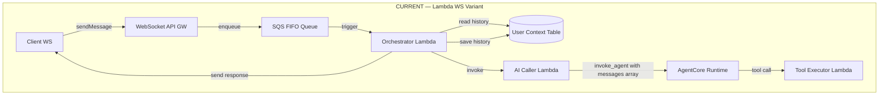
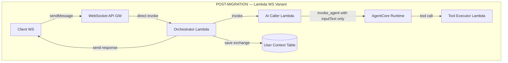
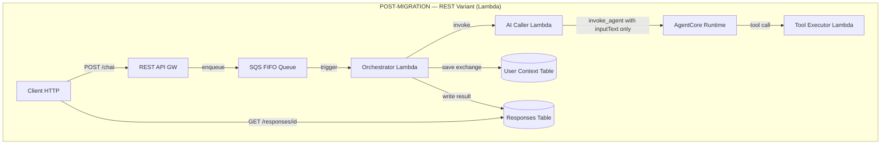
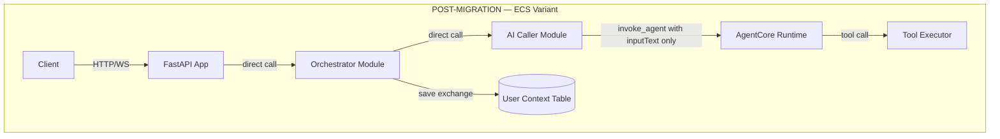
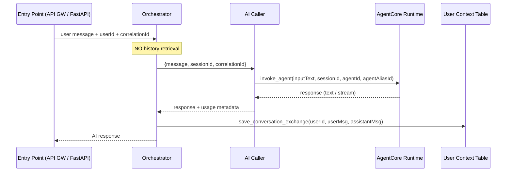

# Design Document: AgentCore Native Session Migration

## Overview

This design covers the migration of 6 AgentCore chatbot-RAG template variants to leverage native AgentCore Runtime session management. The core change is removing redundant conversation history **retrieval** (since AgentCore manages context via `sessionId`), while retaining conversation history **writing** for compliance/audit. Additionally, the SQS async pattern is removed from Lambda WebSocket variants (no timeout constraint), the AI Caller interface is simplified to accept only the current message, and monitoring is streamlined by removing custom metrics that duplicate AgentCore vended logs.

The 6 variants affected are:
1. `chatbot-rag-agentcore` — Lambda + REST (polling) — **keeps SQS**
2. `chatbot-rag-agentcore-ws` — Lambda + WebSocket (non-streaming)
3. `chatbot-rag-agentcore-ws-streaming` — Lambda + WebSocket (streaming)
4. `chatbot-rag-agentcore-ecs` — ECS/container + REST (sync)
5. `chatbot-rag-agentcore-ecs-ws` — ECS + WebSocket (non-streaming)
6. `chatbot-rag-agentcore-ecs-ws-streaming` — ECS + WebSocket (streaming)

Mantle variants, Tool Executor, Knowledge Base, and KB Sync are **not touched**.

## Architecture

### Current vs. Post-Migration Architecture (Lambda WS Variant)





### REST Variant (keeps SQS)



### ECS Variants (all — no SQS change needed)



## Components and Interfaces

### Component 1: Orchestrator (All Variants)

**Purpose**: Receives user messages, invokes the AI Caller, saves the conversation exchange, and delivers the response.

**Post-Migration Interface**:

```python
# Lambda REST variant — still SQS-triggered
def handler(event: dict, context: LambdaContext) -> dict:
    """SQS trigger handler. Processes one message at a time."""
    ...

# Lambda WS variants — now directly invoked (no SQS)
def handler(event: dict, context: LambdaContext) -> dict:
    """Direct invocation from WebSocket API route integration.
    Event contains: userId, message, correlationId (no SQS Records wrapper).
    """
    ...

# ECS variants — unchanged entry point signature
def process_message(user_id: str, message_text: str, *, correlation_id: str | None = None) -> dict:
    ...
```

**New Orchestrator Flow (all variants)**:



**Responsibilities**:
- Parse incoming event (SQS record for REST, direct event for WS, function call for ECS)
- Invoke AI Caller with simplified payload
- Save user+assistant exchange to DynamoDB (non-blocking on failure)
- Deliver response to client (write to Responses Table for REST, send via WS for WebSocket, return dict for ECS)
- Emit business metrics: `MessageProcessingLatency`, `ConversationLength`

**What is REMOVED from Orchestrator**:
- `retrieve_conversation_history()` / `get_conversation_history()` calls
- Building a `messages` array from history + new message
- Any logic that reads from User Context Table before AI invocation

### Component 2: AI Caller (All Variants)

**Purpose**: Wraps the `invoke_agent()` call to AgentCore Runtime. Receives only the current user message.

**Post-Migration Interface**:

```python
# Lambda variant — handler event payload (simplified)
{
    "message": "What is the capital of France?",
    "sessionId": "user-123",
    "correlationId": "req-abc-456"
}

# ECS variant — direct function call (simplified)
def invoke_agentcore(
    session_id: str,
    message: str,
    *,
    correlation_id: str = "",
    stream: bool = False,
) -> dict[str, Any]:
    """Invoke AgentCore Runtime with a single user message.
    
    Args:
        session_id: userId used as AgentCore session ID.
        message: Current user message text (NOT full history).
        correlation_id: Request tracing ID.
        stream: If True, returns streaming generator (for streaming variants).
    """
    ...
```

**What CHANGES in AI Caller**:
- Receives `message` (string) instead of `messages` (list)
- Removes `_extract_latest_user_message()` helper (no longer needed — message is already a string)
- Removes `messages` parameter from function signatures
- Removes `tools` parameter (AgentCore handles tools via action groups — never used externally)
- Lambda handler expects `event["message"]` + `event["sessionId"]` + `event["correlationId"]`

**What STAYS in AI Caller**:
- `invoke_agent()` call with `inputText`, `sessionId`, `agentId`, `agentAliasId`, `sessionState`
- Token usage extraction from trace events
- Finish reason extraction from observations
- Structured logging of AI interactions
- Streaming support (`invoke_agentcore_streaming` generator for streaming variants)
- Error handling and RuntimeError propagation

### Component 3: Shared Modules (Lambda Layer)

**Affected modules** in `src/layers/shared/python/shared/`:

| Module | Change |
|--------|--------|
| `ai_caller_agentcore.py` | Simplify signature: `messages` → `message` (string). Remove `_extract_latest_user_message`. Remove `tools` param. |
| `conversation_context.py` | Remove `get_conversation_history()`. Keep `append_messages()` and `save_conversation_history()`. Keep `trim_history()`. |
| `connection_manager.py` | No change |
| `message_protocol.py` | No change |
| `message_sender.py` | No change |
| `logging_config.py` | No change |
| `models.py` | No change |
| `tool_executor.py` | No change |

**conversation_context.py — Post-Migration API**:

```python
def append_messages(
    user_id: str,
    user_message: str,
    assistant_response: str,
    *,
    correlation_id: str = "",
) -> None:
    """Append user and assistant messages to conversation history.
    
    Post-migration: Does NOT retrieve existing history first.
    Uses DynamoDB update expression to append atomically, avoiding
    a read-before-write pattern.
    
    Alternatively, retrieves existing history, appends, trims, and saves
    (same as current but called ONLY for saving, never for pre-invocation retrieval).
    """
    ...

def save_conversation_history(user_id: str, messages: list[dict], *, correlation_id: str = "") -> None:
    """Save conversation history to DynamoDB. Non-blocking on failure."""
    ...

def trim_history(messages: list[dict], max_messages: int) -> list[dict]:
    """Trim to most recent N messages."""
    ...
```

**Note**: `get_conversation_history()` is still needed internally by `append_messages()` (to read-append-write). The public export changes: the Orchestrator no longer calls it directly for pre-invocation retrieval. The function itself remains in the module for internal use by `append_messages()`.

### Component 4: WebSocket Route Integration (Lambda WS Variants Only)

**Purpose**: After SQS removal, the WebSocket `sendMessage` route must invoke the Orchestrator Lambda directly.

**Current flow**: `sendMessage` route → Lambda integration → SQS enqueue → SQS triggers Orchestrator Lambda

**New flow**: `sendMessage` route → Lambda integration → **direct async invoke** of Orchestrator Lambda

**Implementation approach**:

The existing `sendMessage` route handler Lambda (the one that currently enqueues to SQS) is replaced with a direct `Lambda.invoke()` call to the Orchestrator, or more simply, the WebSocket API Gateway route integration points directly to the Orchestrator Lambda.

```python
# Option A (preferred): WebSocket API GW route integration points directly to Orchestrator Lambda
# The Orchestrator handler accepts the WebSocket event format:

def handler(event: dict, context: LambdaContext) -> dict:
    """WebSocket sendMessage route handler (direct integration).
    
    Event structure from WebSocket API Gateway:
    {
        "requestContext": {"connectionId": "abc123", "routeKey": "sendMessage", ...},
        "body": "{\"message\": \"Hello\", \"userId\": \"user-123\"}"
    }
    """
    body = json.loads(event.get("body", "{}"))
    connection_id = event["requestContext"]["connectionId"]
    user_id = body["userId"]
    message_text = body["message"]
    correlation_id = event["requestContext"].get("requestId", str(uuid.uuid4()))
    
    # Process message (invoke AI Caller, save, deliver via WS)
    ...
    
    return {"statusCode": 200}
```

**Terraform change**: The `sendMessage` route's `integration_uri` changes from the SQS-enqueue Lambda to the Orchestrator Lambda ARN directly.

## Data Models

### User Context Table (DynamoDB) — No Schema Change

```python
# Partition key: userId (String)
{
    "userId": "user-123",
    "messages": [
        {"role": "user", "content": "Hello", "timestamp": "2025-01-15T10:00:00Z"},
        {"role": "assistant", "content": "Hi there!", "timestamp": "2025-01-15T10:00:01Z"},
    ],
    "updatedAt": 1736935200  # Unix epoch
}
```

**No change** — the table schema and access patterns for writing remain identical. The only change is that reads for pre-invocation history retrieval are eliminated.

### AI Caller Invocation Payload — Simplified

**Before**:
```python
{
    "messages": [
        {"role": "user", "content": "Previous msg", "timestamp": "..."},
        {"role": "assistant", "content": "Previous response", "timestamp": "..."},
        {"role": "user", "content": "Current message", "timestamp": "..."}
    ],
    "correlationId": "req-abc-456",
    "tools": [],
    "userId": "user-123"
}
```

**After**:
```python
{
    "message": "Current message",
    "sessionId": "user-123",
    "correlationId": "req-abc-456"
}
```

## Infrastructure Changes Per Variant

### Summary Matrix

| Variant | SQS Removal | Responses Table | Monitoring Simplification | Orchestrator Trigger Change |
|---------|-------------|-----------------|---------------------------|---------------------------|
| `chatbot-rag-agentcore` (REST) | NO — keep SQS | Keep | Remove AIModelLatency, ToolExecutionLatency widgets | None |
| `chatbot-rag-agentcore-ws` | YES | N/A (already absent) | Remove AIModelLatency, ToolExecutionLatency, DLQ widgets | Direct Lambda integration |
| `chatbot-rag-agentcore-ws-streaming` | YES | N/A (already absent) | Remove AIModelLatency, ToolExecutionLatency, DLQ widgets | Direct Lambda integration |
| `chatbot-rag-agentcore-ecs` (REST) | N/A (no SQS) | N/A | Remove AIModelLatency, ToolExecutionLatency widgets | None |
| `chatbot-rag-agentcore-ecs-ws` | N/A (no SQS) | N/A | Remove AIModelLatency, ToolExecutionLatency widgets | None |
| `chatbot-rag-agentcore-ecs-ws-streaming` | N/A (no SQS) | N/A | Remove AIModelLatency, ToolExecutionLatency widgets | None |

### Lambda WS Variants — SQS Removal

**Files to remove**:
- `infra/modules/sqs/main.tf` (entire module directory)

**Files to modify**:
- `infra/main.tf` — Remove `module "sqs"` block, remove SQS-related variables passed to other modules
- `infra/modules/lambda/main.tf` — Remove SQS event source mapping for orchestrator, remove IAM permissions for SQS
- `infra/modules/websocket_api/main.tf` — Change `sendMessage` route integration from SQS-enqueue Lambda to Orchestrator Lambda

**IAM changes**:
- Remove `sqs:SendMessage`, `sqs:ReceiveMessage`, `sqs:DeleteMessage` from Orchestrator role
- Add `lambda:InvokeFunction` from WebSocket route integration to Orchestrator (if using Option A, API GW already has this)

### Lambda WS Variants — Orchestrator Handler Refactor

The Orchestrator handler changes from SQS event format to WebSocket API Gateway event format:

**Before** (SQS-triggered):
```python
def handler(event, context):
    for record in event["Records"]:
        body = json.loads(record["body"])
        user_id = body["userId"]
        message = body["message"]
        ...
```

**After** (direct WebSocket integration):
```python
def handler(event, context):
    body = json.loads(event.get("body", "{}"))
    connection_id = event["requestContext"]["connectionId"]
    user_id = body["userId"]
    message = body["message"]
    correlation_id = event["requestContext"].get("requestId", str(uuid.uuid4()))
    ...
    return {"statusCode": 200}
```

### Monitoring Module Changes

**Widgets REMOVED from dashboard** (all variants):
- "AI Model Latency" (widget referencing `ChatbotRAG/AIModelLatency`)
- "Tool Execution Latency" (widget referencing `ChatbotRAG/ToolExecutionLatency`)

**Widgets KEPT**:
- "Message Processing Latency" (`ChatbotRAG/MessageProcessingLatency`)
- "Conversation Length" (`ChatbotRAG/ConversationLength`)
- "Lambda Errors" (AWS/Lambda native metrics)
- "DLQ Depth" — **REST variant only** (remove from WS variants)

**Alarms KEPT**:
- `lambda-error-rate` alarm
- `p99-latency` alarm
- `dlq-depth` alarm — **REST variant only**

**Custom metric REMOVED from AI Caller code**:
- `metrics.add_metric(name="AIModelLatency", ...)` — removed from Lambda AI Caller handler

### AI Caller Lambda — Code Changes

The Lambda AI Caller handler (`src/ai_caller/handler.py`) changes:

```python
# BEFORE
@metrics.log_metrics(capture_cold_start_metric=True)
@logger.inject_lambda_context
def handler(event, context):
    messages = event.get("messages", [])
    tools = event.get("tools", [])
    user_id = event.get("userId", "")
    ...
    response = invoke_agentcore(session_id=user_id, messages=messages, tools=tools, ...)

# AFTER
@logger.inject_lambda_context
def handler(event, context):
    message = event.get("message", "")
    session_id = event.get("sessionId", "")
    correlation_id = event.get("correlationId", "")
    ...
    response = invoke_agentcore(session_id=session_id, message=message, ...)
```

**Removed**:
- `@metrics.log_metrics` decorator (no more custom AIModelLatency metric)
- `Metrics` import and instantiation
- `metrics.add_metric(name="AIModelLatency", ...)` line
- `messages` and `tools` event parsing
- `_extract_latest_user_message()` helper (input is already a string)

### REST Variant — What Stays

The REST variant (`chatbot-rag-agentcore`) **retains**:
- SQS FIFO queue + DLQ
- Responses Table (for polling)
- `_write_response()` logic in Orchestrator
- SQS event source mapping trigger
- DLQ depth alarm

The REST variant **still changes**:
- Remove history retrieval from Orchestrator
- Simplify AI Caller payload (message string, not messages array)
- Remove AIModelLatency/ToolExecutionLatency from dashboard
- Remove AIModelLatency metric emission from AI Caller code

## Error Handling

### DynamoDB Write Failure (Conversation Save)

**Behavior**: Log ERROR, continue returning AI response to user. Non-blocking.

```python
try:
    save_conversation_exchange(user_id, user_msg, assistant_msg, correlation_id)
except Exception as e:
    logger.error("Failed to save conversation exchange", extra={...})
    # Do NOT raise — response still delivered
```

### AI Caller Invocation Failure

**REST variant**: Orchestrator writes `status: "failed"` to Responses Table. SQS message is consumed (no retry via DLQ for non-transient errors).

**WS variants**: Send `{"type": "error", "message": "..."}` to client via WebSocket. No retry.

**ECS variants**: Raise RuntimeError to FastAPI, which returns HTTP 500.

### Client Disconnect Mid-Stream (WS Streaming)

**Behavior unchanged**: Abort stream, discard partial response, do NOT save to history. Already implemented in current streaming orchestrators.

## Testing Strategy

### Unit Testing Approach

- Test Orchestrator flow without DynamoDB/Lambda mocking history retrieval (since it's removed)
- Test AI Caller with simplified payload acceptance
- Test `conversation_context.append_messages()` still correctly saves
- Test monitoring module emits only retained metrics

### Integration Testing Approach

- Deploy each variant independently with `terraform apply`
- Verify REST variant: POST /chat → poll → completed response
- Verify WS variant: connect → sendMessage → receive response via WS
- Verify WS streaming variant: connect → sendMessage → receive chunks → done
- Verify DynamoDB writes occur after each exchange
- Verify no SQS resources exist in WS variant deployments

## Dependencies

- **AWS Bedrock AgentCore Runtime** — session management via `sessionId` (existing dependency, now relied upon for full context management)
- **boto3** — `bedrock-agent-runtime` client (unchanged)
- **aws-lambda-powertools** — Logger, Metrics (Metrics usage reduced)
- **DynamoDB** — User Context Table for compliance writes (unchanged)
- **Terraform** — Infrastructure provisioning (module changes)

## Correctness Properties

*A property is a characteristic or behavior that should hold true across all valid executions of a system — essentially, a formal statement about what the system should do. Properties serve as the bridge between human-readable specifications and machine-verifiable correctness guarantees.*

### Property 1: Conversation exchange persistence after successful AI response

*For any* successful AI invocation across any variant, the Orchestrator SHALL save both the user message and assistant response to the User Context Table, each with a timestamp and role field.

**Validates: Requirements 2.1, 2.3**

### Property 2: AI Caller receives only current message

*For any* invocation of the AI Caller (Lambda or ECS module), the payload SHALL contain exactly one user message string (not an array), a sessionId, and a correlationId — with no additional conversation history.

**Validates: Requirements 7.1, 7.2, 7.3**

### Property 3: No DynamoDB read before AI invocation

*For any* message processing flow in any variant, the Orchestrator SHALL NOT perform a DynamoDB `get_item` read on the User Context Table prior to invoking the AI Caller.

**Validates: Requirements 1.1, 1.2, 1.4**

### Property 4: REST variant retains async polling

*For any* REST variant deployment, the SQS FIFO queue, DLQ, and Responses Table SHALL be provisioned and functional, with messageId returned immediately on POST /chat.

**Validates: Requirements 3.5, 6.1**

### Property 5: WS variants have no SQS resources

*For any* Lambda WebSocket variant deployment (`ws`, `ws-streaming`), the Terraform plan SHALL NOT include SQS queue, DLQ, or SQS event source mapping resources.

**Validates: Requirements 3.2, 3.3**

### Property 6: Independent deployability

*For any* of the 6 AgentCore template variants, running `terraform init && terraform plan && terraform apply` in isolation SHALL succeed without cross-variant dependencies.

**Validates: Requirements 5.2**

### Property 7: DynamoDB write failure is non-blocking

*For any* DynamoDB write failure during conversation persistence, the Orchestrator SHALL log the error at ERROR level and continue delivering the AI response to the client without raising an exception.

**Validates: Requirements 2.4**

### Property 8: Streaming abort on client disconnect

*For any* WebSocket streaming variant, if the client disconnects mid-stream, the Orchestrator SHALL abort the stream and NOT persist the partial response to conversation history.

**Validates: Requirements 6.5**

### Property 9: Monitoring retains only business metrics

*For any* variant's monitoring module post-migration, the CloudWatch dashboard SHALL contain `MessageProcessingLatency` and `ConversationLength` widgets, and SHALL NOT contain `AIModelLatency` or `ToolExecutionLatency` widgets.

**Validates: Requirements 4.2, 4.3, 4.4**
