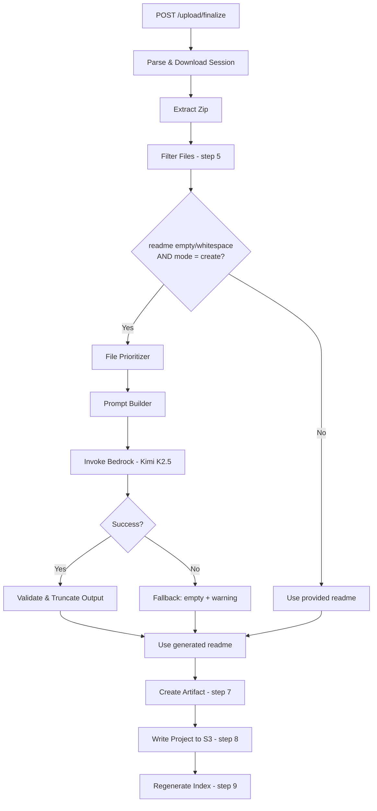

# Design Document: AI-Generated README for Projects

## Overview

This feature adds automatic README generation to the project upload flow. When a user uploads a project without providing a README (empty, whitespace-only, or undefined), the finalize Lambda invokes the Kimi K2.5 model via Amazon Bedrock to generate a markdown README from the project's source files.

The system uses a tiered file prioritization algorithm to select the most informative files within a ~100K token budget, constructs a structured prompt, and integrates the generated README into the existing upload pipeline. No new infrastructure is required — the feature reuses the existing Bedrock IAM permissions, Lambda timeout, and client patterns already established by the `suggest-tags` module.

### Design Decisions

1. **Single module (`generate-readme.ts`)**: All README generation logic lives in one module to keep the integration point in `process.ts` minimal — a single function call.
2. **Synchronous inline execution**: README generation runs inline within the finalize Lambda rather than as a separate async step. The 30s Bedrock timeout plus processing fits well within the existing 120s Lambda timeout.
3. **Graceful degradation over failure**: Any error during generation results in a fallback to "No description provided" with a warning — never a failed upload.
4. **Token estimation via char ratio**: Using a simple 1:4 character-to-token ratio avoids importing a tokenizer library while providing a conservative budget estimate.

## Architecture



The README generation step slots in between the existing step 5 (file filtering) and step 7 (artifact creation) in `process.ts`. It receives the already-filtered `FileEntry[]` array and produces a string that becomes the project's readme.

## Components and Interfaces

### 1. File Prioritizer (`prioritizeFiles`)

Classifies filtered files into tiers and selects content within the token budget.

```typescript
/** Classification tier for a file */
export type FileTier = 'tier1' | 'tier2' | 'tier3' | 'skip';

/** A file with its classification and optionally its text content */
export interface PrioritizedFile {
  path: string;
  tier: FileTier;
  /** Text content included in prompt (undefined for tier3/skip) */
  content?: string;
}

/** Result of file prioritization */
export interface PrioritizationResult {
  /** Files with full content to include in prompt (tier1 + budget-fitting tier2) */
  includedFiles: PrioritizedFile[];
  /** File paths for directory listing (tier3) */
  directoryListing: string[];
  /** Total estimated tokens consumed */
  totalTokens: number;
}

/**
 * Classify and select files within the token budget.
 * @param files - Filtered FileEntry[] from the upload
 * @returns PrioritizationResult with included content and directory listing
 */
export function prioritizeFiles(files: FileEntry[]): PrioritizationResult;
```

**Classification rules (evaluated in precedence order: Tier_1 → Skip → Tier_2 → Tier_3):**

| Tier | Criteria |
|------|----------|
| Tier 1 | Entry points (`main.*`, `index.*`, `app.*`, `server.*`) at root or `src/`; `package.json`, `Dockerfile`, `docker-compose.yml`, `Makefile` at root |
| Skip | Binary/media extensions, lock files, large JSON/YAML (>10KB), CI/CD paths, IaC files, generated files |
| Tier 2 | Source code extensions (`.ts`, `.py`, `.go`, `.java`, `.rs`, etc.) excluding paths with test/spec/__tests__ segments |
| Tier 3 | Everything else (default) |

**Budget algorithm:**
1. Include all Tier_1 files with full content (package.json trimmed to key fields)
2. Sort Tier_2 files alphabetically by path
3. Add Tier_2 files sequentially until the next file would exceed the 100K token budget
4. Include Tier_3 files as a path-only listing

### 2. Prompt Builder (`buildPrompt`)

Constructs the model prompt from prioritized file data.

```typescript
/**
 * Build the model prompt from prioritized files.
 * @param projectName - The project name from session metadata
 * @param prioritization - Result from prioritizeFiles()
 * @returns The complete prompt string for the model
 */
export function buildPrompt(projectName: string, prioritization: PrioritizationResult): string;
```

**Prompt structure:**
1. System instruction (README generation directive, section requirements, no-fabrication rule)
2. Project name
3. For each included file: file path header + full text content
4. Directory listing section with Tier_3 file paths

### 3. README Generator (`generateReadme`)

Top-level orchestrator that invokes Bedrock and handles errors.

```typescript
/** Result of README generation */
export interface GenerateReadmeResult {
  /** Generated README content, or empty string on failure */
  readme: string;
  /** Warning message if generation failed */
  warning?: string;
}

/**
 * Generate a README for the project using AI.
 * @param projectName - Project name from session metadata
 * @param files - Filtered files from the upload
 * @returns Generated README or empty string with warning on failure
 */
export async function generateReadme(
  projectName: string,
  files: FileEntry[]
): Promise<GenerateReadmeResult>;
```

**Bedrock invocation** follows the `suggest-tags.ts` pattern:
- Client: `BedrockRuntimeClient` (module-level singleton)
- Command: `InvokeModelCommand` with model ID `us.moonshotai.kimi-k2.5-0613-v1:0`
- Request body: `{ messages: [{ role: 'user', content: prompt }], max_tokens: 4096 }`
- Timeout: 30-second `AbortController` signal
- Response parsing: check `choices[0].message.content` → `content` → `completion`

### 4. Integration in `process.ts`

The integration adds a conditional call between step 5 (filtering) and step 7 (artifact creation):

```typescript
// After step 5 (filterFiles) and step 6 (tag registry)...

// 6.5: Generate README if not provided (create mode only)
let readmeContent = sessionMeta.readme;
let readmeWarning: string | undefined;

if (sessionMeta.mode !== 'replace' && (!readmeContent || !readmeContent.trim())) {
  const result = await generateReadme(sessionMeta.name, filterResult.files);
  readmeContent = result.readme || 'No description provided';
  readmeWarning = result.warning;
}

// Step 7 onward uses readmeContent instead of sessionMeta.readme
```

### 5. Helper Functions

```typescript
/**
 * Classify a single file into its tier.
 * @param filePath - Relative file path
 * @param contentSize - Size of file content in bytes
 * @returns The tier classification
 */
export function classifyFile(filePath: string, contentSize: number): FileTier;

/**
 * Estimate token count from character count.
 * @param charCount - Number of characters
 * @returns Estimated token count (Math.ceil(charCount / 4))
 */
export function estimateTokens(charCount: number): number;

/**
 * Trim package.json to only relevant fields.
 * @param content - Raw package.json content string
 * @returns Trimmed JSON string with only name, version, description, scripts, dependencies, devDependencies
 */
export function trimPackageJson(content: string): string;

/**
 * Validate and truncate generated README content.
 * - Rejects empty/whitespace-only content
 * - Truncates at last newline before MAX_README_LENGTH
 * @param content - Raw model output
 * @returns Validated content or null if invalid
 */
export function validateReadmeOutput(content: string): string | null;

/**
 * Extract text content from a response body, checking fields in order.
 * @param responseBody - Decoded Bedrock response
 * @returns Extracted text or null
 */
export function extractModelContent(responseBody: string): string | null;
```

## Data Models

### Constants (added to `shared/src/constants.ts` or module-local)

```typescript
/** Maximum token budget for model input */
export const README_TOKEN_BUDGET = 100_000;

/** Character-to-token ratio (1 token ≈ 4 chars) */
export const CHARS_PER_TOKEN = 4;

/** Maximum tokens for model output */
export const README_MAX_OUTPUT_TOKENS = 4096;

/** Bedrock invocation timeout in milliseconds */
export const README_GENERATION_TIMEOUT_MS = 30_000;

/** Bedrock model ID */
export const README_MODEL_ID = 'us.moonshotai.kimi-k2.5-0613-v1:0';
```

### File Classification Data

```typescript
/** Entry point base names (matched at root or src/) */
const ENTRY_POINT_BASES = ['main', 'index', 'app', 'server'];

/** Root-level config files always included as Tier 1 */
const ROOT_CONFIG_FILES = ['package.json', 'Dockerfile', 'docker-compose.yml', 'Makefile'];

/** Source code extensions for Tier 2 */
const SOURCE_EXTENSIONS = new Set([
  '.ts', '.py', '.go', '.java', '.rs', '.rb', '.cpp', '.c', '.h',
  '.cs', '.swift', '.kt', '.scala', '.clj', '.ex', '.exs', '.hs',
  '.ml', '.lua', '.php', '.sh'
]);

/** Binary/media extensions for Skip */
const BINARY_EXTENSIONS = new Set([
  '.exe', '.dll', '.so', '.dylib', '.bin', '.dat', '.o', '.a', '.lib',
  '.class', '.wasm', '.pdf', '.zip', '.tar', '.gz', '.rar', '.7z',
  '.png', '.jpg', '.jpeg', '.gif', '.svg', '.ico', '.mp3', '.mp4',
  '.wav', '.avi', '.mov', '.webm', '.webp', '.bmp', '.tiff'
]);

/** Lock files (exact names) for Skip */
const LOCK_FILES = new Set([
  'package-lock.json', 'yarn.lock', 'pnpm-lock.yaml',
  'Cargo.lock', 'Gemfile.lock', 'poetry.lock'
]);

/** Test path segments (case-insensitive) */
const TEST_SEGMENTS = ['test', 'spec', '__tests__'];
```

## Correctness Properties

*A property is a characteristic or behavior that should hold true across all valid executions of a system — essentially, a formal statement about what the system should do. Properties serve as the bridge between human-readable specifications and machine-verifiable correctness guarantees.*

### Property 1: Trigger decision correctness

*For any* SessionMetadata object, the README generation trigger SHALL evaluate to true if and only if the mode is "create" AND the readme field is undefined, empty, or composed entirely of whitespace characters.

**Validates: Requirements 1.1, 1.2, 1.3**

### Property 2: File classification correctness

*For any* file path and content size, the `classifyFile` function SHALL return: Tier_1 for entry point patterns (main/index/app/server with any single extension) located at root or directly within src/, and for root-level package.json/Dockerfile/docker-compose.yml/Makefile; Skip for binary/media extensions, lock files, large JSON/YAML (>10,240 bytes), CI/CD paths, IaC files, and generated file patterns; Tier_2 for source code extensions not in test/spec/__tests__ path segments; and Tier_3 for all remaining files.

**Validates: Requirements 2.2, 2.3, 2.4, 2.5, 2.6**

### Property 3: Classification precedence

*For any* file path that matches rules for multiple categories, the `classifyFile` function SHALL assign the highest-precedence category where precedence order is Tier_1 > Skip > Tier_2 > Tier_3, ensuring every file is classified into exactly one tier.

**Validates: Requirements 2.1, 2.7**

### Property 4: Tier_1 files always included

*For any* set of uploaded files, all files classified as Tier_1 SHALL appear in the prioritization output with their full text content, regardless of the cumulative token count.

**Validates: Requirements 3.1, 3.8**

### Property 5: package.json field trimming

*For any* valid JSON string representing a package.json file, the `trimPackageJson` function SHALL return a JSON string containing only the fields "name", "version", "description", "scripts", "dependencies", and "devDependencies" (when present in the input), with all other fields removed.

**Validates: Requirements 3.2**

### Property 6: Tier_2 budget-bounded alphabetical inclusion

*For any* set of Tier_2 files, the prioritizer SHALL include them in case-insensitive alphabetical order by path, stopping before the file that would cause cumulative token estimate to exceed 100,000 tokens, with no partial file content ever included.

**Validates: Requirements 3.3, 3.4**

### Property 7: Token estimation formula

*For any* string of length N characters, the `estimateTokens` function SHALL return Math.ceil(N / 4).

**Validates: Requirements 3.6**

### Property 8: Prompt structure completeness

*For any* project name and prioritization result containing at least one included file, the `buildPrompt` function SHALL produce a string containing (in order): a system instruction section, the project name, each included file's path followed by its content, and a directory listing of Tier_3 file paths.

**Validates: Requirements 4.1**

### Property 9: Response field extraction order

*For any* Bedrock response body string, the `extractModelContent` function SHALL return the first non-empty value found by checking `choices[0].message.content`, then `content`, then `completion`, or null if none contain extractable text.

**Validates: Requirements 5.3**

### Property 10: Output truncation at newline boundary

*For any* string exceeding MAX_README_LENGTH (50,000 characters) that contains at least one newline character within the first 50,000 characters, the `validateReadmeOutput` function SHALL truncate at the last newline character at or before the 50,000-character boundary, producing a result of at least 1 character.

**Validates: Requirements 8.3**

### Property 11: Output validity enforcement

*For any* model output string, the `validateReadmeOutput` function SHALL return null for empty or whitespace-only strings, return the content unchanged if it is between 1 and 50,000 characters and contains at least one non-whitespace character, or truncate per Property 10 if it exceeds 50,000 characters.

**Validates: Requirements 8.1, 8.2, 8.4**

## Error Handling

| Error Scenario | Handling | User Impact |
|---|---|---|
| Bedrock invocation timeout (>30s) | Catch error, log to CloudWatch, return `{ readme: '', warning: '...' }` | Upload succeeds with "No description provided" + warning |
| Bedrock throttling (429) | Same as timeout | Same — upload succeeds |
| Bedrock service error (5xx) | Same as timeout | Same — upload succeeds |
| Model returns empty/unparseable response | `extractModelContent` returns null → fallback | Upload succeeds with fallback |
| Model output is whitespace-only | `validateReadmeOutput` returns null → fallback | Upload succeeds with fallback |
| File cannot be decoded as UTF-8 | Skip that file in prompt construction, continue | No impact — other files still included |
| package.json is invalid JSON | Include raw content without trimming | Minor — slightly more tokens used |
| All files are Skip tier | Prompt has empty file section, model gets minimal context | Generated README may be minimal |

**Error logging pattern** (matching existing codebase):
```typescript
console.error('[generate-readme] Error:', err instanceof Error ? `${err.name}: ${err.message}` : err);
```

**Fallback chain:**
1. Model succeeds → use generated content
2. Model fails → `readme = ''`, warning set
3. In `process.ts`: if `readme` is empty after generation → use `'No description provided'`

## Testing Strategy

### Property-Based Tests (fast-check)

The feature's core logic — file classification, token budget management, prompt construction, and output validation — consists of pure functions with clear input/output behavior and large input spaces. Property-based testing is well-suited here.

**Library:** `fast-check` (already compatible with the project's vitest setup)

**Configuration:**
- Minimum 100 iterations per property test
- Each test tagged with: `Feature: ai-readme-generation, Property {N}: {title}`

**Property tests to implement:**
1. Trigger decision correctness (Property 1)
2. File classification correctness (Property 2)
3. Classification precedence (Property 3)
4. Tier_1 always included (Property 4)
5. package.json trimming (Property 5)
6. Budget-bounded alphabetical inclusion (Property 6)
7. Token estimation formula (Property 7)
8. Prompt structure completeness (Property 8)
9. Response extraction order (Property 9)
10. Output truncation (Property 10)
11. Output validity enforcement (Property 11)

### Unit Tests (example-based)

- Trigger: mode="replace" skips generation regardless of readme content
- Trigger: generation failure → upload continues with warning
- Classification: specific files (e.g., `src/main.ts` → Tier_1, `tests/foo.test.ts` → Tier_3)
- Prompt: system instruction contains required README sections
- Prompt: system instruction contains no-fabrication directive
- Integration: `generateReadme` returns empty + warning on Bedrock failure (mocked)
- Integration: `generateReadme` returns empty + warning on empty model response (mocked)
- Response: warning field present in FinalizeResponse on failure

### Integration Tests

- Full `process.ts` flow with mocked Bedrock: empty readme triggers generation, result written to S3
- Full flow with mocked Bedrock failure: upload succeeds with fallback readme
- Full flow with provided readme: generation skipped, user readme preserved
