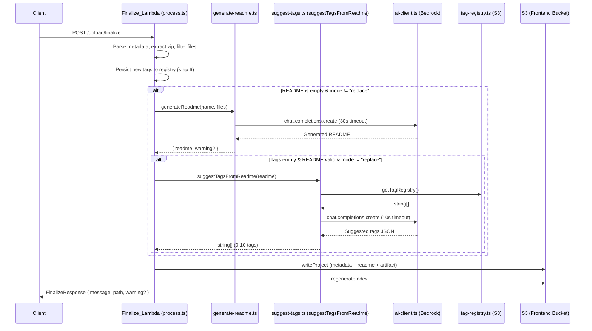

# Design Document: Auto-Tag from Generated README

## Overview

This feature integrates the existing README generation pipeline (`generate-readme.ts`) with the tag suggestion system (`suggest-tags.ts`) within the Finalize_Lambda (`process.ts`). When a project is uploaded without a README (and without user-selected tags), the system generates a README and then uses that generated content to automatically select relevant tags from the Tag_Registry via AI. This eliminates the gap where projects uploaded without a README also ended up with no tags, making them less discoverable.

The design extracts the core tag suggestion logic from the existing Lambda handler into a reusable function that can be called directly within the Finalize_Lambda, avoiding an HTTP round-trip. The auto-tagging step is inserted sequentially after README generation and before S3 writes, with strict timeout enforcement and graceful failure handling to ensure uploads never fail due to tag suggestion errors.

## Architecture

The feature operates entirely within the existing Finalize_Lambda execution context. No new Lambda functions, API endpoints, or infrastructure changes are required.



### Key Design Decisions

1. **Direct function call, not HTTP**: The tag suggestion logic is extracted into a reusable function (`suggestTagsFromReadme`) callable within the same Lambda execution. This avoids network overhead, cold starts, and IAM complexity of invoking the `/tags/suggest` endpoint.

2. **Sequential execution**: Auto-tagging runs after README generation (it needs the README as input) and after tag registry persistence (so newly registered tags are available for suggestion). This ensures data consistency without race conditions.

3. **Independent timeout**: Tag suggestion has its own 10-second AbortController timeout, separate from README generation's 30-second timeout. This guarantees the Lambda stays within its 120-second budget.

4. **Fail-open design**: Any failure in auto-tagging results in an empty tag array and a warning — never a failed upload.

## Components and Interfaces

### New Exported Function: `suggestTagsFromReadme`

Location: `lambda/src/suggest-tags.ts`

```typescript
/**
 * Suggest tags for a project based on its README content.
 * Designed for direct invocation within the Finalize_Lambda (no HTTP).
 *
 * - Truncates README to 10,000 characters
 * - Fetches the current tag registry
 * - Invokes the AI model with the same prompt format as the handler
 * - Parses response and filters to registry-only tags
 * - Enforces a 10-second timeout via AbortController
 * - Returns empty array on any error (never throws)
 *
 * @param readme - The README content to analyze
 * @returns Array of suggested tag strings (0-10 items, all from registry)
 */
export async function suggestTagsFromReadme(readme: string): Promise<string[]>;
```

### Modified: `process.ts` (Finalize_Lambda)

A new auto-tagging step is inserted between step 6.5 (README generation) and step 7 (artifact creation). The step:

1. Checks preconditions: mode is not "replace", tags are empty, generated README is non-empty and not the fallback text
2. Calls `suggestTagsFromReadme(readmeContent)`
3. Uses returned tags in ProjectMetadata construction
4. Captures any warning for the response

```typescript
// Step 6.75: Auto-tag from generated README (create mode only)
let autoTags: string[] = [];
let tagWarning: string | undefined;

if (
  sessionMeta.mode !== 'replace' &&
  !hasUserTags(sessionMeta.tags) &&
  readmeContent &&
  readmeContent.trim() &&
  readmeContent !== 'No description provided'
) {
  try {
    autoTags = await suggestTagsFromReadme(readmeContent);
  } catch {
    // Should not throw (suggestTagsFromReadme catches internally),
    // but defensive catch for safety
    tagWarning = 'Automatic tag suggestion was unsuccessful';
  }
}
```

### Helper Function: `hasUserTags`

```typescript
/**
 * Check if the session metadata tags field contains any non-empty user-provided tags.
 * The tags field is a comma-separated string. Returns true if at least one
 * non-whitespace tag exists after splitting.
 */
function hasUserTags(tags: string): boolean {
  return tags.split(',').some(t => t.trim().length > 0);
}
```

### Updated ProjectMetadata Construction

```typescript
const metadata: ProjectMetadata = {
  name: sessionMeta.name,
  description: readmeContent.slice(0, 200) || 'No description provided',
  tags: hasUserTags(sessionMeta.tags)
    ? sessionMeta.tags.split(',').map(t => t.trim()).filter(t => t.length > 0)
    : autoTags,
  date: new Date().toISOString().split('T')[0],
};
```

## Data Models

### Input/Output of `suggestTagsFromReadme`

| Parameter | Type | Description |
|-----------|------|-------------|
| `readme` (input) | `string` | README content (will be truncated to 10,000 chars internally) |
| return value | `string[]` | Array of 0-10 tag strings, each present in the Tag_Registry |

### Existing Types (Unchanged)

- **`SessionMetadata.tags`**: Comma-separated string. Empty string or whitespace-only means no user tags.
- **`SessionMetadata.mode`**: `'create' | 'replace' | undefined`. Auto-tagging only applies when mode is not `'replace'`.
- **`ProjectMetadata.tags`**: `string[]` (0-10 entries). Same format for both user-selected and auto-tagged projects.
- **`FinalizeResponse.warning`**: Optional string. Multiple warnings are joined with `'; '`.

### Auto-Tagging Decision Matrix

| README provided? | Tags provided? | Mode | Action |
|-----------------|---------------|------|--------|
| No (generated) | No | create | ✅ Auto-tag |
| No (generated) | Yes | create | ❌ Skip (user tags win) |
| Yes (user) | No | create | ❌ Skip (no generated README) |
| Yes (user) | Yes | create | ❌ Skip (user tags win) |
| Any | Any | replace | ❌ Skip (replace mode) |
| Generated but empty/fallback | No | create | ❌ Skip (no useful README) |


## Correctness Properties

*A property is a characteristic or behavior that should hold true across all valid executions of a system — essentially, a formal statement about what the system should do. Properties serve as the bridge between human-readable specifications and machine-verifiable correctness guarantees.*

### Property 1: Auto-tag decision matrix correctness

*For any* `SessionMetadata` (with arbitrary `readme`, `tags`, and `mode` values) and any `readmeContent` produced by README generation, the auto-tagging step SHALL be invoked if and only if ALL of the following hold: (a) `mode` is not `"replace"`, (b) the `tags` field contains no non-empty tags after splitting by comma, (c) the `readmeContent` is non-empty, not whitespace-only, and not equal to `"No description provided"`. In all other cases, auto-tagging SHALL be skipped and the existing tags (user-provided or empty) SHALL be used unchanged.

**Validates: Requirements 1.1, 1.2, 1.3, 1.4, 3.5**

### Property 2: Tag suggestion output is a registry subset capped at 10

*For any* README string and any Tag_Registry state, the return value of `suggestTagsFromReadme` SHALL be an array where every element is present in the Tag_Registry (case-insensitive match) and the array length is at most 10.

**Validates: Requirements 2.3, 3.3**

### Property 3: README content is truncated to 10,000 characters

*For any* README string of any length passed to `suggestTagsFromReadme`, the content included in the AI model prompt SHALL be at most 10,000 characters (the first 10,000 characters of the input).

**Validates: Requirements 2.4**

### Property 4: Empty or whitespace README returns empty without AI invocation

*For any* string that is empty, undefined, or composed entirely of whitespace characters, `suggestTagsFromReadme` SHALL return an empty array and SHALL NOT invoke the AI model.

**Validates: Requirements 2.5**

### Property 5: Auto-tag results flow to ProjectMetadata when user has no tags

*For any* finalize flow where auto-tagging is triggered and `suggestTagsFromReadme` returns a non-empty array `T`, the `ProjectMetadata.tags` field written to S3 SHALL equal `T` exactly (same elements, same order).

**Validates: Requirements 3.1**

## Error Handling

### Tag Suggestion Failures

The `suggestTagsFromReadme` function is designed to **never throw**. All errors are caught internally and result in an empty array return. This includes:

| Failure Type | Handling |
|---|---|
| AI model invocation error | Catch, log to CloudWatch, return `[]` |
| 10-second timeout (AbortController) | Abort signal fires, catch, return `[]` |
| Invalid/unparseable model response | Return `[]` (no JSON match or missing `tags` field) |
| Tag Registry fetch failure | Return `[]` (cannot filter without registry) |
| Empty Tag Registry | Return `[]` without calling AI |

### Warning Propagation

When auto-tagging fails or returns empty due to an error, the Finalize_Lambda adds a warning to the response:

```typescript
tagWarning = 'Automatic tag suggestion was unsuccessful';
```

This warning is concatenated with other warnings (filter warning, registry warning, readme warning) using `'; '` separator in the final `FinalizeResponse.warning` field.

### Combined Failure Scenario

If both README generation and tag suggestion fail:
- README falls back to `"No description provided"`
- Tags fall back to `[]`
- Response includes both warnings: `"README generation failed: ...; Automatic tag suggestion was unsuccessful"`
- Upload still succeeds — the project is created with fallback content

### Timeout Budget

| Step | Max Duration | Mechanism |
|------|-------------|-----------|
| README generation | 30 seconds | AbortController in `generateReadme` |
| Tag suggestion | 10 seconds | AbortController in `suggestTagsFromReadme` |
| Remaining (zip, filter, S3 writes, index) | ~80 seconds | Lambda 120s timeout |

## Testing Strategy

### Property-Based Tests

Property-based testing is appropriate for this feature because the auto-tagging decision logic and the tag suggestion output filtering are pure functions of their inputs with clear universal invariants.

**Library**: `fast-check` (already available in the project via vitest ecosystem)

**Configuration**: Minimum 100 iterations per property test.

**Tag format**: Each test is annotated with `// Feature: auto-tag-from-generated-readme, Property {N}: {title}`

Properties to implement:
1. **Decision matrix** — Generate random `SessionMetadata` (varying `mode`, `tags`, `readme`) and `readmeContent`, assert auto-tagging trigger condition matches the specification
2. **Registry subset** — Generate random README + random registries + mock AI responses with arbitrary tags, assert output ⊆ registry and length ≤ 10
3. **Truncation** — Generate READMEs of length 0 to 50,000, assert model input ≤ 10,000 chars
4. **Empty guard** — Generate whitespace strings, assert empty return without AI call
5. **Data flow** — Generate auto-tag results, assert ProjectMetadata.tags matches exactly

### Unit Tests (Example-Based)

| Test Case | Validates |
|---|---|
| Auto-tagging invoked on empty readme + empty tags in create mode | Req 1.1 |
| Auto-tagging skipped when user provides tags | Req 1.2, 3.5 |
| Auto-tagging skipped when readme is "No description provided" | Req 1.3 |
| Auto-tagging skipped in replace mode | Req 1.4 |
| AI timeout after 10s returns empty tags + warning | Req 4.2, 4.3 |
| Both README gen and tag suggestion fail → fallback + both warnings | Req 4.5 |
| suggestTagsFromReadme catches model error and returns [] | Req 2.6 |
| addTagsToRegistry NOT called with auto-suggested tags | Req 3.4 |
| Auto-tag runs after registry persistence (ordering) | Req 5.2 |

### Integration Tests

| Test Case | Validates |
|---|---|
| Full finalize flow: no readme, no tags → project has auto-tags | Req 1.1, 3.1 |
| Full finalize flow: user readme + user tags → no auto-tagging | Req 1.2 |
| suggestTagsFromReadme uses same prompt format as suggest-tags handler | Req 2.2 |
