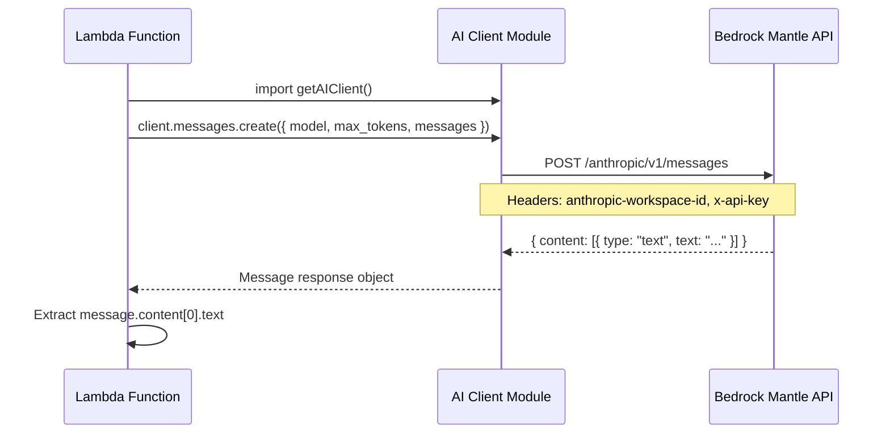

# Design Document: Bedrock Mantle Migration

## Overview

Migrate all AI model invocations from the AWS Bedrock SDK (`@aws-sdk/client-bedrock-runtime` with `InvokeModelCommand`) to the Bedrock Mantle API using `@anthropic-ai/sdk`. This resolves the "invalid model identifier" error with the current Bedrock integration and switches to API-key-based authentication via the Mantle endpoint.

## Main Algorithm/Workflow



## Core Interfaces/Types

```typescript
// Anthropic SDK message response structure (from @anthropic-ai/sdk)
interface MessageResponse {
  id: string;
  type: "message";
  role: "assistant";
  content: ContentBlock[];
  model: string;
  stop_reason: "end_turn" | "max_tokens" | "stop_sequence" | null;
  usage: { input_tokens: number; output_tokens: number };
}

interface ContentBlock {
  type: "text";
  text: string;
}

// AI Client configuration (environment-driven)
interface AIClientConfig {
  baseURL: string;           // https://bedrock-mantle.us-east-1.api.aws/anthropic
  apiKey: string;            // from ANTHROPIC_API_KEY env var
  workspaceId: string;       // from ANTHROPIC_WORKSPACE_ID env var
}

// Model invocation parameters used by both Lambda modules
interface ModelInvocationParams {
  model: string;             // "moonshotai.kimi-k2.5-0613-v1:0" (TBD exact format)
  max_tokens: number;        // 1024 for suggest-tags, 4096 for generate-readme
  messages: { role: "user"; content: string }[];
}
```

## Key Functions with Formal Specifications

### Function 1: getAIClient()

```typescript
function getAIClient(): Anthropic
```

**Preconditions:**
- `process.env.ANTHROPIC_API_KEY` is defined and non-empty
- `process.env.ANTHROPIC_WORKSPACE_ID` is defined and non-empty

**Postconditions:**
- Returns a singleton Anthropic client instance configured with Mantle base URL
- Client includes `anthropic-workspace-id` in default headers
- Subsequent calls return the same instance (singleton pattern)

**Loop Invariants:** N/A

### Function 2: invokeModel() (in suggest-tags)

```typescript
async function invokeModel(prompt: string, maxTokens: number): Promise<string | null>
```

**Preconditions:**
- `prompt` is a non-empty string
- `maxTokens` is a positive integer
- AI client is properly configured

**Postconditions:**
- Returns the text content from the model response, or null on failure
- On success: returned string is `message.content[0].text`
- On error: logs error and returns null (graceful degradation)
- No unhandled exceptions escape this function

**Loop Invariants:** N/A

### Function 3: extractModelContent() (updated for Anthropic SDK)

```typescript
function extractModelContent(message: MessageResponse): string | null
```

**Preconditions:**
- `message` is a valid Anthropic MessageResponse object

**Postconditions:**
- Returns `message.content[0].text` if content array is non-empty and first block is text
- Returns null if content array is empty or first block has no text
- No exceptions thrown (pure extraction)

**Loop Invariants:** N/A

## Algorithmic Pseudocode

### AI Client Initialization

```typescript
import Anthropic from "@anthropic-ai/sdk";

const MODEL_ID = "moonshotai.kimi-k2.5-0613-v1:0"; // exact ID TBD

let clientInstance: Anthropic | null = null;

export function getAIClient(): Anthropic {
  if (!clientInstance) {
    clientInstance = new Anthropic({
      baseURL: "https://bedrock-mantle.us-east-1.api.aws/anthropic",
      apiKey: process.env.ANTHROPIC_API_KEY!,
      defaultHeaders: {
        "anthropic-workspace-id": process.env.ANTHROPIC_WORKSPACE_ID!,
      },
    });
  }
  return clientInstance;
}

export { MODEL_ID };
```

### Suggest Tags - Model Invocation (migrated)

```typescript
// BEFORE (Bedrock SDK):
const command = new InvokeModelCommand({
  modelId: MODEL_ID,
  contentType: "application/json",
  accept: "application/json",
  body: JSON.stringify({ messages: [{ role: "user", content: prompt }], max_tokens: 1024 }),
});
const response = await bedrockClient.send(command);
const responseBody = new TextDecoder().decode(response.body);
const modelOutput = JSON.parse(responseBody);
// Complex field extraction logic...

// AFTER (Anthropic SDK):
const client = getAIClient();
const message = await client.messages.create({
  model: MODEL_ID,
  max_tokens: 1024,
  messages: [{ role: "user", content: prompt }],
});
const content = message.content[0]?.type === "text" ? message.content[0].text : null;
```

### Generate README - Model Invocation (migrated)

```typescript
// BEFORE (Bedrock SDK with timeout):
const abortController = new AbortController();
const timeout = setTimeout(() => abortController.abort(), 30_000);
const command = new InvokeModelCommand({ modelId, contentType, accept, body });
const response = await bedrockClient.send(command, { abortSignal: abortController.signal });

// AFTER (Anthropic SDK with timeout):
const client = getAIClient();
const message = await client.messages.create(
  {
    model: MODEL_ID,
    max_tokens: 4096,
    messages: [{ role: "user", content: prompt }],
  },
  { signal: abortController.signal }
);
const content = message.content[0]?.type === "text" ? message.content[0].text : null;
```

### Response Extraction (simplified)

```typescript
// BEFORE: Complex multi-format parsing
export function extractModelContent(responseBody: string): string | null {
  const modelOutput = JSON.parse(responseBody);
  if (modelOutput.choices?.[0]?.message?.content) return modelOutput.choices[0].message.content;
  if (modelOutput.content && typeof modelOutput.content === "string") return modelOutput.content;
  if (modelOutput.completion) return modelOutput.completion;
  return null;
}

// AFTER: Direct structured access
export function extractModelContent(message: { content: Array<{ type: string; text?: string }> }): string | null {
  if (message.content.length === 0) return null;
  const block = message.content[0];
  if (block.type === "text" && block.text) return block.text;
  return null;
}
```

## Example Usage

```typescript
// ai-client.ts - Shared client module
import Anthropic from "@anthropic-ai/sdk";

const MODEL_ID = "moonshotai.kimi-k2.5-0613-v1:0";

let client: Anthropic | null = null;

export function getAIClient(): Anthropic {
  if (!client) {
    client = new Anthropic({
      baseURL: "https://bedrock-mantle.us-east-1.api.aws/anthropic",
      apiKey: process.env.ANTHROPIC_API_KEY!,
      defaultHeaders: {
        "anthropic-workspace-id": process.env.ANTHROPIC_WORKSPACE_ID!,
      },
    });
  }
  return client;
}

export { MODEL_ID };

// Usage in suggest-tags.ts
import { getAIClient, MODEL_ID } from "./ai-client";

const client = getAIClient();
const message = await client.messages.create({
  model: MODEL_ID,
  max_tokens: 1024,
  messages: [{ role: "user", content: prompt }],
});
const content = message.content[0]?.type === "text" ? message.content[0].text : null;

// Usage in generate-readme.ts
import { getAIClient, MODEL_ID } from "./ai-client";

const client = getAIClient();
const message = await client.messages.create(
  {
    model: MODEL_ID,
    max_tokens: 4096,
    messages: [{ role: "user", content: prompt }],
  },
  { signal: abortController.signal }
);
const content = message.content[0]?.type === "text" ? message.content[0].text : null;
```

## Infrastructure Changes

### Terraform Variables (new)

```hcl
variable "anthropic_api_key" {
  description = "API key for Bedrock Mantle endpoint"
  type        = string
  sensitive   = true
}

variable "anthropic_workspace_id" {
  description = "Workspace ID for Bedrock Mantle"
  type        = string
  sensitive   = true
}
```

### Lambda Environment Variables (updated)

```hcl
# suggest_tags_lambda - add env vars
environment {
  variables = {
    BUCKET_NAME            = aws_s3_bucket.frontend.id
    ANTHROPIC_API_KEY      = var.anthropic_api_key
    ANTHROPIC_WORKSPACE_ID = var.anthropic_workspace_id
  }
}

# process_lambda - add env vars
environment {
  variables = {
    BUCKET_NAME            = aws_s3_bucket.frontend.id
    STAGING_BUCKET         = aws_s3_bucket.staging.id
    ANTHROPIC_API_KEY      = var.anthropic_api_key
    ANTHROPIC_WORKSPACE_ID = var.anthropic_workspace_id
  }
}
```

### IAM Policy Removal

The `lambda_bedrock_policy` resource in `tags.tf` will be modified to remove the `bedrock:InvokeModel` statement (keeping the S3 `GetObject` permission for tag registry access).

## Correctness Properties

*A property is a characteristic or behavior that should hold true across all valid executions of a system — essentially, a formal statement about what the system should do. Properties serve as the bridge between human-readable specifications and machine-verifiable correctness guarantees.*

### Property 1: Response extraction consistency

*For any* valid Anthropic MessageResponse with at least one text content block, `extractModelContent` SHALL return the text field of the first content block.

**Validates: Requirements 4.2**

### Property 2: Graceful degradation on AI failure

*For any* error thrown during `client.messages.create()`, both Lambda handlers SHALL return a valid HTTP response (200 with empty/default result for suggest-tags, empty readme with warning for generate-readme) rather than propagating the error as a 500.

**Validates: Requirements 5.1, 5.2**

### Property 3: Client singleton identity

*For any* number of calls to `getAIClient()` within the same Lambda execution context, the function SHALL return the same Anthropic client instance (referential equality).

**Validates: Requirements 1.5**

### Property 4: Tag filtering correctness

*For any* set of AI-suggested tags and any tag registry, the output of the suggest-tags handler SHALL only contain tags present in the registry (case-insensitive comparison) and SHALL contain at most 10 items.

**Validates: Requirements 2.3**
