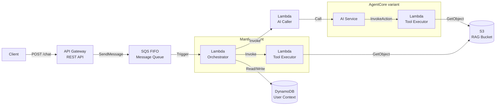
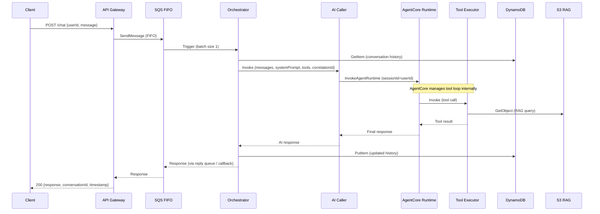
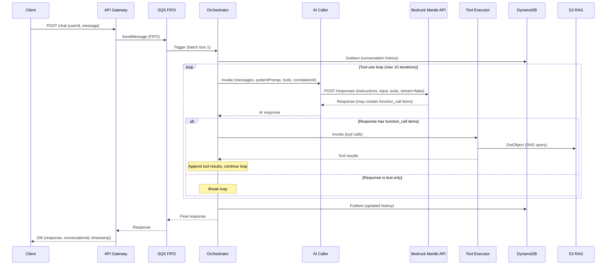

# Design Document: Chatbot RAG Templates

## Overview

This design delivers two complete, deployable project templates for the internal repositories platform that bootstrap chatbot applications with Retrieval-Augmented Generation (RAG). Both templates share an identical serverless architecture — API Gateway → SQS FIFO → Orchestrator Lambda → AI Caller Lambda → Tool Executor Lambda — with DynamoDB for conversation context and S3 for RAG documents. They differ only in the AI service integration layer:

- **chatbot-rag-agentcore**: Uses AWS Bedrock AgentCore Runtime, where the runtime manages the tool-use loop and directly invokes the Tool Executor Lambda as an action group.
- **chatbot-rag-mantle**: Uses Bedrock Mantle API (`POST /responses` endpoint via OpenAI Python SDK), where the Orchestrator manages the tool-use loop by iteratively calling the AI Caller and Tool Executor.

### Key Design Decisions

1. **Non-streaming architecture**: Both templates use synchronous request-response via SQS FIFO for simplicity, ordering guarantees, and compatibility with downstream integrations. The 29-second API Gateway timeout provides the upper bound.
2. **Shared folder structure, divergent AI layer**: The templates maximize code reuse — orchestrator logic, tool executor, logging utilities, and all Terraform modules (except the AI-specific resources) are structurally identical. This enables developers to compare the two approaches side by side.
3. **Configurable naming via tfvars**: All AWS resource names use the pattern `{prefix}-{function}`, injected via a single `project_prefix` variable. This allows multiple deployments without name collisions.
4. **Structured JSON logging with aws-lambda-powertools**: All Lambda functions use the `aws-lambda-powertools` Python package for structured JSON logging with built-in correlation ID support, tracing, and log enrichment. AI interactions are tagged with a dedicated `logType: "ai-interaction"` field for filtering.
5. **Python Lambda code**: Python was chosen for broad AI/ML library support (boto3, openai SDK) and team familiarity.
6. **Separate Lambda folders with shared Lambda Layer**: Each Lambda function has its own subfolder under `src/` with its own handler and requirements. Shared utilities (logging configuration, data models) live in a Lambda Layer deployed alongside the functions.
7. **REST API with OpenAPI specification**: API Gateway uses a REST API (not HTTP API) driven by an OpenAPI 3.0 spec file. All API changes are made in the OpenAPI file; Terraform only references it.
8. **Modular Terraform with environment/modules split**: Infrastructure code is organized into `environment/` (per-env configurations) and `modules/` (reusable service modules). Each Lambda function gets its own isolated module with dedicated IAM, variables, and resource definitions.
9. **Templates stored in `/templates/` directory**: The templates live in the project repository under `/templates/chatbot-rag-agentcore/` and `/templates/chatbot-rag-mantle/`, following the platform's template artifact structure for upload to S3.

## Architecture

### High-Level Architecture (Both Templates)



### Request Flow — AgentCore Template



### Request Flow — Mantle Template



## Components and Interfaces

### Template File Structure

Both templates follow the same artifact structure, differing only in AI-specific code:

```
templates/
├── chatbot-rag-agentcore/
│   ├── README.md
│   ├── metadata.json
│   ├── .gitignore                         # Excludes build/ and .terraform/
│   ├── build/                             # Zip artifacts (gitignored)
│   │   ├── orchestrator.zip
│   │   ├── ai_caller.zip
│   │   ├── tool_executor.zip
│   │   └── shared-layer.zip
│   ├── src/
│   │   ├── layers/
│   │   │   └── shared/                    # Lambda Layer for shared utilities
│   │   │       ├── python/
│   │   │       │   └── shared/
│   │   │       │       ├── __init__.py
│   │   │       │       ├── logging_config.py   # Powertools logging setup
│   │   │       │       └── models.py           # Shared data models/types
│   │   │       └── requirements.txt       # Layer dependencies (aws-lambda-powertools[all])
│   │   ├── orchestrator/
│   │   │   ├── handler.py
│   │   │   └── requirements.txt
│   │   ├── ai_caller/
│   │   │   ├── handler.py                 # AgentCore Runtime integration
│   │   │   └── requirements.txt
│   │   └── tool_executor/
│   │       ├── handler.py
│   │       └── requirements.txt
│   └── infra/
│       ├── openapi/
│       │   └── api-spec.json              # OpenAPI 3.0 spec defining the chatbot API
│       ├── environment/
│       │   ├── dev/
│       │   │   ├── main.tf
│       │   │   ├── variables.tf
│       │   │   ├── outputs.tf
│       │   │   ├── backend.tf
│       │   │   └── terraform.tfvars.example
│       │   ├── staging/
│       │   │   └── ...
│       │   └── prod/
│       │       └── ...
│       └── modules/
│           ├── api_gateway/
│           │   ├── main.tf                # REST API referencing OpenAPI spec
│           │   ├── variables.tf
│           │   └── outputs.tf
│           ├── sqs/
│           │   ├── main.tf
│           │   ├── variables.tf
│           │   └── outputs.tf
│           ├── lambda/
│           │   ├── orchestrator/
│           │   │   ├── lambda.tf
│           │   │   ├── iam.tf
│           │   │   └── variables.tf
│           │   ├── ai_caller/
│           │   │   ├── lambda.tf
│           │   │   ├── iam.tf
│           │   │   └── variables.tf
│           │   ├── tool_executor/
│           │   │   ├── lambda.tf
│           │   │   ├── iam.tf
│           │   │   └── variables.tf
│           │   └── shared_layer/
│           │       ├── lambda_layer.tf
│           │       └── variables.tf
│           ├── dynamodb/
│           │   ├── main.tf
│           │   ├── variables.tf
│           │   └── outputs.tf
│           ├── s3/
│           │   ├── main.tf
│           │   ├── variables.tf
│           │   └── outputs.tf
│           └── agentcore/                 # AgentCore-specific resources
│               ├── main.tf
│               ├── variables.tf
│               └── outputs.tf
│
└── chatbot-rag-mantle/
    ├── README.md
    ├── metadata.json
    ├── .gitignore                         # Excludes build/ and .terraform/
    ├── build/                             # Zip artifacts (gitignored)
    │   ├── orchestrator.zip
    │   ├── ai_caller.zip
    │   ├── tool_executor.zip
    │   └── shared-layer.zip
    ├── src/
    │   ├── layers/
    │   │   └── shared/
    │   │       ├── python/
    │   │       │   └── shared/
    │   │       │       ├── __init__.py
    │   │       │       ├── logging_config.py
    │   │       │       └── models.py
    │   │       └── requirements.txt
    │   ├── orchestrator/
    │   │   ├── handler.py                 # Includes tool-use loop logic
    │   │   └── requirements.txt
    │   ├── ai_caller/
    │   │   ├── handler.py                 # Mantle API / OpenAI SDK integration
    │   │   └── requirements.txt
    │   └── tool_executor/
    │       ├── handler.py
    │       └── requirements.txt
    └── infra/
        ├── openapi/
        │   └── api-spec.json
        ├── environment/
        │   ├── dev/
        │   │   ├── main.tf
        │   │   ├── variables.tf
        │   │   ├── outputs.tf
        │   │   ├── backend.tf
        │   │   └── terraform.tfvars.example
        │   ├── staging/
        │   │   └── ...
        │   └── prod/
        │       └── ...
        └── modules/
            ├── api_gateway/
            │   ├── main.tf
            │   ├── variables.tf
            │   └── outputs.tf
            ├── sqs/
            │   ├── main.tf
            │   ├── variables.tf
            │   └── outputs.tf
            ├── lambda/
            │   ├── orchestrator/
            │   │   ├── lambda.tf
            │   │   ├── iam.tf
            │   │   └── variables.tf
            │   ├── ai_caller/
            │   │   ├── lambda.tf
            │   │   ├── iam.tf
            │   │   └── variables.tf
            │   ├── tool_executor/
            │   │   ├── lambda.tf
            │   │   ├── iam.tf
            │   │   └── variables.tf
            │   └── shared_layer/
            │       ├── lambda_layer.tf
            │       └── variables.tf
            ├── dynamodb/
            │   ├── main.tf
            │   ├── variables.tf
            │   └── outputs.tf
            ├── s3/
            │   ├── main.tf
            │   ├── variables.tf
            │   └── outputs.tf
            └── iam.tf                     # Mantle has no agentcore module
```

### Python Module Interfaces

#### `src/layers/shared/python/shared/logging_config.py` (shared Lambda Layer)

```python
"""Logging configuration using aws-lambda-powertools."""

from aws_lambda_powertools import Logger, Tracer
from aws_lambda_powertools.logging import correlation_paths

# Shared logger instance — each Lambda imports and configures with its own service name
def get_logger(service_name: str) -> Logger:
    """Create a Powertools Logger with structured JSON output and correlation ID support."""
    return Logger(service=service_name, log_uncaught_exceptions=True)

def get_tracer(service_name: str) -> Tracer:
    """Create a Powertools Tracer for X-Ray integration."""
    return Tracer(service=service_name)

def log_ai_interaction(logger: Logger, **kwargs) -> None:
    """
    Log an AI interaction entry with logType='ai-interaction'.
    
    Appends structured fields (model, tokens, latency, etc.) to the logger
    and emits an INFO-level log entry for AI-specific filtering.
    """
    logger.info(
        "AI interaction",
        extra={
            "logType": "ai-interaction",
            **kwargs
        }
    )
```

#### `src/layers/shared/python/shared/models.py` (shared Lambda Layer)

```python
"""Shared data models and types used across Lambda functions."""

from dataclasses import dataclass, field
from typing import Optional, List

@dataclass
class ChatMessage:
    """Represents a single message in a conversation."""
    role: str  # "user" | "assistant" | "tool"
    content: str
    timestamp: str
    tool_calls: Optional[List[dict]] = None
    tool_results: Optional[List[dict]] = None

@dataclass
class ChatRequest:
    """Incoming chat request from API Gateway."""
    user_id: str
    message: str
    correlation_id: str
    timestamp: str
```

#### `src/orchestrator/handler.py` (common structure)

```python
"""Orchestrator Lambda — manages conversation flow and coordinates AI calls."""

import json
import os
import time
import boto3
from shared.logging_config import get_logger, log_ai_interaction
from shared.models import ChatMessage

logger = get_logger("orchestrator")

# Configuration
MAX_CONVERSATION_HISTORY = int(os.environ.get("MAX_CONVERSATION_HISTORY", "50"))
MAX_RETRY_ATTEMPTS = int(os.environ.get("MAX_RETRY_ATTEMPTS", "3"))
MAX_TOOL_ITERATIONS = int(os.environ.get("MAX_TOOL_ITERATIONS", "10"))  # Mantle only

@logger.inject_lambda_context(correlation_id_path="Records[0].body.correlationId")
def handler(event, context):
    """SQS trigger handler — processes one message at a time."""
    ...

def retrieve_conversation_history(user_id: str) -> list:
    """Retrieve conversation history from DynamoDB, trimmed to max length."""
    ...

def save_conversation_history(user_id: str, messages: list) -> None:
    """Append messages to conversation history in DynamoDB."""
    ...

def invoke_ai_caller(payload: dict) -> dict:
    """Synchronously invoke the AI Caller Lambda."""
    ...

def invoke_tool_executor(tool_calls: list) -> list:
    """Invoke the Tool Executor Lambda for each tool call."""
    ...  # Only in Mantle variant
```

#### `src/ai_caller/handler.py` — AgentCore variant

```python
"""AI Caller Lambda — invokes Bedrock AgentCore Runtime."""

import json
import os
import time
import boto3
from shared.logging_config import get_logger, log_ai_interaction

logger = get_logger("ai_caller")

# PLACEHOLDER: Replace this system prompt with your own instructions.
SYSTEM_PROMPT = "You are a helpful assistant. Replace this prompt with your own instructions."

AGENT_RUNTIME_ARN = os.environ["AGENT_RUNTIME_ARN"]
AGENT_ALIAS_ID = os.environ.get("AGENT_ALIAS_ID", "TSTALIASID")

@logger.inject_lambda_context
def handler(event, context):
    """Invoke AgentCore Runtime with conversation and return response."""
    correlation_id = event.get("correlationId")
    logger.set_correlation_id(correlation_id)
    ...

def invoke_agentcore(session_id: str, messages: list) -> dict:
    """Call AgentCore Runtime API with session management."""
    start_time = time.time()
    # ... invoke AgentCore ...
    latency_ms = int((time.time() - start_time) * 1000)
    
    log_ai_interaction(
        logger,
        model="agentcore",
        inputTokens=response.get("inputTokens"),
        outputTokens=response.get("outputTokens"),
        totalTokens=response.get("totalTokens"),
        latencyMs=latency_ms,
        finishReason=response.get("finishReason"),
    )
    return response
```

#### `src/ai_caller/handler.py` — Mantle variant

```python
"""AI Caller Lambda — invokes Bedrock Mantle API via OpenAI SDK."""

import json
import os
import time
from openai import OpenAI
from shared.logging_config import get_logger, log_ai_interaction

logger = get_logger("ai_caller")

# PLACEHOLDER: Replace this system prompt with your own instructions.
SYSTEM_PROMPT = "You are a helpful assistant. Replace this prompt with your own instructions."

MANTLE_BASE_URL = os.environ.get("MANTLE_BASE_URL", "https://bedrock-mantle.us-east-1.api.aws/v1")
MODEL_ID = os.environ["MODEL_ID"]

@logger.inject_lambda_context
def handler(event, context):
    """Invoke Mantle API with conversation and return response."""
    correlation_id = event.get("correlationId")
    logger.set_correlation_id(correlation_id)
    ...

def invoke_mantle(messages: list, tools: list) -> dict:
    """Call Mantle POST /responses with OpenAI SDK (stream=False)."""
    start_time = time.time()
    
    client = OpenAI(
        base_url=MANTLE_BASE_URL,
        api_key="bedrock",  # AWS auth handled by SDK credentials
        default_headers={"OpenAI-Project": "default"},
    )
    response = client.responses.create(
        model=MODEL_ID,
        instructions=SYSTEM_PROMPT,
        input=messages,
        tools=tools,
        stream=False,
    )
    
    latency_ms = int((time.time() - start_time) * 1000)
    log_ai_interaction(
        logger,
        model=MODEL_ID,
        inputTokens=response.usage.input_tokens if response.usage else None,
        outputTokens=response.usage.output_tokens if response.usage else None,
        totalTokens=response.usage.total_tokens if response.usage else None,
        latencyMs=latency_ms,
        finishReason=response.choices[0].finish_reason if response.choices else None,
    )
    return response
```

#### `src/tool_executor/handler.py` (shared)

```python
"""Tool Executor Lambda — executes tool calls (RAG search)."""

import json
import os
import boto3
from shared.logging_config import get_logger

logger = get_logger("tool_executor")

RAG_BUCKET = os.environ["RAG_BUCKET_NAME"]

@logger.inject_lambda_context
def handler(event, context):
    """Execute the requested tool and return results."""
    correlation_id = event.get("correlationId")
    logger.set_correlation_id(correlation_id)
    ...

def search_knowledge_base(query: str) -> str:
    """
    Placeholder tool: searches the RAG bucket by key prefix.
    
    # TODO: Replace this section with your document retrieval logic.
    # Currently reads objects matching the query as a key prefix.
    # Consider adding: vector similarity search, document chunking,
    # relevance filtering, and response formatting.
    """
    ...
```

### Template README Structure

Each template includes a `README.md` at the root with the following structure:

```markdown
# Chatbot RAG Template — Bedrock AgentCore Runtime
(or: # Chatbot RAG Template — Bedrock Mantle API)

## Overview
Brief description of what this template deploys and the AI service it uses.

## Architecture
High-level description of the components: API Gateway, SQS FIFO, 
Orchestrator Lambda, AI Caller Lambda, Tool Executor Lambda, DynamoDB, S3.
Reference to the architecture diagram.

## Prerequisites
- AWS account with Bedrock model access enabled
- Terraform >= 1.5
- Python 3.12
- AWS CLI configured with appropriate credentials

## Project Structure
Explanation of the folder layout (src/, infra/, build/, openapi/).

## Configuration

### Terraform Variables
How to copy terraform.tfvars.example and fill in values.

### System Prompt
Exact file path (src/ai_caller/handler.py) and constant name (SYSTEM_PROMPT)
where the developer should replace the placeholder.

### AI Model
How to set the model_id variable for the chosen foundation model.

## Deployment

### 1. Install Dependencies
pip install commands for each Lambda and the shared layer.

### 2. Configure Environment
Copy tfvars example, fill in values.

### 3. Deploy
terraform init / plan / apply commands from the environment folder.

## RAG Knowledge Base
Purpose of the S3 RAG bucket, supported document formats (.txt, .md, .pdf),
how to upload documents via AWS CLI.

## Logging & Observability
Explanation of structured JSON logs via aws-lambda-powertools,
correlation ID tracing, and the logType: "ai-interaction" filter.

## Customization
Guidance on adding new tools, modifying the orchestration flow,
and extending the OpenAPI spec for new endpoints.
```

### OpenAPI Specification

The REST API is defined via an OpenAPI 3.0 specification file at `infra/openapi/api-spec.json`. Terraform references this file to deploy the API Gateway REST API — all endpoint changes are made in the OpenAPI spec, not in Terraform.

```json
{
  "openapi": "3.0.1",
  "info": {
    "title": "${project_prefix}-chatbot-api",
    "description": "Chatbot RAG API",
    "version": "1.0.0"
  },
  "paths": {
    "/chat": {
      "post": {
        "summary": "Send a chat message",
        "operationId": "postChat",
        "requestBody": {
          "required": true,
          "content": {
            "application/json": {
              "schema": {
                "type": "object",
                "required": ["userId", "message"],
                "properties": {
                  "userId": { "type": "string" },
                  "message": { "type": "string" }
                }
              }
            }
          }
        },
        "responses": {
          "200": {
            "description": "Successful response",
            "content": {
              "application/json": {
                "schema": {
                  "type": "object",
                  "properties": {
                    "response": { "type": "string" },
                    "conversationId": { "type": "string" },
                    "timestamp": { "type": "string", "format": "date-time" }
                  }
                }
              }
            }
          },
          "400": { "description": "Invalid request" },
          "500": { "description": "Server error" }
        },
        "x-amazon-apigateway-integration": {
          "type": "aws",
          "uri": "arn:aws:apigateway:${region}:sqs:action/SendMessage",
          "httpMethod": "POST",
          "requestParameters": {
            "integration.request.querystring.QueueUrl": "'${sqs_queue_url}'",
            "integration.request.querystring.MessageGroupId": "method.request.body.userId"
          },
          "responses": {
            "default": { "statusCode": "200" }
          }
        }
      }
    }
  }
}
```

### Terraform Module Structure

#### Environment Configuration

Each environment folder (`environment/dev/`, `environment/staging/`, `environment/prod/`) contains a `main.tf` that references the shared modules:

```hcl
# environment/dev/main.tf
terraform {
  required_providers {
    aws = {
      source  = "hashicorp/aws"
      version = "~> 6.0"
    }
  }
}

provider "aws" {
  region = var.aws_region
}

module "api_gateway" {
  source          = "../../modules/api_gateway"
  project_prefix  = var.project_prefix
  openapi_spec    = file("${path.root}/../../openapi/api-spec.json")
  aws_region      = var.aws_region
  sqs_queue_url   = module.sqs.queue_url
}

module "sqs" {
  source         = "../../modules/sqs"
  project_prefix = var.project_prefix
}

module "orchestrator" {
  source             = "../../modules/lambda/orchestrator"
  project_prefix     = var.project_prefix
  sqs_queue_arn      = module.sqs.queue_arn
  dynamodb_table_arn = module.dynamodb.table_arn
  ai_caller_arn      = module.ai_caller.function_arn
  tool_executor_arn  = module.tool_executor.function_arn
  shared_layer_arn   = module.shared_layer.layer_arn
  # ...
}

module "ai_caller" {
  source           = "../../modules/lambda/ai_caller"
  project_prefix   = var.project_prefix
  shared_layer_arn = module.shared_layer.layer_arn
  # ...
}

module "tool_executor" {
  source           = "../../modules/lambda/tool_executor"
  project_prefix   = var.project_prefix
  rag_bucket_arn   = module.s3.bucket_arn
  shared_layer_arn = module.shared_layer.layer_arn
  # ...
}

module "shared_layer" {
  source         = "../../modules/lambda/shared_layer"
  project_prefix = var.project_prefix
}

module "dynamodb" {
  source         = "../../modules/dynamodb"
  project_prefix = var.project_prefix
}

module "s3" {
  source         = "../../modules/s3"
  project_prefix = var.project_prefix
}

# AgentCore template only:
module "agentcore" {
  source              = "../../modules/agentcore"
  project_prefix      = var.project_prefix
  tool_executor_arn   = module.tool_executor.function_arn
  model_id            = var.model_id
}
```

#### Module: API Gateway (REST API with OpenAPI)

```hcl
# modules/api_gateway/main.tf
resource "aws_api_gateway_rest_api" "chatbot" {
  name        = "${var.project_prefix}-entry-api"
  description = "Chatbot RAG REST API"
  body        = var.openapi_spec

  endpoint_configuration {
    types = ["REGIONAL"]
  }
}

resource "aws_api_gateway_deployment" "chatbot" {
  rest_api_id = aws_api_gateway_rest_api.chatbot.id

  triggers = {
    redeployment = sha256(var.openapi_spec)
  }

  lifecycle {
    create_before_destroy = true
  }
}

resource "aws_api_gateway_stage" "chatbot" {
  deployment_id = aws_api_gateway_deployment.chatbot.id
  rest_api_id   = aws_api_gateway_rest_api.chatbot.id
  stage_name    = var.stage_name
}
```

#### Module: Lambda (example — orchestrator)

```hcl
# modules/lambda/orchestrator/lambda.tf

data "archive_file" "orchestrator" {
  type        = "zip"
  source_dir  = "${path.root}/../../../src/orchestrator"
  output_path = "${path.root}/../../../build/orchestrator.zip"
}

resource "aws_lambda_function" "orchestrator" {
  function_name    = "${var.project_prefix}-orchestrator"
  runtime          = "python3.12"
  handler          = "handler.handler"
  filename         = data.archive_file.orchestrator.output_path
  source_code_hash = data.archive_file.orchestrator.output_base64sha256
  role             = aws_iam_role.orchestrator.arn
  timeout          = 30

  layers = [var.shared_layer_arn]

  environment {
    variables = {
      MAX_CONVERSATION_HISTORY = var.max_conversation_history
      MAX_RETRY_ATTEMPTS       = var.max_retry_attempts
      MAX_TOOL_ITERATIONS      = var.max_tool_iterations
      AI_CALLER_FUNCTION_NAME  = var.ai_caller_function_name
      TOOL_EXECUTOR_FUNCTION_NAME = var.tool_executor_function_name
      DYNAMODB_TABLE_NAME      = var.dynamodb_table_name
      POWERTOOLS_SERVICE_NAME  = "orchestrator"
      POWERTOOLS_LOG_LEVEL     = var.log_level
    }
  }
}
```

```hcl
# modules/lambda/orchestrator/iam.tf
resource "aws_iam_role" "orchestrator" {
  name = "${var.project_prefix}-orchestrator-role"
  assume_role_policy = data.aws_iam_policy_document.lambda_assume.json
}

resource "aws_iam_role_policy" "orchestrator" {
  role   = aws_iam_role.orchestrator.id
  policy = data.aws_iam_policy_document.orchestrator_permissions.json
}

data "aws_iam_policy_document" "orchestrator_permissions" {
  statement {
    effect = "Allow"
    actions = [
      "sqs:ReceiveMessage",
      "sqs:DeleteMessage",
      "sqs:GetQueueAttributes",
    ]
    resources = [var.sqs_queue_arn]
  }
  statement {
    effect = "Allow"
    actions = [
      "dynamodb:GetItem",
      "dynamodb:PutItem",
    ]
    resources = [var.dynamodb_table_arn]
  }
  statement {
    effect = "Allow"
    actions = ["lambda:InvokeFunction"]
    resources = [
      var.ai_caller_arn,
      var.tool_executor_arn,
    ]
  }
}
```

#### Module: Shared Lambda Layer

```hcl
# modules/lambda/shared_layer/lambda_layer.tf

data "archive_file" "shared_layer" {
  type        = "zip"
  source_dir  = "${path.root}/../../../src/layers/shared"
  output_path = "${path.root}/../../../build/shared-layer.zip"
}

resource "aws_lambda_layer_version" "shared" {
  layer_name               = "${var.project_prefix}-shared-layer"
  filename                 = data.archive_file.shared_layer.output_path
  source_code_hash         = data.archive_file.shared_layer.output_base64sha256
  compatible_runtimes      = ["python3.12"]
  description              = "Shared utilities: powertools logging, data models"
}
```

#### Shared Resources (both templates)

| Resource | Terraform Module | Naming Pattern |
|----------|-----------------|----------------|
| API Gateway REST API | `modules/api_gateway/` | `{prefix}-entry-api` |
| SQS FIFO Queue | `modules/sqs/` | `{prefix}-message-queue.fifo` |
| Orchestrator Lambda | `modules/lambda/orchestrator/` | `{prefix}-orchestrator` |
| AI Caller Lambda | `modules/lambda/ai_caller/` | `{prefix}-ai-caller` |
| Tool Executor Lambda | `modules/lambda/tool_executor/` | `{prefix}-tool-executor` |
| Shared Lambda Layer | `modules/lambda/shared_layer/` | `{prefix}-shared-layer` |
| DynamoDB Table | `modules/dynamodb/` | `{prefix}-user-context` |
| S3 RAG Bucket | `modules/s3/` | `{prefix}-rag-documents` |

#### AgentCore-Specific Resources

| Resource | Terraform Module | Description |
|----------|-----------------|-------------|
| `aws_bedrockagentcore_agent_runtime` | `modules/agentcore/` | Agent runtime deployment |
| Agent alias | `modules/agentcore/` | Points to latest runtime version |
| Action group (Tool Executor) | `modules/agentcore/` | Registers Tool Executor Lambda ARN |

#### Lambda Build & Packaging

Lambda functions and the shared layer are packaged using Terraform's `archive_file` data source. Each module zips its corresponding `src/` directory and outputs the zip to a `build/` folder at the template root. This approach:

- Keeps build artifacts out of source control via `.gitignore`
- Automatically detects source changes via `source_code_hash` (triggers redeployment)
- Requires no external build tools — `terraform apply` handles everything

**Build output structure:**
```
build/
├── orchestrator.zip       # From src/orchestrator/
├── ai_caller.zip          # From src/ai_caller/
├── tool_executor.zip      # From src/tool_executor/
└── shared-layer.zip       # From src/layers/shared/
```

**`.gitignore` (template root):**
```
# Terraform
.terraform/
*.tfstate
*.tfstate.backup
.terraform.lock.hcl
*.tfplan
crash.log
override.tf
override.tf.json
*_override.tf
*_override.tf.json

# Build artifacts
build/
*.zip

# Python
__pycache__/
*.pyc
*.pyo
*.pyd
.pytest_cache/
*.egg-info/
*.egg
dist/
.venv/
venv/
env/
.env
.env.*

# IDE
.idea/
.vscode/
*.swp
*.swo
*~

# OS
.DS_Store
Thumbs.db

# Installed dependencies (packaged into Lambda at deploy time)
src/*/package/
src/layers/shared/python/shared/__pycache__/
```

**Note on dependencies:** For Lambda functions that require third-party packages (e.g., `openai` SDK in the Mantle ai_caller), dependencies must be installed into the function's source directory before `terraform apply` (e.g., `pip install -r requirements.txt -t src/ai_caller/`). The shared layer's `python/` directory structure already follows the Lambda Layer convention so that `aws-lambda-powertools` is importable at runtime. The README documents this pre-deployment step.

#### Key Terraform Variables

```hcl
variable "project_prefix" {
  description = "Prefix for all resource names (e.g., 'mybot')"
  type        = string
}

variable "aws_region" {
  description = "AWS region for deployment"
  type        = string
  default     = "us-east-1"
}

variable "aws_account_id" {
  description = "AWS account ID for ARN construction"
  type        = string
}

variable "model_id" {
  description = "AI model identifier (e.g., 'anthropic.claude-3-sonnet-20240229-v1:0')"
  type        = string
  default     = "your-model-id"  # Replace with an available Bedrock model
}

variable "max_conversation_history" {
  description = "Maximum number of messages to retain in conversation context"
  type        = number
  default     = 50
}

variable "max_retry_attempts" {
  description = "Maximum retry attempts for Orchestrator message processing"
  type        = number
  default     = 3
}

variable "log_level" {
  description = "Powertools log level (DEBUG, INFO, WARNING, ERROR)"
  type        = string
  default     = "INFO"
}

# Mantle-specific
variable "mantle_base_url" {
  description = "Bedrock Mantle API base URL"
  type        = string
  default     = "https://bedrock-mantle.us-east-1.api.aws/v1"
}
```

## Data Models

### DynamoDB Table Schema (User Context)

| Attribute | Type | Key | Description |
|-----------|------|-----|-------------|
| `userId` | String | Partition Key | User identifier |
| `messages` | List | — | Ordered list of conversation messages |
| `updatedAt` | String | — | ISO 8601 timestamp of last update |
| `createdAt` | String | — | ISO 8601 timestamp of first message |

**Message Item Structure:**
```json
{
  "role": "user|assistant|tool",
  "content": "message text",
  "timestamp": "2024-01-15T10:30:00Z",
  "toolCalls": [{"name": "search_knowledge_base", "arguments": {"query": "..."}}],
  "toolResults": [{"name": "search_knowledge_base", "result": "..."}]
}
```

### API Gateway Request/Response

**Request (POST /chat):**
```json
{
  "userId": "user-123",
  "message": "What documents do you have about security policies?"
}
```

**Success Response (200):**
```json
{
  "response": "Based on the documents in the knowledge base...",
  "conversationId": "user-123",
  "timestamp": "2024-01-15T10:30:45Z"
}
```

**Error Response (5xx/timeout):**
```json
{
  "error": true,
  "correlationId": "msg-abc-123",
  "message": "AI service error: model returned an error response"
}
```

### SQS FIFO Message Format

```json
{
  "MessageBody": {
    "userId": "user-123",
    "message": "Hello",
    "correlationId": "req-uuid-here",
    "timestamp": "2024-01-15T10:30:00Z"
  },
  "MessageGroupId": "user-123",
  "MessageDeduplicationId": "req-uuid-here"
}
```

### metadata.json (Template Metadata)

**AgentCore variant:**
```json
{
  "name": "chatbot-rag-agentcore",
  "description": "Chatbot template with RAG using Bedrock AgentCore Runtime for AI orchestration",
  "tags": ["chatbot", "rag", "python", "terraform", "bedrock-agentcore"],
  "date": "2024-01-15"
}
```

**Mantle variant:**
```json
{
  "name": "chatbot-rag-mantle",
  "description": "Chatbot template with RAG using Bedrock Mantle API (OpenAI-compatible)",
  "tags": ["chatbot", "rag", "python", "terraform", "bedrock-mantle"],
  "date": "2024-01-15"
}
```

### Structured Log Format (aws-lambda-powertools)

```json
{
  "level": "INFO",
  "location": "handler:42",
  "message": "AI interaction",
  "timestamp": "2024-01-15T10:30:00.123+00:00",
  "service": "ai_caller",
  "correlation_id": "msg-abc-123",
  "xray_trace_id": "1-abc-def",
  "logType": "ai-interaction",
  "model": "anthropic.claude-3-sonnet-20240229-v1:0",
  "inputTokens": 1250,
  "outputTokens": 340,
  "totalTokens": 1590,
  "latencyMs": 2340,
  "finishReason": "end_turn"
}
```

### Lambda Layer Dependencies

```
# src/layers/shared/requirements.txt
aws-lambda-powertools[all]==3.4.0
```

Each Lambda's own `requirements.txt` contains only function-specific dependencies:

```
# src/orchestrator/requirements.txt
boto3>=1.34.0,<2.0.0

# src/ai_caller/requirements.txt (AgentCore variant)
boto3>=1.34.0,<2.0.0

# src/ai_caller/requirements.txt (Mantle variant)
openai>=1.50.0,<2.0.0

# src/tool_executor/requirements.txt
boto3>=1.34.0,<2.0.0
```

## Correctness Properties

*A property is a characteristic or behavior that should hold true across all valid executions of a system — essentially, a formal statement about what the system should do. Properties serve as the bridge between human-readable specifications and machine-verifiable correctness guarantees.*

### Property 1: Metadata JSON schema validation

*For any* JSON object, the metadata validation logic SHALL accept it if and only if it has: a `name` field matching `/^[a-zA-Z0-9_-]+$/` (1–64 chars), a `description` field (0–200 chars), a `tags` array of 0–50 items each matching `/^[a-z0-9_-]+$/` (1–32 chars), and a `date` field in ISO 8601 "YYYY-MM-DD" format.

**Validates: Requirements 1.6**

### Property 2: Tool-use loop termination

*For any* sequence of AI responses and any configured maximum iteration limit N (where N ≥ 1), the Orchestrator's tool-use loop SHALL terminate after at most N iterations. If all N responses contain function_call items, it SHALL return an error indicating the maximum was reached. If a response with no function_call items is received at iteration K ≤ N, the loop SHALL terminate at iteration K and return the text response.

**Validates: Requirements 6.3, 6.7, 11.3**

### Property 3: Structured JSON log format

*For any* log record with any combination of level (DEBUG, INFO, WARNING, ERROR), message string, and optional extra fields (correlationId, logType, model, tokens), the Powertools Logger SHALL produce a valid JSON string containing at minimum the fields: `timestamp`, `level`, `service`, `correlation_id`, and `message`.

**Validates: Requirements 7.4**

### Property 4: Correlation ID propagation

*For any* correlation ID string received in an upstream event, when the Orchestrator invokes the AI Caller Lambda or Tool Executor Lambda, the invocation payload SHALL contain that same correlation ID value, enabling downstream functions to include it in their log entries.

**Validates: Requirements 7.6**

### Property 5: AI interaction logging completeness

*For any* AI service interaction (request or response), the AI_Caller_Lambda SHALL produce a log entry with `logType: "ai-interaction"` containing: the correlation ID, model identifier, and (for responses) token usage (input, output, total), latency in milliseconds, finish reason, and (when tool calls are present) the count and names of requested tools.

**Validates: Requirements 8.1, 8.2, 8.4, 8.5**

### Property 6: Conversation history trimming preserves recency

*For any* conversation history of length N and any configured maximum M (where M ≥ 1), the trimmed history passed to the AI Caller SHALL have length `min(N, M)`, SHALL contain the M most recent messages (trimming oldest first), and SHALL preserve chronological order.

**Validates: Requirements 9.4**

### Property 7: Conversation history append

*For any* user message string and any AI response string, after processing a message, the Orchestrator SHALL append both the user message (with role "user") and the AI response (with role "assistant") to the conversation history in chronological order, increasing the stored message count by exactly 2.

**Validates: Requirements 9.2**

### Property 8: API success response format

*For any* AI-generated text response, user identifier, and processing timestamp, the Entry_API success response SHALL be a JSON object containing exactly: a `response` field with the AI text, a `conversationId` field matching the user identifier, and a `timestamp` field in ISO 8601 format.

**Validates: Requirements 11.4**

### Property 9: API error response format

*For any* error type (AI service error, timeout, max iterations reached) and any correlation ID string, the Entry_API error response SHALL be a JSON object containing: `error` set to `true`, `correlationId` matching the provided ID, and `message` as a non-empty string describing the failure category.

**Validates: Requirements 11.5**

## Error Handling

| Scenario | Component | Behavior |
|----------|-----------|----------|
| DynamoDB GetItem fails | Orchestrator | Proceed with empty conversation history; log ERROR with userId and correlationId |
| DynamoDB PutItem fails | Orchestrator | Still return AI response to client; log ERROR with userId and correlationId |
| AI service returns error | AI Caller | Raise exception with error code/message; Orchestrator logs ERROR and returns error response |
| AI service timeout | AI Caller | Raise exception with elapsed time; Orchestrator returns timeout error |
| Tool-use loop exceeds max iterations | Orchestrator | Terminate loop; return error response indicating max iterations reached |
| Tool Executor fails | Orchestrator (Mantle) / AgentCore Runtime | Log ERROR; in Mantle variant, return tool error to AI for recovery attempt |
| SQS message processing fails after max retries | Orchestrator | Log ERROR with message body, userId, and attempt count; message goes to DLQ |
| API Gateway timeout (29s) | Entry API | Return timeout error response with correlationId |
| Invalid request body (missing fields) | API Gateway | Return 400 with validation error before SQS (validated via OpenAPI spec request schema) |
| Lambda cold start exceeds timeout | Any Lambda | Standard Lambda timeout behavior; SQS retry on next poll |

### Error Recovery Patterns

- **Graceful degradation on DynamoDB failures**: The orchestrator never blocks on context storage failures — the user still gets their AI response, just without history persistence.
- **Retry via SQS**: If the Orchestrator Lambda fails entirely, SQS automatically retries delivery up to the configured maxReceiveCount before routing to DLQ.
- **AI error propagation**: AI service errors bubble up as structured exceptions containing the original error details, enabling meaningful error responses to the client.
- **Tool-use loop safety valve**: The configurable max iteration limit prevents infinite loops if the model repeatedly requests tools without converging.
- **OpenAPI validation**: The REST API validates request bodies against the OpenAPI schema before forwarding to SQS, rejecting malformed requests early.

## Testing Strategy

### Testing Approach Assessment

This feature involves two categories of code:
1. **Static template artifacts** (Terraform files, README, metadata.json) — best tested with example-based structural tests
2. **Python Lambda application logic** (logging, conversation management, tool-use loop, response formatting) — suitable for property-based testing

PBT is appropriate for the Lambda application logic because it contains pure functions with clear input/output behavior (JSON formatting, history trimming, loop termination) and universal properties that hold across a wide input space.

### Unit Tests (Example-Based)

| Test | Validates |
|------|-----------|
| Template artifact contains correct root directory | Req 1.1 |
| README.md has all required sections | Req 1.2 |
| infra/ contains environment/ and modules/ directories | Req 1.3 |
| src/ contains orchestrator/, ai_caller/, tool_executor/, and layers/ directories | Req 1.4 |
| Layer requirements.txt has pinned aws-lambda-powertools | Req 1.5 |
| Each Lambda folder has its own requirements.txt | Req 1.5 |
| ai_caller handler.py has SYSTEM_PROMPT constant with PLACEHOLDER comment | Req 4.1, 4.2 |
| README has System Prompt customization section | Req 4.3 |
| AgentCore ai_caller invokes correct API with tools | Req 5.1, 5.2 |
| Mantle ai_caller calls responses.create with stream=False | Req 6.1, 6.4 |
| Mantle tools are in OpenAI function format | Req 6.2 |
| AgentCore modules/agentcore/ has required resources | Req 5.4 |
| Mantle environment main.tf has base URL and model variables | Req 6.5 |
| Terraform module resource names follow {prefix}-{function} pattern | Req 3.2 |
| DynamoDB module uses userId partition key | Req 9.3 |
| S3 module has versioning + Block Public Access | Req 10.1 |
| Tool Executor handler.py has search_knowledge_base function | Req 10.4 |
| Tool Executor IAM grants read-only S3 access | Req 10.5 |
| AgentCore README title contains "Bedrock AgentCore Runtime" | Req 12.1 |
| Mantle README title contains "Bedrock Mantle API" | Req 12.2 |
| metadata.json tags include variant-specific tag | Req 12.3 |
| metadata.json description within 200 chars and contains service name | Req 12.4 |
| OpenAPI spec defines POST /chat with required schema | REST API |
| API Gateway module uses `body` parameter with OpenAPI spec | REST API |
| Lambda modules set POWERTOOLS_SERVICE_NAME env var | Logging |
| Shared layer module produces layer with compatible runtime | Layer |

### Property-Based Tests

Property-based tests use **Hypothesis** (Python PBT library) with a minimum of 100 iterations per property.

| Property | Tag |
|----------|-----|
| Metadata JSON schema validation | Feature: chatbot-rag-templates, Property 1: Metadata JSON schema validation |
| Tool-use loop termination | Feature: chatbot-rag-templates, Property 2: Tool-use loop termination |
| Structured JSON log format | Feature: chatbot-rag-templates, Property 3: Structured JSON log format |
| Correlation ID propagation | Feature: chatbot-rag-templates, Property 4: Correlation ID propagation |
| AI interaction logging completeness | Feature: chatbot-rag-templates, Property 5: AI interaction logging completeness |
| Conversation history trimming | Feature: chatbot-rag-templates, Property 6: Conversation history trimming preserves recency |
| Conversation history append | Feature: chatbot-rag-templates, Property 7: Conversation history append |
| API success response format | Feature: chatbot-rag-templates, Property 8: API success response format |
| API error response format | Feature: chatbot-rag-templates, Property 9: API error response format |

### Integration Tests

| Test | Validates |
|------|-----------|
| Template artifact zips correctly and contains all files | Req 1.1–1.6 |
| Terraform validates successfully (`terraform validate`) per environment | Req 2.x, 3.x |
| Template deploys and returns AI response with placeholder prompt | Req 4.4, 5.1, 6.1 |
| End-to-end message flow through SQS to response | Req 11.1 |
| OpenAPI spec is valid and parseable by API Gateway | REST API |

### Edge Case Tests

| Test | Validates |
|------|-----------|
| AgentCore error raises exception with details | Req 5.6 |
| Mantle error raises exception with code and message | Req 6.6 |
| DynamoDB read failure → empty history + ERROR log | Req 9.6 |
| DynamoDB write failure → response still returned + ERROR log | Req 9.7 |
| Max retries exhausted → ERROR log with attempt count | Req 7.5 |
| AI error → ERROR log with elapsed time | Req 8.3 |

### Test Configuration

- **Framework**: pytest
- **PBT Library**: Hypothesis (Python)
- **Mocking**: unittest.mock (boto3, openai SDK, aws-lambda-powertools)
- **Minimum iterations**: 100 per property test (via `@settings(max_examples=100)`)
- **Test location**: `templates/chatbot-rag-agentcore/tests/` and `templates/chatbot-rag-mantle/tests/` for template-specific tests; shared logic tests in a common test module
- **Each property test tagged with**: `# Feature: chatbot-rag-templates, Property N: {title}`
