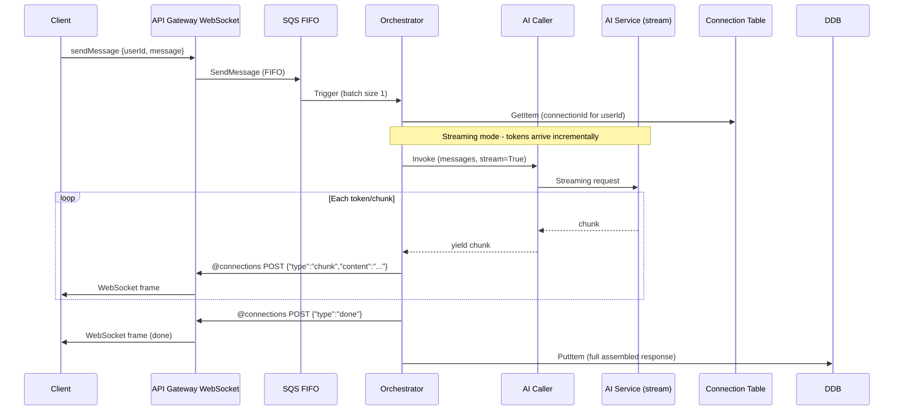
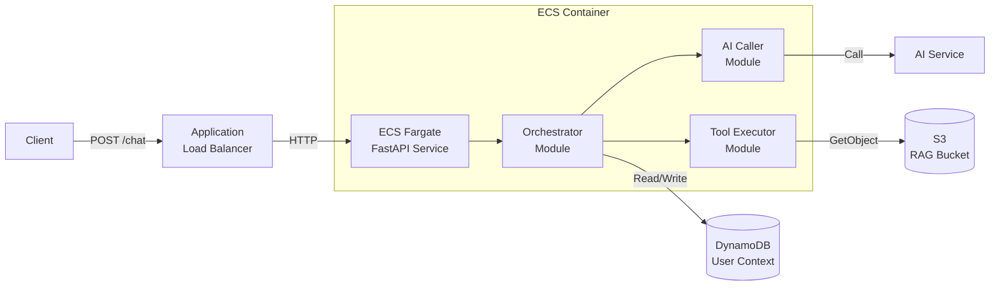

# Design Document: Chatbot Template Variants

## Overview

This design extends the existing two chatbot RAG templates (`chatbot-rag-agentcore` and `chatbot-rag-mantle`) with ten new template variants that expand across three dimensions: **WebSocket transport**, **streaming AI responses**, and **ECS Fargate compute**. Each variant reuses the identical core business logic (orchestration, AI calling, tool execution, conversation context, RAG) while varying the communication protocol, response delivery mode, and compute layer.

### Variant Matrix

| # | Template Name | AI Service | Compute | Transport | Streaming |
|---|---------------|-----------|---------|-----------|-----------|
| 1 | `chatbot-rag-agentcore-ws` | AgentCore | Lambda | WebSocket | No |
| 2 | `chatbot-rag-mantle-ws` | Mantle | Lambda | WebSocket | No |
| 3 | `chatbot-rag-agentcore-ws-streaming` | AgentCore | Lambda | WebSocket | Yes |
| 4 | `chatbot-rag-mantle-ws-streaming` | Mantle | Lambda | WebSocket | Yes |
| 5 | `chatbot-rag-agentcore-ecs` | AgentCore | ECS Fargate | REST | No |
| 6 | `chatbot-rag-mantle-ecs` | Mantle | ECS Fargate | REST | No |
| 7 | `chatbot-rag-agentcore-ecs-ws` | AgentCore | ECS Fargate | WebSocket | No |
| 8 | `chatbot-rag-mantle-ecs-ws` | Mantle | ECS Fargate | WebSocket | No |
| 9 | `chatbot-rag-agentcore-ecs-ws-streaming` | AgentCore | ECS Fargate | WebSocket | Yes |
| 10 | `chatbot-rag-mantle-ecs-ws-streaming` | Mantle | ECS Fargate | WebSocket | Yes |

### Key Design Decisions

1. **Shared core logic, varied infrastructure wiring**: The AI Caller, Tool Executor, and conversation management functions are identical across all variants of the same AI service. Only the transport layer, compute wrapper, and streaming adapter change.
2. **FastAPI for ECS variants**: Python 3.12 with FastAPI provides HTTP + WebSocket handling in a single framework, matching team conventions (uv, ruff, pytest) while supporting async streaming natively.
3. **API Gateway WebSocket for Lambda variants**: AWS API Gateway v2 WebSocket API replaces the REST API for bidirectional communication, with a Connection_Table in DynamoDB for connection tracking.
4. **VPC Link + NLB for ECS WebSocket**: ECS WebSocket variants use API Gateway WebSocket -> VPC Link -> NLB -> ECS, since ALB doesn't support WebSocket route-level integration with API Gateway.
5. **Connection_Table with TTL**: DynamoDB TTL on `expiresAt` provides automatic cleanup of stale connections without scheduled cleanups.
6. **Streaming only over WebSocket**: Streaming variants require WebSocket transport — REST transport cannot progressively deliver tokens. This eliminates REST+streaming combinations.
7. **Single-container architecture for ECS**: All modules (orchestrator, ai_caller, tool_executor) run in one container communicating via in-process calls, simplifying deployment and reducing inter-service latency.
8. **Architecture diagrams via Draw.io MCP**: Each template includes a `.drawio` source and `.png` export generated using the Draw.io MCP AWS4 shape library, providing professional architecture visualization.
9. **Self-contained Terraform per variant**: Each template provisions all its own infrastructure (VPC, DynamoDB, IAM, compute) without cross-stack references, enabling isolated parallel deployments.

## Architecture

### Lambda WebSocket Non-Streaming Architecture

```mermaid
graph LR
    Client[Client] -->|WebSocket| APIGW[API Gateway<br/>WebSocket API]
    APIGW -->|$connect| ConnMgr[Lambda<br/>Connection Manager]
    APIGW -->|$disconnect| ConnMgr
    APIGW -->|sendMessage| SQS[SQS FIFO<br/>Message Queue]
    ConnMgr -->|PutItem/DeleteItem| ConnDB[(DynamoDB<br/>Connections)]
    SQS -->|Trigger| Orch[Lambda<br/>Orchestrator]
    Orch -->|Invoke| AICaller[Lambda<br/>AI Caller]
    Orch -->|Read/Write| DDB[(DynamoDB<br/>User Context)]
    Orch -->|@connections POST| APIGW
    AICaller -->|Call| AIService[AI Service]
    AIService -.->|AgentCore: InvokeAction| ToolExec[Lambda<br/>Tool Executor]
    Orch -.->|Mantle: Invoke| ToolExec
    ToolExec -->|GetObject| S3[(S3<br/>RAG Bucket)]
```

### Lambda WebSocket Streaming Architecture



### ECS REST Non-Streaming Architecture



### ECS WebSocket Streaming Architecture

```mermaid
graph LR
    Client[Client] -->|WebSocket| APIGW[API Gateway<br/>WebSocket API]
    APIGW -->|VPC Link| NLB[Network<br/>Load Balancer]
    NLB -->|TCP| ECS[ECS Fargate<br/>FastAPI Service]
    
    subgraph "VPC - Private Subnet"
        ECS --> Orch[Orchestrator<br/>Module]
        Orch --> AICaller[AI Caller<br/>Module]
        Orch --> ToolExec[Tool Executor<br/>Module]
        Orch --> ConnMgr[Connection<br/>Manager]
        Orch --> MsgSender[Message<br/>Sender]
    end
    
    MsgSender -->|@connections POST| APIGW
    AICaller -.->|stream| AIService[AI Service]
    Orch -->|Read/Write| DDB[(DynamoDB<br/>User Context)]
    ConnMgr -->|Read/Write| ConnDB[(DynamoDB<br/>Connections)]
    ToolExec -->|GetObject| S3[(S3<br/>RAG Bucket)]
    ECS -->|NAT GW| Internet[AWS Services]
```

## Components and Interfaces

### Template File Structure — Lambda WebSocket Variant

```
templates/chatbot-rag-{ai_service}-ws[-streaming]/
├── README.md
├── metadata.json
├── pyproject.toml                        # uv project config (dev deps: pytest, ruff, hypothesis)
├── uv.lock                               # Lockfile for reproducibility
├── Makefile                              # build, deploy, test, lint, format
├── .gitignore
├── docs/
│   └── architecture.drawio               # Draw.io MCP generated diagram
│   └── architecture.png                  # Exported PNG
├── build/                                # Zip artifacts (gitignored)
├── tests/
│   ├── unit/
│   │   ├── test_connection_manager.py
│   │   ├── test_message_sender.py
│   │   ├── test_orchestrator.py
│   │   └── test_streaming.py            # streaming variants only
│   └── property/
│       └── test_properties.py
├── src/
│   ├── layers/
│   │   └── shared/
│   │       ├── python/
│   │       │   └── shared/
│   │       │       ├── __init__.py
│   │       │       ├── logging_config.py
│   │       │       ├── models.py
│   │       │       └── message_protocol.py    # WebSocket message format builders
│   │       └── requirements.txt
│   ├── connection_manager/
│   │   ├── handler.py                    # $connect/$disconnect handler
│   │   └── requirements.txt
│   ├── orchestrator/
│   │   ├── handler.py                    # Includes WebSocket response delivery
│   │   └── requirements.txt
│   ├── ai_caller/
│   │   ├── handler.py                    # AgentCore or Mantle integration
│   │   └── requirements.txt
│   └── tool_executor/
│       ├── handler.py
│       └── requirements.txt
└── infra/
    ├── openapi/                           # Not used for WebSocket (routes defined in TF)
    ├── environment/
    │   ├── dev/
    │   │   ├── main.tf
    │   │   ├── variables.tf
    │   │   ├── outputs.tf
    │   │   ├── backend.tf
    │   │   └── terraform.tfvars.example
    │   ├── staging/
    │   └── prod/
    └── modules/
        ├── websocket_api/                # API Gateway v2 WebSocket
        │   ├── main.tf
        │   ├── variables.tf
        │   └── outputs.tf
        ├── sqs/
        ├── lambda/
        │   ├── connection_manager/
        │   │   ├── lambda.tf
        │   │   ├── iam.tf
        │   │   └── variables.tf
        │   ├── orchestrator/
        │   │   ├── lambda.tf
        │   │   ├── iam.tf
        │   │   └── variables.tf
        │   ├── ai_caller/
        │   ├── tool_executor/
        │   └── shared_layer/
        ├── dynamodb/                     # User context + Connection table
        │   ├── main.tf
        │   ├── variables.tf
        │   └── outputs.tf
        ├── s3/
        └── agentcore/                    # AgentCore variants only
```

### Template File Structure — ECS Variant

```
templates/chatbot-rag-{ai_service}-ecs[-ws][-streaming]/
├── README.md
├── metadata.json
├── pyproject.toml                        # App deps: fastapi, uvicorn, boto3, openai/boto3
├── uv.lock
├── Makefile                              # build, deploy, test, lint, format, docker-build, docker-push
├── Dockerfile                            # Multi-stage Python 3.12 slim
├── .gitignore
├── docs/
│   └── architecture.drawio
│   └── architecture.png
├── build/                                # (gitignored)
├── tests/
│   ├── unit/
│   │   ├── test_orchestrator.py
│   │   ├── test_ai_caller.py
│   │   ├── test_health.py
│   │   └── test_streaming.py            # streaming variants only
│   └── property/
│       └── test_properties.py
└── src/
    └── app/
        ├── __init__.py
        ├── main.py                        # FastAPI entry point
        ├── orchestrator.py
        ├── ai_caller.py
        ├── tool_executor.py
        ├── connection_manager.py          # WebSocket variants only
        ├── message_sender.py              # WebSocket variants only
        ├── logging_config.py
        ├── models.py
        └── config.py                      # Environment variable loading
└── infra/
    ├── environment/
    │   ├── dev/
    │   │   ├── main.tf
    │   │   ├── variables.tf
    │   │   ├── outputs.tf
    │   │   ├── backend.tf
    │   │   └── terraform.tfvars.example
    │   ├── staging/
    │   └── prod/
    └── modules/
        ├── vpc/
        │   ├── main.tf                    # VPC, subnets, NAT GW, IGW
        │   ├── variables.tf
        │   └── outputs.tf
        ├── ecs/
        │   ├── cluster.tf
        │   ├── service.tf
        │   ├── task_definition.tf
        │   ├── iam.tf                     # Task role + execution role
        │   ├── security_groups.tf
        │   ├── variables.tf
        │   └── outputs.tf
        ├── ecr/
        │   ├── main.tf
        │   ├── variables.tf
        │   └── outputs.tf
        ├── alb/                           # REST variants only
        │   ├── main.tf
        │   ├── variables.tf
        │   └── outputs.tf
        ├── nlb/                           # WebSocket variants only
        │   ├── main.tf
        │   ├── variables.tf
        │   └── outputs.tf
        ├── websocket_api/                 # WebSocket variants only
        │   ├── main.tf
        │   ├── variables.tf
        │   └── outputs.tf
        ├── dynamodb/
        ├── s3/
        └── agentcore/                     # AgentCore variants only
```

### Python Module Interfaces

#### `src/app/main.py` (ECS Entry Point)

```python
"""FastAPI application entry point for ECS chatbot service."""

import os
import signal
import asyncio
from contextlib import asynccontextmanager
from fastapi import FastAPI, HTTPException, Request
from app.orchestrator import Orchestrator
from app.logging_config import get_logger
from app.models import ChatRequest, ChatResponse, ErrorResponse

logger = get_logger("main")

# Graceful shutdown state
_shutting_down = False

@asynccontextmanager
async def lifespan(app: FastAPI):
    """Manage application lifecycle — setup and graceful shutdown."""
    logger.info("Service starting", extra={"port": os.environ.get("PORT", "8080")})
    yield
    global _shutting_down
    _shutting_down = True
    logger.info("Service shutting down — draining connections")

app = FastAPI(lifespan=lifespan)

@app.get("/health")
async def health():
    """Health check endpoint for ALB/NLB target group."""
    if _shutting_down:
        raise HTTPException(status_code=503, detail="Shutting down")
    return {"status": "healthy"}

@app.post("/chat", response_model=ChatResponse)
async def chat(request: ChatRequest):
    """Process chat message (REST non-streaming variants)."""
    ...

if __name__ == "__main__":
    import uvicorn
    port = int(os.environ.get("PORT", "8080"))
    uvicorn.run(app, host="0.0.0.0", port=port)
```

#### `src/app/connection_manager.py` (ECS WebSocket Variants)

```python
"""Connection lifecycle management for WebSocket variants."""

import time
import boto3
from app.logging_config import get_logger
from app.config import CONNECTION_TABLE_NAME, CONNECTION_TTL_SECONDS

logger = get_logger("connection_manager")

dynamodb = boto3.resource("dynamodb")
table = dynamodb.Table(CONNECTION_TABLE_NAME)


def store_connection(connection_id: str, user_id: str) -> None:
    """Store WebSocket connection mapping with TTL."""
    now = int(time.time())
    table.put_item(
        Item={
            "connectionId": connection_id,
            "userId": user_id,
            "connectedAt": now,
            "expiresAt": now + CONNECTION_TTL_SECONDS,
        }
    )


def remove_connection(connection_id: str) -> None:
    """Remove connection entry from table."""
    table.delete_item(Key={"connectionId": connection_id})


def get_connection_for_user(user_id: str) -> str | None:
    """Look up active connection ID for a user."""
    ...
```

#### `src/app/message_sender.py` (WebSocket Variants)

```python
"""Sends messages to WebSocket clients via API Gateway Management API."""

import json
import time
import boto3
from botocore.exceptions import ClientError
from app.logging_config import get_logger
from app.connection_manager import remove_connection
from app.config import WEBSOCKET_API_ENDPOINT

logger = get_logger("message_sender")

MAX_RETRIES = 3
BACKOFF_BASE = 0.5  # seconds


def send_to_connection(connection_id: str, message: dict) -> bool:
    """
    Send a message to a WebSocket client.
    
    Handles:
    - 410 Gone: removes stale connection, returns False
    - Transient errors: retries up to MAX_RETRIES with exponential backoff
    """
    client = boto3.client(
        "apigatewaymanagementapi",
        endpoint_url=WEBSOCKET_API_ENDPOINT,
    )
    payload = json.dumps(message).encode("utf-8")

    for attempt in range(MAX_RETRIES):
        try:
            client.post_to_connection(ConnectionId=connection_id, Data=payload)
            return True
        except ClientError as e:
            error_code = e.response["Error"]["Code"]
            if error_code == "GoneException":
                logger.warning("Stale connection detected", extra={"connectionId": connection_id})
                remove_connection(connection_id)
                return False
            if attempt < MAX_RETRIES - 1:
                time.sleep(BACKOFF_BASE * (2 ** attempt))
            else:
                logger.error("Send failed after retries", extra={
                    "connectionId": connection_id, "error": str(e)
                })
                return False
```

#### `src/layers/shared/python/shared/message_protocol.py` (Shared Layer)

```python
"""WebSocket message protocol builders — consistent across Lambda and ECS variants."""

from datetime import datetime, timezone


def build_chunk_message(content: str) -> dict:
    """Build a streaming chunk message."""
    return {"type": "chunk", "content": content}


def build_done_message(conversation_id: str) -> dict:
    """Build a stream completion message."""
    return {
        "type": "done",
        "conversationId": conversation_id,
        "timestamp": datetime.now(timezone.utc).isoformat(),
    }


def build_message_response(response: str, conversation_id: str) -> dict:
    """Build a non-streaming complete message response."""
    return {
        "type": "message",
        "response": response,
        "conversationId": conversation_id,
        "timestamp": datetime.now(timezone.utc).isoformat(),
    }


def build_status_message(message: str) -> dict:
    """Build a processing status message (tool-use loop)."""
    return {"type": "status", "message": message}


def build_error_message(message: str, correlation_id: str | None = None) -> dict:
    """Build an error message."""
    msg = {"type": "error", "message": message}
    if correlation_id:
        msg["correlationId"] = correlation_id
    return msg


def validate_client_message(data: dict) -> tuple[bool, str | None]:
    """
    Validate a client-to-server WebSocket message.
    
    Returns (is_valid, error_description).
    """
    if not isinstance(data, dict):
        return False, "Message must be a JSON object"
    
    action = data.get("action")
    if action != "sendMessage":
        return False, "Invalid action: must be 'sendMessage'"
    
    user_id = data.get("userId")
    if not user_id or not isinstance(user_id, str) or len(user_id) > 256:
        return False, "Invalid message format: userId must be a non-empty string (1-256 chars)"
    
    message = data.get("message")
    if not message or not isinstance(message, str) or len(message) > 4096:
        return False, "Invalid message format: message must be a non-empty string (1-4096 chars)"
    
    return True, None
```

### Terraform Module: WebSocket API (Lambda Variants)

```hcl
# modules/websocket_api/main.tf
resource "aws_apigatewayv2_api" "websocket" {
  name                       = "${var.project_name}-${var.environment}-ws-api"
  protocol_type              = "WEBSOCKET"
  route_selection_expression = "$request.body.action"
}

resource "aws_apigatewayv2_route" "connect" {
  api_id    = aws_apigatewayv2_api.websocket.id
  route_key = "$connect"
  target    = "integrations/${aws_apigatewayv2_integration.connect.id}"
}

resource "aws_apigatewayv2_route" "disconnect" {
  api_id    = aws_apigatewayv2_api.websocket.id
  route_key = "$disconnect"
  target    = "integrations/${aws_apigatewayv2_integration.disconnect.id}"
}

resource "aws_apigatewayv2_route" "send_message" {
  api_id    = aws_apigatewayv2_api.websocket.id
  route_key = "sendMessage"
  target    = "integrations/${aws_apigatewayv2_integration.send_message.id}"
}

resource "aws_apigatewayv2_integration" "connect" {
  api_id             = aws_apigatewayv2_api.websocket.id
  integration_type   = "AWS_PROXY"
  integration_uri    = var.connection_manager_invoke_arn
  integration_method = "POST"
}

resource "aws_apigatewayv2_integration" "disconnect" {
  api_id             = aws_apigatewayv2_api.websocket.id
  integration_type   = "AWS_PROXY"
  integration_uri    = var.connection_manager_invoke_arn
  integration_method = "POST"
}

resource "aws_apigatewayv2_integration" "send_message" {
  api_id             = aws_apigatewayv2_api.websocket.id
  integration_type   = "AWS"
  integration_uri    = "arn:aws:apigateway:${var.aws_region}:sqs:action/SendMessage"
  integration_method = "POST"
  
  request_parameters = {
    "integration.request.querystring.QueueUrl"         = "'${var.sqs_queue_url}'"
    "integration.request.querystring.MessageGroupId"   = "route.request.body.userId"
    "integration.request.querystring.MessageBody"      = "route.request.body"
  }
}

resource "aws_apigatewayv2_stage" "main" {
  api_id      = aws_apigatewayv2_api.websocket.id
  name        = var.environment
  auto_deploy = true
}
```

### Terraform Module: ECS Service

```hcl
# modules/ecs/service.tf
resource "aws_ecs_cluster" "chatbot" {
  name = "${var.project_name}-${var.environment}-cluster"

  setting {
    name  = "containerInsights"
    value = "enabled"
  }
}

resource "aws_ecs_service" "chatbot" {
  name            = "${var.project_name}-${var.environment}-service"
  cluster         = aws_ecs_cluster.chatbot.id
  task_definition = aws_ecs_task_definition.chatbot.arn
  desired_count   = var.desired_count
  launch_type     = "FARGATE"

  deployment_minimum_healthy_percent = 100
  deployment_maximum_percent         = 200

  deployment_circuit_breaker {
    enable   = true
    rollback = true
  }

  network_configuration {
    subnets          = var.private_subnet_ids
    security_groups  = [var.ecs_security_group_id]
    assign_public_ip = false
  }

  load_balancer {
    target_group_arn = var.target_group_arn
    container_name   = "chatbot"
    container_port   = var.container_port
  }
}

resource "aws_ecs_task_definition" "chatbot" {
  family                   = "${var.project_name}-${var.environment}-chatbot"
  requires_compatibilities = ["FARGATE"]
  network_mode             = "awsvpc"
  cpu                      = var.cpu_units
  memory                   = var.memory_mib
  execution_role_arn       = var.execution_role_arn
  task_role_arn            = var.task_role_arn

  container_definitions = jsonencode([{
    name  = "chatbot"
    image = "${var.ecr_repository_url}:latest"
    
    portMappings = [{
      containerPort = var.container_port
      protocol      = "tcp"
    }]

    environment = [
      { name = "PORT", value = tostring(var.container_port) },
      { name = "POWERTOOLS_SERVICE_NAME", value = "chatbot-ecs" },
      { name = "POWERTOOLS_LOG_LEVEL", value = var.log_level },
      { name = "DYNAMODB_TABLE_NAME", value = var.dynamodb_table_name },
      { name = "RAG_BUCKET_NAME", value = var.rag_bucket_name },
      { name = "MAX_CONVERSATION_HISTORY", value = tostring(var.max_conversation_history) },
      { name = "MAX_TOOL_ITERATIONS", value = tostring(var.max_tool_iterations) },
    ]

    logConfiguration = {
      logDriver = "awslogs"
      options = {
        "awslogs-group"         = var.log_group_name
        "awslogs-region"        = var.aws_region
        "awslogs-stream-prefix" = "ecs"
      }
    }

    stopTimeout = 30
  }])
}
```

### Terraform Module: VPC (ECS Variants)

```hcl
# modules/vpc/main.tf
resource "aws_vpc" "main" {
  cidr_block           = var.vpc_cidr
  enable_dns_hostnames = true
  enable_dns_support   = true

  tags = {
    Name = "${var.project_name}-${var.environment}-vpc"
  }
}

resource "aws_subnet" "public" {
  count             = 2
  vpc_id            = aws_vpc.main.id
  cidr_block        = cidrsubnet(var.vpc_cidr, 8, count.index)
  availability_zone = data.aws_availability_zones.available.names[count.index]

  tags = {
    Name = "${var.project_name}-${var.environment}-public-${count.index}"
  }
}

resource "aws_subnet" "private" {
  count             = 2
  vpc_id            = aws_vpc.main.id
  cidr_block        = cidrsubnet(var.vpc_cidr, 8, count.index + 10)
  availability_zone = data.aws_availability_zones.available.names[count.index]

  tags = {
    Name = "${var.project_name}-${var.environment}-private-${count.index}"
  }
}

resource "aws_nat_gateway" "main" {
  allocation_id = aws_eip.nat.id
  subnet_id     = aws_subnet.public[0].id

  tags = {
    Name = "${var.project_name}-${var.environment}-nat"
  }
}
```

### Dockerfile (ECS Variants)

```dockerfile
# Multi-stage build for Python 3.12 slim
FROM python:3.12-slim AS builder

WORKDIR /build
COPY pyproject.toml uv.lock ./
RUN pip install uv && uv export --format requirements-txt > requirements.txt
RUN pip install --no-cache-dir --target /build/deps -r requirements.txt

FROM python:3.12-slim AS runtime

WORKDIR /app
COPY --from=builder /build/deps /usr/local/lib/python3.12/site-packages/
COPY src/app/ ./app/

ENV PORT=8080
ENV PYTHONUNBUFFERED=1

EXPOSE 8080

# Graceful shutdown via SIGTERM
STOPSIGNAL SIGTERM

CMD ["python", "-m", "app.main"]
```

### Makefile (Common Structure)

```makefile
# Common targets for all variants
.PHONY: build deploy test lint format

build:
	uv sync
	# Lambda: package zips / ECS: docker build

deploy:
	cd infra/environment/$(ENV) && terraform init && terraform apply

test:
	uv run pytest tests/ -v

lint:
	uv run ruff check .

format:
	uv run ruff format .

# ECS-specific targets
.PHONY: docker-build docker-push

docker-build:
	docker build -t $(ECR_REPO):latest .

docker-push:
	aws ecr get-login-password --region $(AWS_REGION) | docker login --username AWS --password-stdin $(ECR_REPO)
	docker push $(ECR_REPO):latest
```

### Draw.io Architecture Diagram Generation Approach

Each template's architecture diagram is generated using the Draw.io MCP with the following approach:

1. **Create diagram**: Initialize a blank diagram for the variant
2. **Insert AWS groups**: Use `insert_aws_group` for `awsCloud`, `vpc`, `publicSubnet`, `privateSubnet` containers (ECS variants)
3. **Insert AWS icons**: Use `insert_aws_icon` for each service (API Gateway, Lambda/ECS, SQS, DynamoDB, S3, Bedrock)
4. **Insert edges**: Use `batch_insert_edges` with labels for data flow ("POST /chat", "SendMessage", "stream chunks", etc.)
5. **Differentiate streaming**: Use dashed edge styles for streaming data paths
6. **Layout**: Follow left-to-right flow pattern with `plan_layout` for consistent spacing
7. **Save and export**: Save `.drawio` source to `docs/architecture.drawio`

The diagram generation uses these AWS4 icon categories:
- `compute` — Lambda, ECS
- `networking` — API Gateway, ALB, NLB, VPC, NAT Gateway
- `database` — DynamoDB
- `storage` — S3, ECR
- `machine-learning` — Bedrock
- `app-integration` — SQS

## Data Models

### Connection_Table Schema (WebSocket Variants)

| Attribute | Type | Key | Description |
|-----------|------|-----|-------------|
| `connectionId` | String | Partition Key | API Gateway WebSocket connection ID |
| `userId` | String | GSI-PK | User identifier for reverse lookup |
| `connectedAt` | Number | — | Unix epoch (seconds) of connection time |
| `expiresAt` | Number | TTL | Unix epoch (seconds) = connectedAt + 86400 (24h) |

**TTL Configuration**: DynamoDB TTL enabled on `expiresAt` attribute for automatic stale connection cleanup.

**GSI**: `userId-index` on `userId` for looking up connection by user.

### WebSocket Client-to-Server Message

```json
{
  "action": "sendMessage",
  "userId": "user-123",
  "message": "What documents do you have about security?"
}
```

**Validation rules:**
- `action`: must be exactly `"sendMessage"` (string)
- `userId`: required, non-empty string, 1–256 characters
- `message`: required, non-empty string, 1–4096 characters

### WebSocket Server-to-Client Messages

**Non-streaming response:**
```json
{
  "type": "message",
  "response": "Based on the knowledge base...",
  "conversationId": "user-123",
  "timestamp": "2024-01-15T10:30:45+00:00"
}
```

**Streaming chunk:**
```json
{"type": "chunk", "content": "Based on"}
```

**Streaming done:**
```json
{
  "type": "done",
  "conversationId": "user-123",
  "timestamp": "2024-01-15T10:30:47+00:00"
}
```

**Status (tool-use loop):**
```json
{"type": "status", "message": "Processing..."}
```

**Error:**
```json
{
  "type": "error",
  "message": "Maximum tool iterations exceeded",
  "correlationId": "req-abc-123"
}
```

### metadata.json Examples

**Lambda WebSocket Streaming (Mantle):**
```json
{
  "name": "chatbot-rag-mantle-ws-streaming",
  "description": "Chatbot RAG with Bedrock Mantle API, Lambda compute, WebSocket transport, streaming AI responses",
  "tags": ["chatbot", "rag", "python", "terraform", "bedrock-mantle", "websocket", "streaming"],
  "date": "2024-01-20"
}
```

**ECS WebSocket Non-Streaming (AgentCore):**
```json
{
  "name": "chatbot-rag-agentcore-ecs-ws",
  "description": "Chatbot RAG with Bedrock AgentCore Runtime, ECS Fargate compute, WebSocket transport",
  "tags": ["chatbot", "rag", "python", "terraform", "bedrock-agentcore", "ecs", "websocket"],
  "date": "2024-01-20"
}
```

### ECS Health Check Response

```json
{"status": "healthy"}
```

Or during shutdown:
```
HTTP 503: {"detail": "Shutting down"}
```

### ECS REST Chat Response (Same as Lambda REST)

**Request:**
```json
{
  "userId": "user-123",
  "message": "Hello"
}
```

**Success Response (200):**
```json
{
  "response": "Based on the documents...",
  "conversationId": "user-123",
  "timestamp": "2024-01-15T10:30:45Z"
}
```

**Validation Error (400):**
```json
{
  "error": "Invalid message format: userId must be a non-empty string (1-256 chars)"
}
```

**Server Error (500):**
```json
{
  "error": "Processing failed — please retry"
}
```

### Terraform Variables (Common Across Variants)

```hcl
variable "project_name" {
  description = "Project name prefix for all resources"
  type        = string
}

variable "environment" {
  description = "Deployment environment (dev, staging, prod)"
  type        = string
}

variable "aws_region" {
  description = "AWS region for deployment"
  type        = string
  default     = "us-east-1"
}

variable "model_id" {
  description = "Bedrock model identifier"
  type        = string
}

variable "max_conversation_history" {
  description = "Maximum messages retained in conversation context"
  type        = number
  default     = 50
}

variable "max_tool_iterations" {
  description = "Maximum tool-use loop iterations (Mantle variants)"
  type        = number
  default     = 10
}

variable "log_level" {
  description = "Powertools log level"
  type        = string
  default     = "INFO"
}

# ECS-specific
variable "desired_count" {
  description = "ECS service desired task count"
  type        = number
  default     = 1
}

variable "cpu_units" {
  description = "ECS task CPU units"
  type        = number
  default     = 512
}

variable "memory_mib" {
  description = "ECS task memory in MiB"
  type        = number
  default     = 1024
}

variable "container_port" {
  description = "Container port for the application"
  type        = number
  default     = 8080
}

variable "vpc_cidr" {
  description = "VPC CIDR block"
  type        = string
  default     = "10.0.0.0/16"
}

# Streaming-specific
variable "max_chunk_size" {
  description = "Maximum tokens per WebSocket frame (1-50)"
  type        = number
  default     = 1
  validation {
    condition     = var.max_chunk_size >= 1 && var.max_chunk_size <= 50
    error_message = "max_chunk_size must be between 1 and 50."
  }
}
```

## Correctness Properties

*A property is a characteristic or behavior that should hold true across all valid executions of a system — essentially, a formal statement about what the system should do. Properties serve as the bridge between human-readable specifications and machine-verifiable correctness guarantees.*

### Property 1: Template naming convention validation

*For any* combination of AI service (`agentcore` or `mantle`), compute layer (`lambda` or `ecs`), transport (`rest` or `websocket`), and streaming mode (`streaming` or `non-streaming`), the generated template name SHALL match the pattern `chatbot-rag-{ai_service}[-ecs][-ws][-streaming]` with optional segments appearing only when the non-default option is selected and in the exact specified order.

**Validates: Requirements 1.1, 1.2**

### Property 2: Metadata JSON schema validation

*For any* metadata.json object, the validation logic SHALL accept it if and only if it has: a `name` field matching the template naming pattern (1–64 chars), a `description` field of no more than 200 characters explicitly mentioning AI service, transport, streaming mode, and compute layer, a `tags` array containing at minimum `chatbot`, `rag`, `python`, `terraform`, and the AI-service-specific tag plus variant characteristic tags, and a `date` field in ISO 8601 "YYYY-MM-DD" format.

**Validates: Requirements 1.3, 1.4, 1.5**

### Property 3: WebSocket client message validation

*For any* JSON object, the client message validation function SHALL accept it if and only if it contains: `action` equal to `"sendMessage"`, `userId` as a non-empty string of 1–256 characters, and `message` as a non-empty string of 1–4096 characters. All other inputs SHALL be rejected with a specific error description identifying the invalid field.

**Validates: Requirements 7.1, 7.4, 7.5**

### Property 4: WebSocket message protocol format consistency

*For any* server-to-client message produced by the message protocol builders, the resulting JSON object SHALL contain a `type` field with one of the valid values (`message`, `chunk`, `done`, `status`, `error`), and SHALL include exactly the fields specified for that message type — no extra fields, no missing required fields.

**Validates: Requirements 7.2, 7.3**

### Property 5: Connection store/remove round-trip

*For any* valid connection ID and user ID pair, storing the connection in the Connection_Table and then removing it SHALL result in the connection entry no longer being retrievable, and the `expiresAt` value at storage time SHALL equal the `connectedAt` timestamp plus 86400 seconds (24 hours).

**Validates: Requirements 9.1, 9.2, 9.3**

### Property 6: Streaming response assembly preserves content

*For any* sequence of text chunks produced by the AI service during streaming, the concatenation of all chunk `content` fields in delivery order SHALL equal the full response text saved to conversation history after the stream completes.

**Validates: Requirements 3.4, 11.4**

### Property 7: Tool-use loop with streaming terminates correctly

*For any* configured maximum iteration limit N (where N >= 1) and any sequence of Mantle API responses, the streaming tool-use loop SHALL: (a) stream tokens to the client only from the final iteration that produces text without function_call items, (b) send exactly one `status` message per tool-use iteration, and (c) terminate with an error message if all N iterations contain function_call items.

**Validates: Requirements 10.1, 10.2, 10.3, 10.4, 10.5**

### Property 8: Correlation ID propagation across all variants

*For any* correlation ID string received in the initial request context, every log entry produced during that request's processing (across orchestrator, AI caller, tool executor, connection manager, and message sender) SHALL include that same correlation ID value.

**Validates: Requirements 15.5, 15.6**

### Property 9: AI interaction log completeness (streaming and non-streaming)

*For any* AI service call that completes (streaming or non-streaming), exactly one log entry with `logType: "ai-interaction"` SHALL be produced containing: `correlation_id`, `model`, `inputTokens`, `outputTokens`, `totalTokens`, `latencyMs`, and `finishReason`. For streaming calls, this single entry SHALL be emitted only after the stream finishes.

**Validates: Requirements 15.2, 15.3**

### Property 10: Message sender retry behavior

*For any* transient error sequence of length L (where L <= 3) followed by a success, the Message_Sender SHALL retry with exponential backoff and successfully deliver. For any transient error sequence of length > 3, the Message_Sender SHALL log the failure at ERROR level and return False without further retries.

**Validates: Requirements 2.8**

### Property 11: Stale connection detection and cleanup

*For any* connection whose `expiresAt` value is in the past, or for which the API Gateway returns a 410 Gone status, the Message_Sender SHALL: skip delivery (for expired), delete the connection entry from the Connection_Table, and return False to the caller.

**Validates: Requirements 2.7, 9.4, 9.8**

### Property 12: ECS graceful shutdown preserves in-flight requests

*For any* set of in-flight requests at SIGTERM time, the application SHALL: stop accepting new connections immediately, allow existing requests to complete (up to stop timeout), send WebSocket close frames to remaining clients, and exit with code 0.

**Validates: Requirements 8.4**

## Error Handling

| Scenario | Component | Variant | Behavior |
|----------|-----------|---------|----------|
| Client sends malformed JSON via WebSocket | Backend handler | WebSocket (all) | Respond with `{"type": "error", "message": "Invalid JSON format"}` |
| Client message missing required fields | Backend handler | WebSocket (all) | Respond with `{"type": "error", "message": "Invalid message format: {field}"}` |
| Connection_Table PutItem fails on $connect | Connection Manager | WebSocket (all) | Return non-success → reject WebSocket connection; log ERROR |
| Connection_Table DeleteItem fails on $disconnect | Connection Manager | WebSocket (all) | Log WARN; rely on TTL expiration within 48h |
| API GW ManageConnections returns 410 Gone | Message Sender | WebSocket (all) | Remove connection from table; log WARN; skip delivery |
| API GW ManageConnections transient failure | Message Sender | WebSocket (all) | Retry up to 3x with exponential backoff; log ERROR on exhaustion |
| Client disconnects during streaming | Orchestrator | Streaming (all) | Abort AI stream; log WARN; discard partial response |
| AI streaming error mid-stream | Orchestrator | Streaming (all) | Send `{"type": "error"}` to client; log ERROR; discard partial response |
| Tool-use loop exceeds MAX_TOOL_ITERATIONS | Orchestrator | Streaming Mantle | Send error message to client; stop processing; log ERROR |
| ECS SIGTERM received | Main process | ECS (all) | Stop new connections; drain in-flight requests (30s timeout); exit 0 |
| ECS health check fails 3 consecutive times | ECS Service | ECS (all) | Service replaces unhealthy task; retains last 100 log events |
| ECS deployment fails circuit breaker | ECS Service | ECS (all) | Automatic rollback to previous working task definition |
| DynamoDB GetItem fails (User Context) | Orchestrator | All | Proceed with empty history; log ERROR |
| DynamoDB PutItem fails (User Context) | Orchestrator | All | Return AI response anyway; log ERROR |
| AI service error | AI Caller | All | Raise exception; Orchestrator returns error to client |
| AI service timeout | AI Caller | All | Raise exception with elapsed time; log ERROR |
| SQS retry exhausted | Orchestrator | Lambda (all) | Log ERROR; message routed to DLQ |
| Connection expired (TTL) but not yet cleaned | Message Sender | WebSocket (all) | Detect via `expiresAt < now`; skip delivery; delete entry |

### Error Recovery Patterns

- **Connection resilience**: TTL-based expiration (24h) provides guaranteed cleanup even if `$disconnect` handler fails. The 48h maximum DynamoDB TTL deletion delay is acceptable.
- **Streaming abort on disconnect**: When client disconnects mid-stream, resources are released within 5 seconds (AgentCore) to prevent dangling connections.
- **ECS circuit breaker**: Failed deployments automatically roll back, preventing broken code from persisting in production.
- **Graceful degradation**: DynamoDB failures for context storage never block the AI response path — the user still gets a response, just without history persistence.

## Testing Strategy

### Testing Approach Assessment

This feature contains two main testable areas:

1. **Application logic** (message protocol validation, connection management, streaming assembly, tool-use loop termination, logging format, retry logic): Pure functions with clear input/output — **suitable for property-based testing**.
2. **Infrastructure as Code** (Terraform modules, ECS task definitions, VPC configuration): Declarative configuration — **NOT suitable for PBT**. Use `terraform validate`, plan inspection, and integration tests.

PBT is appropriate for the application logic because:
- Message validation operates over a wide input space (arbitrary JSON objects)
- Streaming assembly must work for any token sequence
- Tool-use loop must terminate for any response pattern
- Connection management must be consistent for any connection/user pair

### Unit Tests (Example-Based)

| Test | Validates |
|------|-----------|
| Template directory contains all required files per variant type | Req 6.1, 6.2 |
| metadata.json has correct tags for each variant combination | Req 1.3 |
| metadata.json description ≤ 200 chars and mentions all dimensions | Req 1.4 |
| Connection Manager stores connection with correct TTL | Req 9.2 |
| Connection Manager removes connection on $disconnect | Req 9.3 |
| Connection Manager rejects $connect without userId | Req 2.3 |
| Message Sender handles 410 Gone by removing connection | Req 2.7 |
| Streaming chunks arrive in order sent | Req 7.6 |
| ECS health endpoint returns 200 when healthy, 503 when shutting down | Req 8.1 |
| ECS POST /chat validates request body | Req 12.3, 12.4 |
| README has all required sections per variant type | Req 14.1 |
| Terraform validates per environment (`terraform validate`) | Req 6.3, 6.4 |
| Backend.tf uses unique state key per variant | Req 13.5 |
| IAM roles include project prefix and environment | Req 13.6 |
| ECS task definition has correct stopTimeout (30s) | Req 8.3 |
| ECS service has circuit breaker with rollback | Req 8.5 |
| WebSocket API has $connect, $disconnect, sendMessage routes | Req 2.1 |
| Connection_Table has TTL on expiresAt | Req 9.5 |
| Streaming variants set stream=True in AI call | Req 3.1 |
| Non-streaming WS variants send single "message" type | Req 3.5 |
| Core function bodies are identical across same-service variants | Req 5.7 |
| SYSTEM_PROMPT constant exists with PLACEHOLDER comment | Req 5.6 |
| ECS Dockerfile uses Python 3.12-slim multi-stage | Req 4.2 |
| Makefile has required targets (build, deploy, test, lint, format) | Req 6.6 |
| ECS Makefile has docker-build and docker-push targets | Req 6.6 |

### Property-Based Tests

Property-based tests use **Hypothesis** (Python PBT library) with minimum 100 iterations per property.

| Property | Tag |
|----------|-----|
| Template naming convention validation | Feature: chatbot-template-variants, Property 1: Template naming convention validation |
| Metadata JSON schema validation | Feature: chatbot-template-variants, Property 2: Metadata JSON schema validation |
| WebSocket client message validation | Feature: chatbot-template-variants, Property 3: WebSocket client message validation |
| WebSocket message protocol format consistency | Feature: chatbot-template-variants, Property 4: WebSocket message protocol format consistency |
| Connection store/remove round-trip | Feature: chatbot-template-variants, Property 5: Connection store/remove round-trip |
| Streaming response assembly preserves content | Feature: chatbot-template-variants, Property 6: Streaming response assembly preserves content |
| Tool-use loop with streaming terminates correctly | Feature: chatbot-template-variants, Property 7: Tool-use loop with streaming terminates correctly |
| Correlation ID propagation across all variants | Feature: chatbot-template-variants, Property 8: Correlation ID propagation across all variants |
| AI interaction log completeness | Feature: chatbot-template-variants, Property 9: AI interaction log completeness |
| Message sender retry behavior | Feature: chatbot-template-variants, Property 10: Message sender retry behavior |
| Stale connection detection and cleanup | Feature: chatbot-template-variants, Property 11: Stale connection detection and cleanup |
| ECS graceful shutdown preserves in-flight requests | Feature: chatbot-template-variants, Property 12: ECS graceful shutdown preserves in-flight requests |

### Integration Tests

| Test | Validates |
|------|-----------|
| WebSocket connection lifecycle (connect → send → receive → disconnect) | Req 2.1–2.6 |
| Streaming response delivers all tokens progressively | Req 3.1–3.4 |
| ECS container starts and passes health check | Req 8.1, 12.7 |
| ECS graceful shutdown drains in-flight requests | Req 8.4 |
| Tool-use loop with streaming Mantle variant | Req 10.1–10.6 |
| AgentCore streaming event consumption | Req 11.1–11.4 |
| Terraform plan succeeds for each variant/environment | Req 13.1 |

### Edge Case Tests

| Test | Validates |
|------|-----------|
| Client sends empty string as message → validation error | Req 7.5 |
| Client sends message exceeding 4096 chars → validation error | Req 7.5 |
| userId exceeding 256 chars → rejected | Req 7.5 |
| Connection_Table PutItem fails → $connect rejected | Req 2.9, 9.6 |
| AI stream error mid-stream → error message sent, partial discarded | Req 3.6, 11.5 |
| Client disconnects mid-stream → stream aborted within 5s | Req 3.8, 11.6 |
| Expired connection (TTL past) → skip delivery + cleanup | Req 9.8 |
| DeleteItem fails on $disconnect → WARN log, no retry | Req 9.7 |
| ECS receives SIGTERM with active WebSocket connections | Req 8.4 |
| max_chunk_size set to 50 → tokens batched correctly | Req 3.7 |

### Test Configuration

- **Framework**: pytest
- **PBT Library**: Hypothesis (Python)
- **Mocking**: unittest.mock (boto3, openai SDK, aws-lambda-powertools, apigatewaymanagementapi)
- **Minimum iterations**: 100 per property test (via `@settings(max_examples=100)`)
- **Test location**: `templates/{variant-name}/tests/` with `unit/` and `property/` subdirectories
- **Each property test tagged with**: `# Feature: chatbot-template-variants, Property N: {title}`
- **Linting**: ruff (no black)
- **Package manager**: uv
- **CI command**: `uv run pytest tests/ -v`
