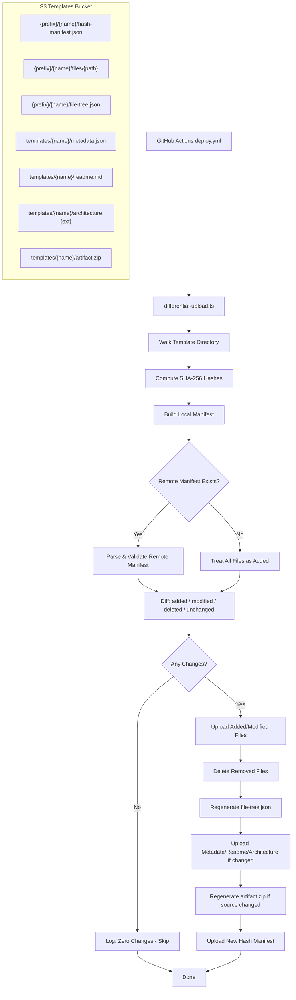

# Design Document: CI Differential Upload

## Overview

This feature replaces the existing unconditional template upload pipeline with a differential (hash-based) upload system. Instead of uploading all template files on every push to `main`, the system computes SHA-256 content hashes for each file, compares them against a persisted manifest in S3, and uploads only the files that have actually changed (added, modified, or deleted).

The design consolidates two existing workflow steps ("Package and deploy templates" + "Expand template files for file browser") into a single TypeScript script (`differential-upload.ts`) that handles all template deployment logic: source file expansion, metadata/readme/architecture uploads, artifact.zip generation, and file-tree.json regeneration.

**Key Benefits:**
- Dramatically reduced deploy time when few or no template files change
- S3 native ChecksumSHA256 integrity verification on every upload
- Single script consolidation reduces workflow complexity
- Manifest versioning enables future schema evolution

## Architecture



### Data Flow

1. **Input**: Template directory path, template name, S3 prefix (CLI args) + `BUCKET_NAME` env var
2. **Hash Computation**: Walk directory (excluding patterns), SHA-256 each file
3. **Manifest Retrieval**: Attempt to GET existing `hash-manifest.json` from S3
4. **Differential Comparison**: Compare local hashes vs remote hashes
5. **Selective Operations**: Upload/delete only changed files; regenerate derived artifacts
6. **Manifest Persistence**: Upload new manifest reflecting current state

## Components and Interfaces

### 1. CLI Entry Point (`differential-upload.ts`)

```typescript
// Usage: npx tsx .github/scripts/differential-upload.ts <name> <source-dir> [prefix]
// Environment: BUCKET_NAME (required)
```

Responsibilities:
- Parse CLI arguments and validate inputs
- Orchestrate the differential upload pipeline
- Exit with non-zero code on any critical failure
- Log summary statistics (added/modified/deleted/unchanged)

### 2. Directory Walker Module

Reuses the same traversal logic from `expand-template-files.ts` with the same exclusion set:

```typescript
const EXCLUDED_DIRS = new Set([
  '.git', 'node_modules', '__pycache__', '.pytest_cache',
  '.hypothesis', '.ruff_cache', '.kiro', '.venv', 'venv',
  'dist', 'build', '.terraform',
]);
```

Returns: `LocalFile[]` — array of `{ relativePath, absolutePath, size }`.

### 3. Hash Computation Module

```typescript
interface HashResult {
  relativePath: string;
  hash: string;       // lowercase hex, 64 chars
  hashBase64: string; // base64 of raw digest bytes (for ChecksumSHA256)
  size: number;
}

async function computeFileHashes(files: LocalFile[]): Promise<HashResult[]>;
```

Computes SHA-256 using Node.js `crypto.createHash('sha256')`. Each file is read sequentially, producing both hex (for manifest) and base64 (for S3 ChecksumSHA256) representations from the same digest.

### 4. Manifest Manager

```typescript
interface HashManifest {
  version: 1;
  generatedAt: string; // ISO-8601 UTC (e.g., "2025-01-15T10:30:00.000Z")
  files: Record<string, { hash: string; size: number }>;
}

async function fetchRemoteManifest(s3: S3Client, bucket: string, key: string): Promise<HashManifest | null>;
async function uploadManifest(s3: S3Client, bucket: string, key: string, manifest: HashManifest): Promise<void>;
function validateManifest(parsed: unknown): HashManifest | null;
```

- `fetchRemoteManifest`: GET from S3, return `null` on 404/NoSuchKey, throw on transient errors (5xx, network timeout)
- `validateManifest`: Checks `version === 1`, presence of required fields. Returns null (triggering full upload) on unknown version or invalid structure
- `uploadManifest`: Validates size < 5 MB before PUT

### 5. Diff Engine

```typescript
interface DiffResult {
  added: string[];    // relative paths present locally but not remotely
  modified: string[]; // present in both, different hash
  deleted: string[];  // present remotely but not locally
  unchanged: string[];
}

function computeDiff(local: HashManifest, remote: HashManifest | null): DiffResult;
```

Pure function — compares `files` maps by hash value. If `remote` is null, all local files are "added".

### 6. S3 Upload Engine

```typescript
interface UploadOptions {
  bucket: string;
  key: string;
  body: Buffer;
  contentType: string;
  checksumSHA256: string; // base64-encoded
}

async function uploadWithChecksum(s3: S3Client, options: UploadOptions): Promise<void>;
```

- Includes `ChecksumSHA256` and `ChecksumAlgorithm: "SHA256"` on every PUT
- Retries up to 2 additional times on checksum mismatch errors (re-reads and re-hashes file on each retry)
- Continues processing remaining files on persistent failure, tracks errors

### 7. File Tree Generator

Reuses the same `generateManifest()` logic from `expand-template-files.ts`:
- Produces `{ version: 1, totalFiles, totalSize, entries: [...] }` schema
- Includes directory entries deduced from file paths
- Only regenerated when diff shows changes

### 8. Artifact Zip Generator

```typescript
async function generateArtifactZip(sourceDir: string, excludePatterns: string[]): Promise<Buffer>;
```

Exclusion patterns: `docs/`, `.git*`, `build/`, `.kiro/`, `*.zip`

Uses Node.js `archiver` (already a project dependency) to create zip in-memory. Only triggered when at least one "packagable" source file has changed.

### 9. Metadata Uploader

Handles conditional upload of:
- `metadata.json` → `templates/{name}/metadata.json`
- `README.md` → `templates/{name}/readme.md`
- Architecture image → `templates/{name}/architecture.{ext}` (SVG preferred over PNG)

Each is included in the hash manifest and only uploaded when its hash differs from the remote.

### 10. Content-Type Resolver

Reuses the same `CONTENT_TYPE_MAP` and `getContentType()` from `expand-template-files.ts`:
- Extracts last dot-extension from filename
- Converts to lowercase
- Looks up in map; defaults to `application/octet-stream`

## Data Models

### Hash Manifest (`hash-manifest.json`)

```json
{
  "version": 1,
  "generatedAt": "2025-07-15T14:30:00.000Z",
  "files": {
    "src/main.py": { "hash": "a1b2c3...64hex", "size": 1234 },
    "requirements.txt": { "hash": "d4e5f6...64hex", "size": 56 },
    "metadata.json": { "hash": "g7h8i9...64hex", "size": 789 },
    "README.md": { "hash": "j0k1l2...64hex", "size": 2345 }
  }
}
```

- **version**: Always integer `1` for this implementation
- **generatedAt**: ISO-8601 UTC timestamp
- **files**: Object mapping relative POSIX paths → `{ hash, size }`
  - `hash`: lowercase hexadecimal SHA-256 (64 characters)
  - `size`: integer bytes (minimum 0)
- Maximum serialized size: 5 MB

### File Tree Manifest (`file-tree.json`)

```json
{
  "version": 1,
  "totalFiles": 42,
  "totalSize": 128000,
  "entries": [
    { "path": "src/", "type": "directory" },
    { "path": "src/main.py", "type": "file", "size": 1234 }
  ]
}
```

Same schema as existing `expand-template-files.ts` output.

### Diff Result (Internal)

```typescript
interface DiffResult {
  added: string[];
  modified: string[];
  deleted: string[];
  unchanged: string[];
}
```

### CLI Interface

```
npx tsx .github/scripts/differential-upload.ts <name> <source-dir> [prefix]

Arguments:
  name       - Template name (e.g., "chatbot-rag-python")
  source-dir - Path to template directory (e.g., "templates/chatbot-rag-python")
  prefix     - S3 key prefix (default: "templates")

Environment:
  BUCKET_NAME - Target S3 bucket name (required)

Exit Codes:
  0 - Success (including "zero changes" case)
  1 - Fatal error (missing args, empty directory, S3 failures after retries)
```

## Correctness Properties

*A property is a characteristic or behavior that should hold true across all valid executions of a system — essentially, a formal statement about what the system should do. Properties serve as the bridge between human-readable specifications and machine-verifiable correctness guarantees.*

### Property 1: Hash Determinism

*For any* file content bytes, computing the SHA-256 hash multiple times SHALL produce the same lowercase hexadecimal string (64 characters) on every invocation.

**Validates: Requirements 1.1, 1.5**

### Property 2: Hash-to-Base64 Round Trip

*For any* SHA-256 hash computed from file content, converting the raw digest bytes to base64 and back to hex SHALL produce the original hash value. This ensures the ChecksumSHA256 parameter is consistent with the manifest hash.

**Validates: Requirements 1.6, 10.5**

### Property 3: Diff Correctness — Added Files

*For any* local manifest and remote manifest, a file present in the local manifest but absent from the remote manifest SHALL appear exactly once in the `added` set of the diff result, and SHALL NOT appear in `modified`, `deleted`, or `unchanged`.

**Validates: Requirements 3.1**

### Property 4: Diff Correctness — Modified Files

*For any* local manifest and remote manifest, a file present in both manifests with different hash values SHALL appear exactly once in the `modified` set of the diff result, and SHALL NOT appear in `added`, `deleted`, or `unchanged`.

**Validates: Requirements 3.1**

### Property 5: Diff Correctness — Deleted Files

*For any* local manifest and remote manifest, a file present in the remote manifest but absent from the local manifest SHALL appear exactly once in the `deleted` set of the diff result, and SHALL NOT appear in `added`, `modified`, or `unchanged`.

**Validates: Requirements 3.1**

### Property 6: Diff Correctness — Unchanged Files

*For any* local manifest and remote manifest, a file present in both manifests with the same hash value SHALL appear exactly once in the `unchanged` set of the diff result, and SHALL NOT appear in `added`, `modified`, or `deleted`.

**Validates: Requirements 3.1, 3.4**

### Property 7: Diff Completeness

*For any* local manifest and remote manifest, the union of `added`, `modified`, `deleted`, and `unchanged` sets SHALL equal the union of all keys in both manifests, with no duplicates across sets.

**Validates: Requirements 3.1**

### Property 8: Null Remote Manifest Means Full Upload

*For any* local manifest, when the remote manifest is null, all local files SHALL appear in the `added` set, and `modified`, `deleted`, and `unchanged` sets SHALL be empty.

**Validates: Requirements 3.6, 2.3**

### Property 9: Content-Type Resolution

*For any* filename with a dot, extracting the substring from the last dot to the end, converting to lowercase, and looking up in CONTENT_TYPE_MAP SHALL produce a deterministic content-type string. *For any* filename without a dot, the result SHALL be `application/octet-stream`.

**Validates: Requirements 9.1, 9.2, 9.3**

### Property 10: Manifest Serialization Round Trip

*For any* valid HashManifest object (version=1, valid generatedAt, valid files map), serializing to JSON and parsing back SHALL produce an equivalent object that passes validation.

**Validates: Requirements 8.1, 8.2, 8.3**

### Property 11: Directory Exclusion Consistency

*For any* directory tree, files inside excluded directories (`.git`, `node_modules`, `__pycache__`, etc.) SHALL never appear in the walker output, regardless of nesting depth.

**Validates: Requirements 1.2**

### Property 12: File Tree Manifest Integrity

*For any* set of local files, the generated file-tree.json SHALL have `totalFiles` equal to the number of file entries, `totalSize` equal to the sum of all file sizes, and every file path in the input SHALL appear exactly once in the entries array with type `"file"`.

**Validates: Requirements 4.3, 4.4**

## Error Handling

### Error Categories and Responses

| Error | Behavior | Exit Code |
|-------|----------|-----------|
| Missing CLI args (`name`, `source-dir`) | Log usage, exit immediately | 1 |
| Missing `BUCKET_NAME` env var | Log error, exit immediately | 1 |
| Empty/missing template directory | Log error identifying the directory | 1 |
| Remote manifest 404/NoSuchKey | Treat as first deploy (full upload) | 0 |
| Remote manifest transient error (5xx, timeout) | Fail deployment, log reason | 1 |
| Remote manifest invalid JSON / unknown version | Log warning, treat as first deploy | 0 |
| S3 upload checksum mismatch | Retry 2x (re-read + re-hash), then log failure | — |
| S3 upload/delete failure (per file) | Log failed path, continue remaining files | — |
| Any file operation failures during run | Exit non-zero after all files processed | 1 |
| Manifest upload failure post-deploy | Fail pipeline, log error | 1 |
| Generated manifest > 5 MB | Fail pipeline, log size error | 1 |

### Retry Strategy

- **ChecksumSHA256 mismatch**: Re-read file from disk, re-compute hash, retry upload (max 2 retries)
- **Transient S3 errors on file upload/delete**: No automatic retry (rely on AWS SDK built-in retry config)
- **Manifest retrieval transient errors**: Fail immediately (cannot safely proceed without knowing remote state)

### Graceful Degradation

- Individual file upload/delete failures do not stop processing of remaining files
- The script tracks all failures and exits non-zero if any occurred
- The workflow (`deploy.yml`) treats non-zero exit as job failure, preventing processing of subsequent templates

## Testing Strategy

### Unit Tests

Unit tests will cover:
- **Content-Type resolution**: Specific filenames → expected content types (`.py` → `text/x-python`, no extension → `application/octet-stream`, `.tar.gz` → `application/gzip`)
- **Manifest validation**: Edge cases (missing fields, unknown version, null values, non-integer version)
- **Empty directory handling**: Verify error exit for empty or non-existent directories
- **Architecture image priority**: SVG preferred over PNG when both exist
- **Artifact exclusion patterns**: Verify `docs/`, `.git*`, `build/`, `.kiro/`, `*.zip` are excluded

### Property-Based Tests

Property-based tests (using [fast-check](https://github.com/dubzzz/fast-check)) will validate the correctness properties defined above:

- **Hash determinism**: Generate random byte buffers, hash twice, assert equality
- **Diff engine properties**: Generate random manifests (local + remote), verify partition correctness, completeness, and mutual exclusivity
- **Content-Type resolution**: Generate random filenames with various extension patterns
- **Manifest round-trip**: Generate valid manifest structures, serialize/deserialize, verify equivalence
- **File tree integrity**: Generate random file sets, verify totalFiles/totalSize invariants

Each property test will run a minimum of 100 iterations.

Tag format: `Feature: ci-differential-upload, Property {N}: {description}`

### Integration Tests (Manual / CI)

- Deploy a template with no prior manifest → verify full upload
- Deploy same template again with no changes → verify zero uploads
- Modify one file, deploy → verify only that file is uploaded
- Delete a file, deploy → verify S3 delete is issued
- Corrupt remote manifest JSON → verify graceful fallback to full upload

### Test Framework

- **Runner**: Vitest (already used in the project's frontend workspace)
- **PBT Library**: fast-check
- **Location**: `.github/scripts/differential-upload.test.ts`
