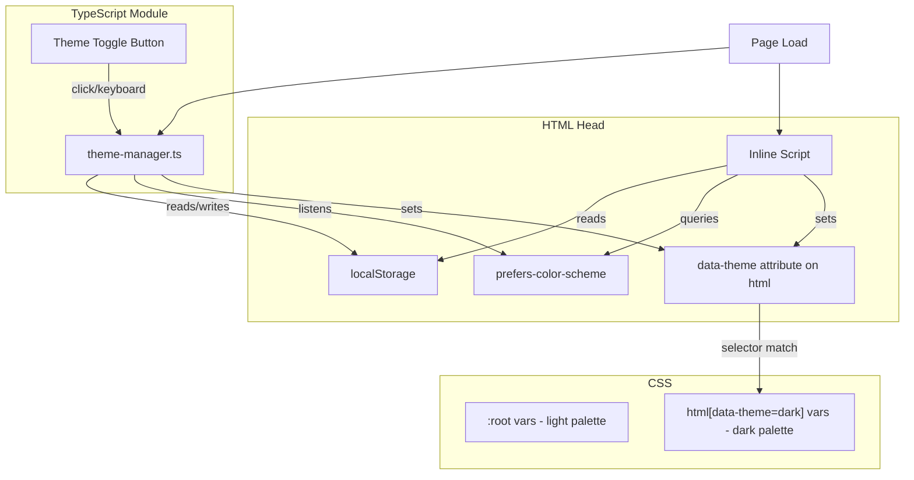

# Design Document: Dark Mode Toggle

## Overview

This design adds a client-side dark mode toggle to the Internal Repos static page. The implementation uses CSS custom properties (already in place for the light theme) to define a dark palette, a small TypeScript module (`theme-manager.ts`) to handle persistence and resolution logic, and an inline script in the HTML `<head>` to prevent flash-of-incorrect-theme (FOIT).

The architecture prioritizes:
- Zero server-side dependencies (all logic runs in-browser)
- No perceptible flash on page load
- Accessibility (WCAG AA contrast, keyboard navigation, ARIA labels)
- Minimal bundle size (the theme toggle is lightweight; the inline head script is ~30 lines)

## Architecture



**Key architectural decisions:**

1. **`data-theme` attribute on `<html>`** — The resolved theme is applied as `data-theme="dark"` or `data-theme="light"` on the root `<html>` element. CSS uses `html[data-theme="dark"]` selector to override custom properties. This avoids class-name collisions and makes the theme state inspectable.

2. **Inline head script for FOIT prevention** — A synchronous inline `<script>` in `<head>` reads localStorage and `prefers-color-scheme` before stylesheets or body render. This sets `data-theme` immediately, so the browser never paints with the wrong palette.

3. **CSS custom properties override** — The existing `:root` variables define the light palette. A `html[data-theme="dark"]` block re-declares the same custom property names with dark-palette values. All existing CSS continues to work unchanged because it already references these variables.

4. **Single TypeScript module** — `theme-manager.ts` encapsulates all runtime logic: reading preference, toggling, persisting, and listening for OS changes. The inline head script is a minimal duplicate of just the resolution logic (no toggle UI concerns).

## Components and Interfaces

### 1. Inline Head Script (`index.html`)

A small synchronous script that runs before body paint:

```typescript
// Pseudocode for inline script
(function() {
  const STORAGE_KEY = 'theme-preference';
  const VALID_THEMES = ['light', 'dark'];
  
  let theme: string | null = null;
  
  try {
    const stored = localStorage.getItem(STORAGE_KEY);
    if (stored && VALID_THEMES.includes(stored)) {
      theme = stored;
    }
  } catch (e) {
    // localStorage unavailable — ignore
  }
  
  if (!theme) {
    theme = window.matchMedia('(prefers-color-scheme: dark)').matches ? 'dark' : 'light';
  }
  
  document.documentElement.setAttribute('data-theme', theme);
})();
```

### 2. ThemeManager Module (`frontend/src/theme-manager.ts`)

```typescript
export type Theme = 'light' | 'dark';

export interface ThemeManager {
  /** Get the currently active theme */
  getTheme(): Theme;
  
  /** Toggle between light and dark, persist, and apply */
  toggle(): Theme;
  
  /** Apply a specific theme, persist, and update DOM */
  setTheme(theme: Theme): void;
  
  /** Start listening for OS preference changes (when no stored pref) */
  startListening(): void;
  
  /** Stop listening for OS preference changes */
  stopListening(): void;
}

export const STORAGE_KEY = 'theme-preference';
export const VALID_THEMES: readonly Theme[] = ['light', 'dark'];
```

**Pure logic functions (testable without DOM):**

```typescript
/** Resolve theme from inputs — pure function */
export function resolveTheme(
  storedValue: string | null,
  systemPrefersDark: boolean
): Theme;

/** Validate a stored value */
export function isValidTheme(value: unknown): value is Theme;

/** Get the opposite theme */
export function oppositeTheme(current: Theme): Theme;

/** Get aria-label for the toggle button given current theme */
export function getToggleLabel(current: Theme): string;

/** Get icon identifier for the current theme */
export function getToggleIcon(current: Theme): 'sun' | 'moon';
```

### 3. Theme Toggle Button (rendered in header)

The toggle button is injected into the existing `<nav>` element in the header. It uses inline SVG icons for sun/moon to avoid external asset dependencies.

```typescript
export function createThemeToggle(manager: ThemeManager): HTMLButtonElement;
```

### 4. Dark Palette CSS

Added as a `html[data-theme="dark"]` block in the existing `<style>` tag in `index.html`:

| Light Variable | Light Value | Dark Value |
|---|---|---|
| `--color-bg` | `#f4f2ef` | `#1a1a1e` |
| `--color-surface` | `#ffffff` | `#242428` |
| `--color-surface-raised` | `#fafaf8` | `#2c2c31` |
| `--color-border` | `#e2dfd9` | `#3a3a40` |
| `--color-border-strong` | `#c9c4bc` | `#4e4e56` |
| `--color-text` | `#2c2a26` | `#e8e6e1` |
| `--color-text-muted` | `#6b6660` | `#9e9a94` |
| `--color-accent` | `#d35c2e` | `#e8743f` |
| `--color-accent-hover` | `#b84d24` | `#f08a56` |
| `--color-accent-subtle` | `#fdf0eb` | `#2e2018` |
| `--color-tag-bg` | `#eae7e2` | `#2e2e33` |
| `--color-tag-text` | `#4a4640` | `#c4c0ba` |
| `--color-success` | `#3d8c5c` | `#4ea870` |
| `--color-error` | `#c43d3d` | `#e05555` |
| `--color-code-bg` | `#2c2a26` | `#1e1e22` |

Additionally, the header's semi-transparent background needs a dark override:

```css
html[data-theme="dark"] header {
  background: rgba(36, 36, 40, 0.92);
}
```

## Data Models

### Theme Preference Storage

| Key | Value | Storage |
|---|---|---|
| `theme-preference` | `"light"` or `"dark"` | `window.localStorage` |

### Theme State (runtime)

```typescript
interface ThemeState {
  current: Theme;           // 'light' | 'dark'
  source: 'stored' | 'system' | 'default';  // how the theme was resolved
}
```

### Resolution Priority

```
1. localStorage stored preference (if valid)
2. OS prefers-color-scheme media query
3. Default: 'light'
```

## Correctness Properties

*A property is a characteristic or behavior that should hold true across all valid executions of a system — essentially, a formal statement about what the system should do. Properties serve as the bridge between human-readable specifications and machine-verifiable correctness guarantees.*

### Property 1: Toggle involution

*For any* valid theme state, toggling twice should return to the original theme. That is, `oppositeTheme(oppositeTheme(theme)) === theme` for all valid themes.

**Validates: Requirements 1.2**

### Property 2: UI indicators match theme state

*For any* valid theme value, the toggle icon and aria-label correctly reflect the current state: `getToggleIcon(theme)` returns `'sun'` for light and `'moon'` for dark, and `getToggleLabel(theme)` describes switching to the opposite theme.

**Validates: Requirements 1.3, 1.5**

### Property 3: Theme persistence round-trip

*For any* valid theme value, writing it to localStorage via the theme manager and then resolving the theme from that stored value should produce the same theme. That is, `resolveTheme(theme, anySystemPref) === theme` when `theme` is a valid stored value.

**Validates: Requirements 3.1, 3.2**

### Property 4: Invalid preferences trigger fallback

*For any* string that is not a recognized theme identifier (i.e., not `"light"` or `"dark"`), the `resolveTheme` function should ignore the invalid stored value and fall back to the system preference or default.

**Validates: Requirements 3.3**

### Property 5: Theme resolution priority

*For any* combination of stored preference (valid, invalid, or null) and OS dark-mode preference (true or false), the `resolveTheme` function should follow the priority: valid stored preference > OS preference > default light. Specifically:
- If stored is valid → return stored value
- If stored is null/invalid and OS prefers dark → return `'dark'`
- If stored is null/invalid and OS does not prefer dark → return `'light'`

**Validates: Requirements 4.1, 4.2, 3.5**

### Property 6: Dark palette WCAG AA contrast

*For any* text/background color pair defined in the dark palette, the computed contrast ratio shall be at least 4.5:1 for normal text colors and at least 3:1 for large text or UI component colors.

**Validates: Requirements 2.2**

## Error Handling

| Scenario | Handling |
|---|---|
| `localStorage` inaccessible (private browsing, disabled) | Catch exception in try/catch, fall through to system preference detection. Theme still works, just won't persist. |
| `localStorage` contains invalid value | `isValidTheme()` check fails, value is discarded, resolution falls through to system preference. |
| `matchMedia` not supported (very old browsers) | Fallback to `false` for `systemPrefersDark`, resulting in light theme default. |
| `data-theme` attribute manually tampered | The ThemeManager reads its own internal state, not the DOM attribute, for current theme. DOM is write-only from the manager's perspective. |
| CSS custom property not overridden (missing variable) | All dark-palette variables are declared in a single block; if the block loads, all variables are present. Linting/build-time checks can catch missing variables. |

## Testing Strategy

### Unit Tests (Vitest + jsdom)

- Toggle button renders in the header
- Keyboard activation (Enter, Space) triggers toggle
- Icon changes on theme switch
- Aria-label updates on theme switch
- Dark CSS variables are applied when `data-theme="dark"` is set
- System preference listener fires on media query change
- Graceful handling when localStorage throws

### Property-Based Tests (Vitest + fast-check)

The project already has `fast-check` installed. Each correctness property maps to a property-based test:

- **Property 1**: Generate random sequences of toggle operations, verify involution
- **Property 2**: Generate random valid themes, verify icon/label mapping
- **Property 3**: Generate random valid themes + random system preferences, verify stored preference always wins
- **Property 4**: Generate arbitrary strings (excluding "light"/"dark"), verify fallback behavior
- **Property 5**: Generate all combinations of (stored: valid|invalid|null) × (systemPrefersDark: true|false), verify priority
- **Property 6**: Enumerate all dark-palette text/background pairs, compute WCAG contrast ratio, verify ≥ 4.5:1

**Configuration:**
- Minimum 100 iterations per property test
- Tag format: `Feature: dark-mode-toggle, Property {N}: {title}`
- Library: `fast-check` (already in root devDependencies)
- Runner: `vitest run`

### Integration / Manual Tests

- Full page load with dark preference in localStorage → no flash
- OS preference change while page is open → theme updates (when no stored pref)
- Toggle button visible and functional on mobile viewport
- All interactive element states (hover, focus, active, disabled) visually distinguishable in dark mode
