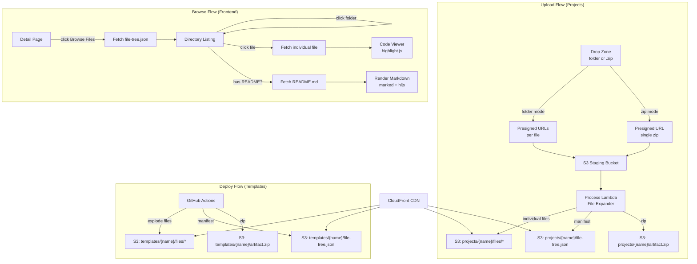

# Design Document: File Code Viewer

## Overview

This feature adds a GitHub/GitLab-style file browser and syntax-highlighted code viewer to the Internal Repos project and template detail pages. The approach uses pre-exploded files stored individually in S3, a lightweight `file-tree.json` manifest for instant directory rendering, and on-demand file fetching for individual file viewing.

**Key design decisions:**

1. **Pre-exploded files in S3** — Files are stored individually at upload/deploy time rather than extracting from zip at browse time. This enables on-demand fetching without client-side zip extraction, leverages CloudFront caching per-file, and keeps the browser lightweight.

2. **Dual-path upload pipeline** — The frontend accepts both folder uploads (individual files staged via multiple presigned URLs) and `.zip` uploads (single presigned URL). The Lambda normalizes both into the same output structure.

3. **Manifest-first rendering** — The `file-tree.json` manifest (typically < 50 KB) is the only fetch needed to render the directory tree. Individual file content is fetched on demand.

4. **Reuse existing tooling** — highlight.js (already bundled for README rendering) provides syntax highlighting. The `marked` library handles per-folder README rendering. No new heavyweight dependencies.

## Architecture



### S3 Bucket Structure (Updated)

```
S3 Bucket (frontend)
├── index.html
├── global-index.json
├── tags.json
├── projects/
│   └── {project-name}/
│       ├── readme.md
│       ├── metadata.json
│       ├── artifact.zip
│       ├── file-tree.json          ← NEW
│       └── files/                   ← NEW
│           ├── src/
│           │   ├── main.ts
│           │   └── utils.ts
│           ├── package.json
│           └── README.md
└── templates/
    └── {template-name}/
        ├── readme.md
        ├── metadata.json
        ├── artifact.zip
        ├── architecture.svg
        ├── file-tree.json          ← NEW
        └── files/                   ← NEW
            └── ...
```

## Components and Interfaces

### Frontend Components

#### 1. File Browser (`file-browser.ts`)

Top-level orchestrator component rendered on detail pages. Manages state machine:

```
IDLE → LOADING_MANIFEST → BROWSING → LOADING_FILE → VIEWING_FILE
                                ↑                          │
                                └──────────────────────────┘
```

```typescript
interface FileBrowserOptions {
  /** Container element to render into */
  container: HTMLElement;
  /** CDN base URL + path prefix, e.g. "https://cdn.example.com/projects/my-project/" */
  basePath: string;
  /** Optional initial path from URL hash for deep linking */
  initialPath?: string;
  /** Callback when navigation changes (for URL hash updates) */
  onNavigate?: (path: string) => void;
}

interface FileBrowserAPI {
  /** Initialize the browser — shows "Browse Files" button */
  mount(): void;
  /** Navigate to a specific path (for deep link restoration) */
  navigateTo(path: string): void;
  /** Cleanup event listeners and DOM */
  destroy(): void;
}
```

#### 2. Directory Listing (`directory-listing.ts`)

Renders a flat table of the current directory's immediate children.

```typescript
interface DirectoryListingOptions {
  /** Entries to display (pre-sorted) */
  entries: FileTreeEntry[];
  /** Callback when a directory is activated */
  onDirectorySelect: (path: string) => void;
  /** Callback when a file is activated */
  onFileSelect: (entry: FileTreeEntry) => void;
}
```

#### 3. Breadcrumb Navigation (`breadcrumb-nav.ts`)

Horizontal navigation bar showing the current path as clickable segments.

```typescript
interface BreadcrumbNavOptions {
  /** Current path segments, e.g. ["src", "components"] */
  segments: string[];
  /** Callback when a segment is activated (receives target directory path) */
  onNavigate: (path: string) => void;
  /** Label for root segment */
  rootLabel?: string;
}
```

#### 4. Code Viewer (`code-viewer.ts`)

Full-page view replacing the directory listing when a file is selected.

```typescript
interface CodeViewerOptions {
  /** File content as a string */
  content: string;
  /** File name for language detection */
  filename: string;
  /** File size in bytes (from manifest) */
  fileSize: number;
  /** Full CDN URL for image preview */
  fileUrl: string;
}
```

#### 5. Language Mapper (`language-mapper.ts`)

Pure module mapping file extensions and special filenames to highlight.js language identifiers.

```typescript
/** Map file path to highlight.js language identifier, or null for auto-detect */
function detectLanguage(filename: string): string | null;

/** Check if a file is binary (non-text) */
function isBinaryFile(filename: string): boolean;

/** Check if a file is a previewable image */
function isImageFile(filename: string): boolean;

/** Get MIME content-type for a file extension */
function getContentType(filename: string): string;
```

### Backend Components

#### 6. File Expander (Lambda — `file-expander.ts`)

New module in the Lambda package that handles file explosion and manifest generation.

```typescript
interface FileExpanderResult {
  /** Number of files written */
  filesWritten: number;
  /** Generated manifest */
  manifest: FileTreeManifest;
  /** Warnings (e.g., failed file writes) */
  warnings: string[];
}

/** Expand files from either folder-staged or zip-extracted sources */
async function expandFiles(
  files: FileEntry[],
  projectName: string,
  bucket: string,
): Promise<FileExpanderResult>;

/** Generate the file-tree.json manifest from a list of file entries */
function generateManifest(files: FileEntry[]): FileTreeManifest;
```

#### 7. Initiate Lambda Changes

The `/upload/initiate` endpoint gains dual-mode support:
- **Folder mode**: Returns an array of presigned URLs (one per file) plus a session metadata write.
- **Zip mode**: Returns a single presigned URL (existing behavior).

```typescript
interface InitiateResponse {
  sessionId: string;
  /** Single presigned URL (zip mode) */
  uploadUrl?: string;
  /** Multiple presigned URLs mapped by path (folder mode) */
  uploadUrls?: Record<string, string>;
  /** Upload mode for the frontend to track */
  mode: 'zip' | 'folder';
  expiresAt: string;
}
```

#### 8. CI/CD Template Expansion Script

Shell script (or Node.js utility) added to the deploy workflow that:
1. Walks the template directory
2. Uploads each file individually to `templates/{name}/files/{path}`
3. Generates and uploads `file-tree.json`
4. Continues to produce `artifact.zip`

#### 9. Migration Script (`scripts/migrate-files.ts`)

One-time Node.js script that:
1. Lists all `projects/*/artifact.zip` without a sibling `file-tree.json`
2. Downloads each zip, explodes to `projects/{name}/files/*`
3. Generates and uploads `file-tree.json`
4. Idempotent — safe to re-run

### Router Changes

New route patterns for deep linking:

```typescript
// Project file browsing
/^\/project\/(?<name>[^/]+)\/files(?:\/(?<path>.*))?$/

// Template file browsing
/^\/template\/(?<name>[^/]+)\/files(?:\/(?<path>.*))?$/
```

## Data Models

### File Tree Manifest (`file-tree.json`)

```typescript
/**
 * The complete file tree manifest stored at {prefix}/file-tree.json.
 * Flat array of all entries (files and directories) for efficient lookup.
 */
interface FileTreeManifest {
  /** Schema version for forward compatibility */
  version: 1;
  /** Total number of files (excluding directories) */
  totalFiles: number;
  /** Total size in bytes across all files */
  totalSize: number;
  /** Flat list of all entries */
  entries: FileTreeEntry[];
}

/**
 * A single entry in the file tree (either a file or directory).
 */
interface FileTreeEntry {
  /** Relative path from project root, e.g. "src/main.ts" or "src/" for dirs */
  path: string;
  /** Entry type */
  type: 'file' | 'directory';
  /** File size in bytes (only present for type: "file") */
  size?: number;
}
```

**Design rationale for flat array:**
- Simpler to generate (just iterate file list, deduce parent directories)
- Smaller JSON payload than nested tree (no repeated key names per level)
- Frontend can efficiently derive any directory's children via prefix filtering
- Easy to search/filter without recursive traversal

**Example:**

```json
{
  "version": 1,
  "totalFiles": 5,
  "totalSize": 12480,
  "entries": [
    { "path": "src/", "type": "directory" },
    { "path": "src/main.ts", "type": "file", "size": 2048 },
    { "path": "src/utils.ts", "type": "file", "size": 1024 },
    { "path": "package.json", "type": "file", "size": 512 },
    { "path": "README.md", "type": "file", "size": 4096 },
    { "path": "tsconfig.json", "type": "file", "size": 256 }
  ]
}
```

### Session Metadata (Updated)

```typescript
interface SessionMetadata {
  sessionId: string;
  name: string;
  tags: string;
  readme: string;
  createdAt: string;
  newTags?: string[];
  mode?: 'create' | 'replace';
  repositoryUrl?: string;
  /** Upload type: "zip" or "folder" — NEW */
  uploadType?: 'zip' | 'folder';
  /** File paths for folder mode — used to track staged files */
  filePaths?: string[];
}
```

### Content-Type Mapping

Shared between Lambda, CI/CD script, and migration script:

```typescript
const CONTENT_TYPE_MAP: Record<string, string> = {
  '.html': 'text/html',
  '.css': 'text/css',
  '.js': 'application/javascript',
  '.mjs': 'application/javascript',
  '.ts': 'text/plain',
  '.tsx': 'text/plain',
  '.json': 'application/json',
  '.md': 'text/markdown',
  '.txt': 'text/plain',
  '.xml': 'application/xml',
  '.yaml': 'text/yaml',
  '.yml': 'text/yaml',
  '.toml': 'text/plain',
  '.py': 'text/x-python',
  '.rs': 'text/plain',
  '.go': 'text/plain',
  '.java': 'text/plain',
  '.tf': 'text/plain',
  '.hcl': 'text/plain',
  '.sh': 'text/x-shellscript',
  '.png': 'image/png',
  '.jpg': 'image/jpeg',
  '.jpeg': 'image/jpeg',
  '.gif': 'image/gif',
  '.webp': 'image/webp',
  '.svg': 'image/svg+xml',
  '.ico': 'image/x-icon',
  '.woff': 'font/woff',
  '.woff2': 'font/woff2',
  '.ttf': 'font/ttf',
  '.pdf': 'application/pdf',
  '.zip': 'application/zip',
  '.tar': 'application/x-tar',
  '.gz': 'application/gzip',
};

const DEFAULT_CONTENT_TYPE = 'application/octet-stream';
```

### Language Mapper Data

```typescript
const EXTENSION_MAP: Record<string, string> = {
  '.ts': 'typescript',
  '.tsx': 'typescript',
  '.js': 'javascript',
  '.jsx': 'javascript',
  '.mjs': 'javascript',
  '.py': 'python',
  '.rs': 'rust',
  '.go': 'go',
  '.java': 'java',
  '.kt': 'kotlin',
  '.rb': 'ruby',
  '.php': 'php',
  '.cs': 'csharp',
  '.cpp': 'cpp',
  '.c': 'c',
  '.h': 'c',
  '.hpp': 'cpp',
  '.swift': 'swift',
  '.tf': 'hcl',
  '.hcl': 'hcl',
  '.json': 'json',
  '.yaml': 'yaml',
  '.yml': 'yaml',
  '.toml': 'toml',
  '.xml': 'xml',
  '.html': 'xml',
  '.htm': 'xml',
  '.css': 'css',
  '.scss': 'scss',
  '.less': 'less',
  '.md': 'markdown',
  '.sh': 'bash',
  '.bash': 'bash',
  '.zsh': 'bash',
  '.fish': 'bash',
  '.ps1': 'powershell',
  '.sql': 'sql',
  '.graphql': 'graphql',
  '.gql': 'graphql',
  '.dockerfile': 'dockerfile',
  '.proto': 'protobuf',
  '.lua': 'lua',
  '.r': 'r',
  '.scala': 'scala',
  '.ex': 'elixir',
  '.exs': 'elixir',
  '.erl': 'erlang',
  '.hs': 'haskell',
  '.clj': 'clojure',
  '.vim': 'vim',
  '.ini': 'ini',
  '.cfg': 'ini',
};

const FILENAME_MAP: Record<string, string> = {
  'Dockerfile': 'dockerfile',
  'Makefile': 'makefile',
  'Jenkinsfile': 'groovy',
  'Vagrantfile': 'ruby',
  'Gemfile': 'ruby',
  'Rakefile': 'ruby',
  '.gitignore': 'bash',
  '.dockerignore': 'bash',
  '.editorconfig': 'ini',
  '.env.example': 'bash',
  'Procfile': 'yaml',
  'Brewfile': 'ruby',
};

const BINARY_EXTENSIONS = new Set([
  '.png', '.jpg', '.jpeg', '.gif', '.webp', '.svg', '.ico', '.bmp', '.tiff',
  '.woff', '.woff2', '.ttf', '.eot', '.otf',
  '.pdf', '.doc', '.docx', '.xls', '.xlsx', '.ppt', '.pptx',
  '.exe', '.dll', '.so', '.dylib', '.o', '.class', '.pyc',
  '.zip', '.tar', '.gz', '.bz2', '.7z', '.rar', '.jar', '.war',
  '.mp3', '.mp4', '.avi', '.mov', '.wav', '.flac',
  '.sqlite', '.db',
]);

const IMAGE_EXTENSIONS = new Set([
  '.png', '.jpg', '.jpeg', '.gif', '.webp', '.svg',
]);
```

## Correctness Properties

*A property is a characteristic or behavior that should hold true across all valid executions of a system — essentially, a formal statement about what the system should do. Properties serve as the bridge between human-readable specifications and machine-verifiable correctness guarantees.*

### Property 1: S3 Key Construction

*For any* valid project name and valid relative file path, the constructed S3 key SHALL equal `projects/{name}/files/{filePath}` (or `templates/{name}/files/{filePath}` for templates), preserving the exact relative path structure without transformation.

**Validates: Requirements 1.5, 1.8**

### Property 2: Manifest Generation Correctness

*For any* set of file entries (each with a path and content buffer), the generated File_Tree_Manifest SHALL contain: (a) a file entry for every input file with the correct relative path, type "file", and size equal to the buffer length; (b) a directory entry for every unique parent directory implied by the file paths; (c) no entries that do not correspond to an input file or an implied parent directory.

**Validates: Requirements 1.10, 1.11**

### Property 3: Content-Type / Language Mapping Consistency

*For any* filename with an extension present in the known mapping table, the `getContentType` function SHALL return the expected MIME type, and the `detectLanguage` function SHALL return the expected highlight.js language identifier. The two mappings SHALL be consistent (i.e., a `.ts` file always maps to `text/plain` content-type and `typescript` language).

**Validates: Requirements 1.13, 9.1, 9.2**

### Property 4: Upload Mode Detection

*For any* FileList input, if the input contains exactly one file whose name ends with `.zip` (case-insensitive), the detected mode SHALL be `"zip"`; otherwise the detected mode SHALL be `"folder"`.

**Validates: Requirements 1.18**

### Property 5: Directory Listing Shows Immediate Children Only

*For any* valid File_Tree_Manifest and any directory path within that manifest, the directory listing function SHALL return exactly the entries whose parent directory equals the given path — no deeper descendants, no entries from other directories.

**Validates: Requirements 3.4, 5.1**

### Property 6: Directory Listing Sort Order

*For any* list of FileTreeEntry items, the sorted result SHALL have all entries with type "directory" before all entries with type "file", and within each group entries SHALL be ordered alphabetically by name using case-insensitive comparison.

**Validates: Requirements 5.2**

### Property 7: Breadcrumb Segment Generation

*For any* valid file or directory path string, the breadcrumb generation function SHALL produce a segments array where: (a) the first segment is always "root"; (b) subsequent segments correspond one-to-one to the directory components of the path; (c) activating segment at index `i` navigates to the path formed by joining segments 0..i.

**Validates: Requirements 6.1, 6.3**

### Property 8: Per-Folder README Detection

*For any* directory in a File_Tree_Manifest, the README detection function SHALL return `true` if and only if the directory contains an entry whose basename matches `readme.md` or `readme` (case-insensitive comparison).

**Validates: Requirements 7.1**

### Property 9: Line Number Generation

*For any* non-empty text content, the line number generation function SHALL produce a sequence of integers from 1 to N, where N equals the number of lines in the content (splitting on `\n`, with a trailing newline not producing an extra empty line number).

**Validates: Requirements 8.3**

### Property 10: File Type Classification

*For any* filename, the classification function SHALL categorize it into exactly one of: (a) image (extension in IMAGE_EXTENSIONS set), (b) binary (extension in BINARY_EXTENSIONS set but not IMAGE_EXTENSIONS), or (c) text (all others). These three categories are mutually exclusive and exhaustive.

**Validates: Requirements 10.2, 10.3**

### Property 11: Deep Link URL Encoding Round-Trip

*For any* valid project/template name and any valid file or directory path within the manifest, encoding the path into a URL hash fragment and then decoding it back SHALL produce the original name and path without loss of information.

**Validates: Requirements 12.1, 12.2**

### Property 12: Migration Idempotence

*For any* project that has been migrated (files exploded + manifest generated), running the migration logic again on the same project SHALL produce byte-identical S3 objects and an equivalent manifest — no duplicates, no missing files, no corruption.

**Validates: Requirements 14.6**

## Error Handling

| Scenario | Behavior |
|----------|----------|
| `file-tree.json` returns 404 | Show "File browsing not available for this project" message with explanation that it's a legacy upload |
| `file-tree.json` fetch fails (network/5xx) | Show error message with "Retry" button |
| `file-tree.json` contains invalid JSON | Treat as fetch failure — show error with retry |
| Individual file fetch fails | Show error inline in code viewer with "Retry" button |
| File > 500 KB selected | Show size warning + "Load anyway" confirmation before fetching |
| File > 500 KB loaded | Skip syntax highlighting, render plain text with notice |
| Per-folder README fetch fails | Silently hide README section (no error shown) |
| Lambda fails to write one file during expansion | Log warning, continue with remaining files, report warning in response |
| All files filtered out during expansion | Return 400 error (existing `AllFilesFilteredError` behavior) |
| Deep link path not found in manifest | Navigate to root directory listing, show notice |
| Migration script fails on one project | Log error, continue with remaining projects |
| Clipboard copy fails (browser permission denied) | Show "Copy failed" feedback for 2 seconds |

## Testing Strategy

### Property-Based Tests (fast-check)

The feature's pure logic functions are excellent candidates for property-based testing using `fast-check`:

- **Library**: `fast-check` (already used in the project ecosystem via Hypothesis on backend — fast-check is the TS/JS equivalent)
- **Minimum iterations**: 100 per property
- **Tag format**: `Feature: file-code-viewer, Property {N}: {description}`

Target functions for PBT:
1. `constructS3Key(name, filePath)` → Property 1
2. `generateManifest(files)` → Property 2
3. `getContentType(filename)` / `detectLanguage(filename)` → Property 3
4. `detectUploadMode(files)` → Property 4
5. `getDirectoryChildren(manifest, dirPath)` → Property 5
6. `sortEntries(entries)` → Property 6
7. `generateBreadcrumbs(path)` → Property 7
8. `hasReadme(manifest, dirPath)` → Property 8
9. `generateLineNumbers(content)` → Property 9
10. `classifyFile(filename)` → Property 10
11. `encodeFilePath(name, path)` / `decodeFilePath(hash)` → Property 11
12. Migration logic idempotence → Property 12

### Unit Tests (Vitest)

Example-based tests covering:
- UI component rendering (Directory Listing, Code Viewer, Breadcrumb)
- Error states and edge cases (404 manifest, oversized files, empty directories)
- Keyboard navigation and accessibility
- Cache hit/miss behavior
- Copy-to-clipboard interaction
- Binary file detection for specific known extensions
- Deep link parsing for known URL patterns

### Integration Tests

- End-to-end upload flow (folder mode): stage files → finalize → verify S3 objects + manifest
- End-to-end upload flow (zip mode): stage zip → finalize → verify same output structure
- Template deployment: run CI script → verify files/ + file-tree.json in S3
- Migration script: create mock project with artifact.zip → run migration → verify output
- Deep link restoration: navigate to hash URL → verify correct file/directory displayed

### Manual / Visual Testing

- Responsive layout across viewport widths (narrow, 16:9, 21:9, ultrawide)
- Horizontal scroll behavior for long code lines
- Syntax highlighting accuracy across language samples
- Image preview rendering with various aspect ratios
- Keyboard navigation flow through directory listing
- Screen reader compatibility of breadcrumb and listing ARIA attributes
