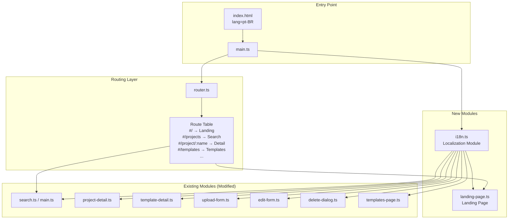

# Design Document: Homepage & PT-BR Localization

## Overview

This feature introduces two coordinated changes to the Internal Repos frontend SPA:

1. **Landing Page** — A new home page at `#/` that serves as an entry point with navigation cards directing users to the Projects and Templates sections. The current projects search view moves to `#/projects`.

2. **PT-BR Localization** — A centralized localization module (`i18n.ts`) that provides all user-facing static strings in Brazilian Portuguese, applied site-wide to every page and component.

The implementation follows the existing architecture: vanilla TypeScript with imperative DOM manipulation, hash-based routing, CSS custom properties for theming, and no framework dependencies.

## Architecture



### Key Design Decisions

1. **Single-locale approach (no i18n framework)**: Since the entire site targets only PT-BR, a lightweight key-value module is sufficient. No runtime locale switching is needed. This avoids adding a dependency like `i18next` for a single-language use case.

2. **Flat key namespace**: Keys use dot-separated paths (e.g., `header.title`, `search.placeholder`, `landing.heading`) for clarity without nested object complexity.

3. **Landing page as a standalone module**: `landing-page.ts` follows the same pattern as `templates-page.ts` — a render function that receives params and a container.

4. **Route relocation without breaking changes**: The projects search moves from `#/` to `#/projects`, with all internal redirects (post-upload, post-delete) updated to point to `#/projects`.

## Components and Interfaces

### 1. Localization Module (`src/i18n.ts`)

```typescript
/**
 * Centralized PT-BR string dictionary.
 * All user-facing static text is defined here.
 */

/** The complete dictionary type — flat keys mapping to PT-BR strings. */
export type I18nKey = keyof typeof strings;

const strings = {
  // Header & Navigation
  'header.title': 'Repos Internos',
  'nav.projects': 'Projetos',
  'nav.templates': 'Templates',
  'nav.upload': 'Upload',

  // Landing Page
  'landing.heading': 'Repositório Interno de Projetos',
  'landing.description': 'Explore projetos compartilhados pela equipe ou descubra templates prontos para iniciar novos desenvolvimentos.',
  'landing.projects.title': 'Projetos',
  'landing.projects.description': 'Navegue e pesquise projetos compartilhados pela equipe.',
  'landing.templates.title': 'Templates',
  'landing.templates.description': 'Descubra templates prontos para acelerar o desenvolvimento.',

  // Search (Projects)
  'search.heading': 'Pesquisar Projetos',
  'search.placeholder': 'Pesquisar por nome, descrição ou tags…',
  'search.loading': 'Carregando projetos…',
  'search.error': 'Não foi possível carregar os projetos',
  'search.retry': 'Tentar novamente',
  'search.noResults': 'Nenhum resultado encontrado',

  // Templates Page
  'templates.heading': 'Templates de Projeto',
  'templates.placeholder': 'Pesquisar templates por nome, descrição ou tags…',
  'templates.loading': 'Carregando templates…',
  'templates.empty': 'Nenhum template disponível ainda',

  // Project Detail
  'projectDetail.back': '← Voltar para projetos',
  'projectDetail.unavailable': 'Detalhes do projeto não disponíveis',
  'projectDetail.download': 'Baixar artifact.zip',
  'projectDetail.downloadDisabled': 'Baixar artifact.zip',
  'projectDetail.artifactUnavailable': 'Artefato não disponível para download',
  'projectDetail.docUnavailable': 'Documentação não disponível',
  'projectDetail.edit': 'Editar',
  'projectDetail.delete': 'Excluir',
  'projectDetail.repository': 'Repositório: ',
  'projectDetail.noProject': 'Nenhum projeto especificado',

  // Template Detail
  'templateDetail.back': '← Voltar para templates',
  'templateDetail.unavailable': 'Detalhes do template não disponíveis',
  'templateDetail.download': 'Baixar Template',
  'templateDetail.noTemplate': 'Nenhum template especificado',
  'templateDetail.docUnavailable': 'Documentação do template não disponível',
  'templateDetail.language': 'Linguagem',

  // Upload Form
  'upload.heading': 'Upload de Projeto',
  'upload.nameLabel': 'Nome do Projeto',
  'upload.namePlaceholder': 'meu-nome-de-projeto',
  'upload.repoLabel': 'URL do Repositório (opcional)',
  'upload.repoPlaceholder': 'https://github.com/org/repo',
  'upload.tagsLabel': 'Tags',
  'upload.readmeLabel': 'Conteúdo do Readme',
  'upload.readmePlaceholder': '# Meu Projeto\n\nDescreva seu projeto aqui...',
  'upload.submit': 'Enviar Projeto',
  'upload.submitting': 'Enviando...',
  'upload.zipping': 'Compactando arquivos...',
  'upload.initiating': 'Iniciando upload...',
  'upload.processing': 'Processando...',
  'upload.suggestingTags': 'Sugerindo tags...',
  'upload.tooLarge': 'Projeto muito grande para upload (excede limite de 500 MB).',
  'upload.noFilesAfterFilter': 'Nenhum arquivo restou após filtrar artefatos e padrões ignorados.',
  'upload.tagsWarning': 'Sugestões de tags existentes indisponíveis',

  // Edit Form
  'edit.heading': 'Editar Projeto',
  'edit.loading': 'Carregando dados do projeto...',
  'edit.loadError': 'Não foi possível carregar os dados do projeto',
  'edit.nameLabel': 'Nome do Projeto',
  'edit.repoLabel': 'URL do Repositório (opcional)',
  'edit.readmeLabel': 'Conteúdo do Readme',
  'edit.filesLabel': 'Substituir Artefato (opcional — selecione pasta)',
  'edit.submit': 'Salvar Alterações',
  'edit.saving': 'Salvando...',
  'edit.cancel': 'Cancelar',
  'edit.successWithArtifact': 'Projeto atualizado com sucesso (artefato substituído)!',
  'edit.success': 'Projeto atualizado com sucesso!',
  'edit.updatingMetadata': 'Atualizando metadados...',
  'edit.initiatingReplace': 'Iniciando substituição do artefato...',

  // Delete Dialog
  'delete.title': 'Excluir Projeto',
  'delete.warning': 'Esta ação não pode ser desfeita. Isso excluirá permanentemente o projeto e todos os arquivos associados.',
  'delete.prompt': 'Digite <strong>{name}</strong> para confirmar.',
  'delete.inputPlaceholder': 'Digite o nome do projeto para confirmar',
  'delete.confirm': 'Excluir',
  'delete.cancel': 'Cancelar',
  'delete.deleting': 'Excluindo projeto…',
  'delete.success': 'Projeto "{name}" foi excluído.',

  // Validation
  'validation.nameRequired': 'Nome do projeto é obrigatório',
  'validation.nameTooLong': 'Nome do projeto deve ter no máximo {max} caracteres',
  'validation.nameInvalid': 'Nome do projeto pode conter apenas caracteres alfanuméricos, hifens e underscores',
  'validation.readmeTooLong': 'Readme deve ter no máximo {max} caracteres',
  'validation.filesRequired': 'Pelo menos um arquivo deve ser selecionado',
  'validation.folderEmpty': 'Pasta selecionada não contém arquivos',
  'validation.repoTooLong': 'URL do repositório deve ter no máximo 2048 caracteres',
  'validation.repoInvalidProtocol': 'URL do repositório deve usar HTTPS ou HTTP',
  'validation.repoInvalidUrl': 'Por favor, insira uma URL válida',

  // Drop Zone
  'dropZone.text': 'Arraste uma pasta aqui ou clique para selecionar',
  'dropZone.summary': '{count} arquivo(s) selecionado(s)',

  // Readme Preview
  'readmePreview.write': 'Escrever',
  'readmePreview.preview': 'Pré-visualizar',
  'readmePreview.autofill': 'Preenchido automaticamente de {filename}',
  'readmePreview.truncated': 'Conteúdo foi truncado para {max} caracteres (máximo permitido).',

  // Card Grid
  'cardGrid.noResults': 'Nenhum resultado encontrado',

  // Paginator
  'paginator.previous': 'Anterior',
  'paginator.next': 'Próximo',

  // Theme Toggle
  'theme.switchToDark': 'Mudar para tema escuro',
  'theme.switchToLight': 'Mudar para tema claro',
} as const;

/**
 * Look up a localized string by key.
 * Returns the PT-BR string if the key exists, or the key itself if missing.
 */
export function t(key: string): string;

/**
 * Look up a localized string with interpolation.
 * Replaces `{placeholder}` tokens in the string with provided values.
 */
export function t(key: string, params: Record<string, string | number>): string;
```

### 2. Landing Page (`src/landing-page.ts`)

```typescript
/**
 * Render the landing page into the given container.
 * Route handler for `#/`.
 */
export function renderLandingPage(
  _params: Record<string, string>,
  container: HTMLElement,
): void;
```

The landing page renders:
- A heading (`<h1>`) with the application title
- An introductory paragraph (`<p>`)
- A grid of two navigation cards (using `<a>` elements with `role="link"`)

Each navigation card:
- Is a block-level `<a>` element with `href` pointing to the section route
- Contains a title (`<h2>`) and description (`<p>`)
- Supports keyboard activation (Enter/Space) via native anchor behavior
- Uses CSS custom properties for visual consistency

### 3. Updated Route Table (`src/main.ts`)

```typescript
const routes: Route[] = [
  { pattern: /^\/$/, handler: renderLandingPage },          // NEW: Landing
  { pattern: /^\/projects$/, handler: renderSearchView },   // MOVED from /
  { pattern: /^\/project\/(?<name>[^/]+)\/edit$/, handler: renderEditView },
  { pattern: /^\/project\/(?<name>[^/]+)$/, handler: renderDetailView },
  { pattern: /^\/templates$/, handler: renderTemplatesPage },
  { pattern: /^\/template\/(?<name>[^/]+)$/, handler: renderTemplateDetail },
  { pattern: /^\/upload$/, handler: renderUploadView },
];
```

### 4. Updated Navigation Active State (`src/main.ts`)

```typescript
/**
 * Determine the active navigation section for a given route path.
 * Returns 'projects' | 'templates' | null.
 */
export function getActiveNavSection(path: string): 'projects' | 'templates' | null;
```

Logic:
- Path starts with `/projects` or `/project/` → `'projects'`
- Path starts with `/templates` or `/template/` → `'templates'`
- All other paths (including `/`, `/upload`) → `null`

## Data Models

### Localization Dictionary Structure

The localization module uses a flat `Record<string, string>` stored as a `const` object. Keys follow the pattern `{component}.{identifier}`:

| Prefix | Scope |
|--------|-------|
| `header.*` | Site header and title |
| `nav.*` | Navigation links |
| `landing.*` | Landing page |
| `search.*` | Projects search page |
| `templates.*` | Templates page |
| `projectDetail.*` | Project detail page |
| `templateDetail.*` | Template detail page |
| `upload.*` | Upload form |
| `edit.*` | Edit form |
| `delete.*` | Delete dialog |
| `validation.*` | Form validation messages |
| `dropZone.*` | Drop zone component |
| `readmePreview.*` | Readme preview component |
| `cardGrid.*` | Card grid component |
| `paginator.*` | Paginator component |
| `theme.*` | Theme toggle |

### Interpolation

Strings containing `{placeholder}` tokens (e.g., `'Projeto "{name}" foi excluído.'`) are resolved at call time via `t(key, { name: projectName })`.

## Correctness Properties

*A property is a characteristic or behavior that should hold true across all valid executions of a system — essentially, a formal statement about what the system should do. Properties serve as the bridge between human-readable specifications and machine-verifiable correctness guarantees.*

### Property 1: Localization completeness — all keys resolve to non-empty strings

*For any* key defined in the localization dictionary, calling `t(key)` SHALL return a non-empty string that is different from the key itself (proving a real translation exists).

**Validates: Requirements 3.1**

### Property 2: Missing key fallback — unknown keys are returned as-is

*For any* string that is NOT a valid key in the localization dictionary, calling `t(unknownKey)` SHALL return the exact input string unchanged.

**Validates: Requirements 3.10**

### Property 3: Navigation active state classification

*For any* route path string, the `getActiveNavSection` function SHALL return:
- `'projects'` if and only if the path matches `/projects` or starts with `/project/`
- `'templates'` if and only if the path matches `/templates` or starts with `/template/`
- `null` for all other paths (including `/`, `/upload`, and any unrecognized route)

**Validates: Requirements 4.1, 4.2, 4.3, 4.4**

## Error Handling

| Scenario | Behavior |
|----------|----------|
| Missing localization key | `t(key)` returns the key string as-is, making it visually detectable |
| Interpolation with missing param | Placeholder token `{name}` remains in the output string unchanged |
| Router encounters unknown hash | Existing 404 handler renders "Página não encontrada" |
| Landing page renders before DOM ready | Guarded by existing `DOMContentLoaded` listener in `main.ts` |
| User navigates to old `#/` expecting projects | Landing page provides clear navigation card to `#/projects` |

## Testing Strategy

### Unit Tests (Example-Based)

- **Landing page structure**: Render `renderLandingPage` into a container, assert heading, description, and two navigation cards with correct hrefs exist.
- **Route wiring**: Verify `#/` renders landing page, `#/projects` renders search view, existing sub-routes still resolve.
- **Localization integration**: Spot-check that each page/component pulls text from `i18n.ts` (e.g., search placeholder, upload button, delete dialog title).
- **Redirect updates**: Verify post-upload redirects to `#/projects`, post-delete redirects to `#/projects`.
- **HTML lang attribute**: Assert `document.documentElement.lang === 'pt-BR'`.

### Property-Based Tests

Property-based testing applies to the localization module and navigation active state logic, both of which are pure functions with clear input/output behavior and large input spaces.

**Library**: `fast-check` (TypeScript-native, zero-config, works with Vitest)

**Configuration**:
- Minimum 100 iterations per property
- Each test tagged with: `Feature: homepage-ptbr-localization, Property {N}: {description}`

**Property tests to implement**:

1. **Localization completeness** — Generate keys from the set of all defined keys, assert `t(key)` returns a non-empty string ≠ key.
2. **Missing key fallback** — Generate arbitrary strings (including empty, unicode, special chars), filter out valid keys, assert `t(invalidKey) === invalidKey`.
3. **Navigation active state** — Generate random route path strings (including valid project/template patterns, edge cases, empty strings), assert classification matches the expected rule.

### Responsive/Accessibility Tests

- Manual or automated visual regression at viewport widths 320px, 640px, 768px, 1024px.
- Keyboard navigation test: Tab through landing page cards, verify focus visible and activation works.
- Screen reader audit: Verify `lang="pt-BR"` is announced, navigation landmarks are present.
