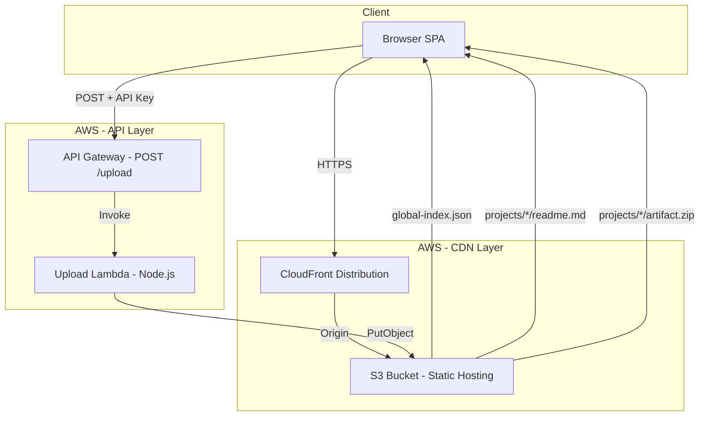

# Design Document

## Overview

Internal Repos is a serverless internal tool that enables employees to search, browse, and upload past company projects. The system follows a static-first architecture: a Vite-built SPA served via S3 + CloudFront for the frontend, a single Lambda function behind API Gateway for uploads, and a JSON manifest (`global-index.json`) for client-side search powered by Fuse.js.

Key design decisions:
- **Client-side search**: No search backend needed. Fuse.js operates on a flat JSON index fetched at page load, keeping infrastructure minimal.
- **Single Lambda**: One function handles upload processing, artifact filtering, and index regeneration, reducing deployment complexity.
- **S3 as database**: Project entries are stored as flat files in S3 (`readme.md`, `metadata.json`, `artifact.zip`), avoiding the need for a database.
- **Node.js throughout**: Both frontend tooling and Lambda runtime use JavaScript/Node.js for a single maintenance pattern.

## Architecture



### Request Flows

**Browse/Search Flow:**
1. Browser loads SPA from CloudFront
2. SPA fetches `global-index.json` from S3 via CloudFront
3. Fuse.js indexes the manifest client-side
4. User types query → debounced 200ms → Fuse.js returns ranked results
5. User selects project → SPA fetches `projects/{name}/readme.md` and `metadata.json`

**Upload Flow:**
1. User fills upload form (name, tags, readme, files via `webkitdirectory`)
2. Frontend POSTs to API Gateway with `x-api-key` header
3. API Gateway validates API key → invokes Lambda
4. Lambda validates input → filters files (deny list + .gitignore) → creates `artifact.zip`
5. Lambda writes `readme.md`, `metadata.json`, `artifact.zip` to `projects/{name}/`
6. Lambda scans all `metadata.json` files → regenerates `global-index.json`
7. Returns success response to frontend

**CI/CD Flow:**
1. Push to main triggers pipeline
2. `terraform plan/apply` provisions infrastructure
3. `npm run build` compiles frontend
4. `aws s3 sync` deploys build output
5. CloudFront cache invalidation on all paths

## Components and Interfaces

### Frontend SPA

| Module | Responsibility |
|--------|---------------|
| `search.js` | Initializes Fuse.js, handles debounced search queries, renders results list |
| `project-detail.js` | Fetches and renders readme.md (marked + highlight.js), displays metadata, handles download |
| `upload-form.js` | Manages upload form validation, file collection via webkitdirectory, POST to API Gateway |
| `api.js` | HTTP client layer; fetches index, project files; sends upload requests with API key |
| `router.js` | Client-side routing for SPA navigation (search view, project detail view, upload view) |

### Upload Lambda

| Module | Responsibility |
|--------|---------------|
| `handler.js` | Entry point; request validation, orchestration of upload pipeline, error responses |
| `filter.js` | Implements deny list matching and .gitignore parsing using the `ignore` npm package |
| `archiver-wrapper.js` | Wraps the `archiver` library to create artifact.zip from filtered file list |
| `s3-writer.js` | Writes readme.md, metadata.json, artifact.zip to S3 project entry path |
| `index-generator.js` | Scans all metadata.json in S3, builds and writes global-index.json |

### Interfaces

**API Gateway POST /upload**

Request:
```
POST /upload
Headers:
  x-api-key: <api-key>
  Content-Type: multipart/form-data

Body (multipart):
  - name: string (max 64 chars, alphanumeric + hyphens + underscores)
  - tags: string (comma-separated, max 10 tags, each max 32 chars)
  - readme: string (max 50,000 chars)
  - files: File[] (via webkitdirectory, total payload max 10 MB)
```

Responses:
```
200 OK: { "message": "Project uploaded successfully", "path": "projects/{name}/" }
400 Bad Request: { "error": "<validation message>" }
403 Forbidden: { "error": "Forbidden" }
409 Conflict: { "error": "Project name already taken" }
500 Internal Server Error: { "error": "Index generation failed" }
```

**S3 Read Paths (via CloudFront, no auth):**
- `GET /global-index.json`
- `GET /projects/{name}/readme.md`
- `GET /projects/{name}/metadata.json`
- `GET /projects/{name}/artifact.zip`

## Data Models

### global-index.json (Search_Index)

```json
[
  {
    "name": "project-alpha",
    "description": "Internal CI/CD tooling for deployment automation",
    "tags": ["ci-cd", "automation", "devops"],
    "date": "2024-01-15",
    "path": "projects/project-alpha/"
  }
]
```

TypeScript interface:
```typescript
interface ProjectIndexEntry {
  name: string;        // 1-64 chars, alphanumeric + hyphens + underscores
  description: string; // Free text from metadata
  tags: string[];      // 1-10 tags, each 1-32 chars
  date: string;        // ISO date format "YYYY-MM-DD"
  path: string;        // S3 prefix "projects/{name}/"
}

type SearchIndex = ProjectIndexEntry[];
```

### metadata.json (per project)

```json
{
  "name": "project-alpha",
  "description": "Internal CI/CD tooling for deployment automation",
  "tags": ["ci-cd", "automation", "devops"],
  "date": "2024-01-15"
}
```

```typescript
interface ProjectMetadata {
  name: string;
  description: string;
  tags: string[];
  date: string;
}
```

### Upload Request (validated by Lambda)

```typescript
interface UploadRequest {
  name: string;          // Required, max 64, /^[a-zA-Z0-9_-]+$/
  tags: string;          // Required, comma-separated
  readme: string;        // Required, max 50,000 chars
  files: FileEntry[];    // Required, at least 1 file after filtering
}

interface FileEntry {
  path: string;          // Relative path from project root
  content: Buffer;       // File content
}
```

### Deny List (hardcoded)

```typescript
const DENY_LIST: string[] = [
  '.git/',
  '.terraform/',
  'node_modules/',
  '__pycache__/',
  '.env',
  '.env.*',
  '*.pyc',
  '.DS_Store'
];
```

### Fuse.js Configuration

```typescript
const fuseOptions: Fuse.IFuseOptions<ProjectIndexEntry> = {
  keys: ['name', 'description', 'tags'],
  threshold: 0.4,       // Fuzzy matching tolerance
  includeScore: true,
  sortFn: (a, b) => a.score - b.score  // Rank by relevance
};
```


## Correctness Properties

*A property is a characteristic or behavior that should hold true across all valid executions of a system—essentially, a formal statement about what the system should do. Properties serve as the bridge between human-readable specifications and machine-verifiable correctness guarantees.*

### Property 1: Search results are ranked by relevance

*For any* valid search index and any non-empty query string, the results returned by Fuse.js SHALL be ordered by ascending score (most relevant first), and every returned result SHALL contain a fuzzy match against at least one of the searchable fields (name, description, or tags).

**Validates: Requirements 1.2**

### Property 2: Empty query returns all projects sorted by date descending

*For any* valid search index containing one or more projects, an empty query SHALL return all projects from the index, and the results SHALL be sorted by date in descending order (newest first).

**Validates: Requirements 1.3, 1.6**

### Property 3: Project detail view displays all metadata fields

*For any* valid metadata object, the rendered project detail view SHALL contain the project name, description, all tags, and the date formatted as "YYYY-MM-DD".

**Validates: Requirements 2.2**

### Property 4: Missing required fields produce specific validation errors

*For any* upload request with one or more required fields (project name, readme content, or files) missing, the Upload Lambda SHALL return a 400 status code, and the error message SHALL identify each missing required field by name.

**Validates: Requirements 3.5**

### Property 5: Invalid project names are rejected

*For any* string containing characters other than alphanumeric characters, hyphens, or underscores, the Upload Lambda SHALL reject the project name with a 400 status code and an error message indicating the allowed character set.

**Validates: Requirements 3.7**

### Property 6: File filtering excludes deny-listed and gitignore-matched files

*For any* set of uploaded files with an optional .gitignore file, the filtering logic SHALL exclude all files matching the deny list patterns, SHALL additionally exclude files matching valid .gitignore patterns, and deny list patterns SHALL never be overridden by .gitignore negation patterns.

**Validates: Requirements 4.1, 4.2**

### Property 7: Artifact zip preserves directory structure

*For any* set of filtered files with relative paths, creating an artifact.zip and then extracting it SHALL produce the same directory structure and file contents as the original filtered file set.

**Validates: Requirements 4.3**

### Property 8: Index generation produces valid entries from mixed metadata

*For any* set of metadata.json contents where some are valid and some are malformed (invalid JSON or missing required fields), the generated search index SHALL contain exactly one entry per valid metadata file, each entry SHALL include name, description, tags, date, and correct path fields, and no malformed metadata SHALL appear in the output.

**Validates: Requirements 5.2, 5.4**

### Property 9: PR validation requires both readme.md and metadata.json

*For any* project directory file listing, the CI/CD validation logic SHALL pass only when the listing contains both a readme.md and a metadata.json file, and SHALL fail otherwise.

**Validates: Requirements 7.4**

## Error Handling

### Frontend Errors

| Scenario | Handling |
|----------|----------|
| Search index fails to load | Display error message with retry button; disable search |
| readme.md fails to load | Show error banner; still display available metadata |
| metadata.json fails to load | Show error message; hide project details |
| artifact.zip unavailable | Disable download link; show "unavailable" message |
| Upload returns 400 | Display validation error message from response body |
| Upload returns 403 | Display "unauthorized" message; check API key config |
| Upload returns 409 | Display "project name taken" message |
| Upload returns 500 | Display generic error with retry suggestion |
| Network timeout | Display timeout error with retry option |

### Lambda Errors

| Scenario | Response | Side Effects |
|----------|----------|--------------|
| Missing required fields | 400 + field names | None |
| Invalid project name format | 400 + allowed chars | None |
| Project name already exists | 409 + conflict msg | None |
| All files filtered out | 400 + "no files remain" | None |
| artifact.zip > 100 MB | 400 + size exceeded | None |
| .gitignore parse failure | 200 + warning | Filters with deny list only |
| S3 write failure (project) | 500 + error msg | Partial writes may exist |
| S3 write failure (index) | 500 + "index generation failed" | Project files preserved; old index preserved |
| Malformed metadata during scan | Continue silently | Skip entry in index |

### Error Recovery Strategy

- **Idempotent uploads**: If upload fails partway, retrying with the same project name will get a 409 since partial files may exist. An admin cleanup process or manual S3 deletion may be needed.
- **Index resilience**: Index generation skips malformed metadata rather than failing entirely, ensuring one bad project doesn't break search for all.
- **Old index preservation**: If writing the new `global-index.json` fails, the old one remains in place.

## Testing Strategy

### Unit Tests

Unit tests cover specific examples, edge cases, and error conditions:

- **Frontend**: Form validation logic, API client request construction, date formatting, error state rendering
- **Lambda handler**: Request validation (specific examples of valid/invalid inputs), error response format
- **Filter module**: Specific deny list patterns, gitignore edge cases (negation, comments, blank lines)
- **Index generator**: Empty project list, single project, malformed JSON handling

### Property-Based Tests

Property-based testing is applicable to this feature because:
- The filtering logic (deny list + gitignore) operates as a pure function over arbitrary file trees
- The index generator transforms arbitrary metadata sets into a structured output
- Validation logic must hold across all possible input strings
- Search behavior must maintain invariants across all possible indexes and queries

**Library**: [fast-check](https://github.com/dubzzz/fast-check) (JavaScript property-based testing)

**Configuration**:
- Minimum 100 iterations per property test
- Each test tagged with design property reference
- Tag format: **Feature: internal-repos, Property {number}: {property_text}**

**Property tests to implement:**
1. Search relevance ranking (Property 1)
2. Empty query sort order (Property 2)
3. Metadata display completeness (Property 3)
4. Missing fields validation (Property 4)
5. Invalid name rejection (Property 5)
6. File filtering correctness (Property 6)
7. Zip round-trip structure preservation (Property 7)
8. Index generation from mixed metadata (Property 8)
9. PR validation logic (Property 9)

### Integration Tests

Integration tests verify component interaction with mocked AWS services:

- Upload flow end-to-end (mock S3): valid upload → files written → index regenerated
- Project exists check (mock S3 headObject)
- Index generation S3 scanning (mock listObjectsV2 + getObject)
- API Gateway auth rejection (missing/invalid key → 403)

### Smoke Tests

Infrastructure validation (post-deployment):

- S3 bucket configured for static hosting with correct index/error documents
- CloudFront HTTPS redirect active
- API Gateway usage plan with API key requirement
- CloudFront serves content without auth on read paths
- CI/CD pipeline configuration contains required steps

### Test Execution

```bash
# Unit + property tests
npm test

# Property tests only
npm test -- --grep "Property"

# Integration tests (requires AWS mocks)
npm run test:integration
```
