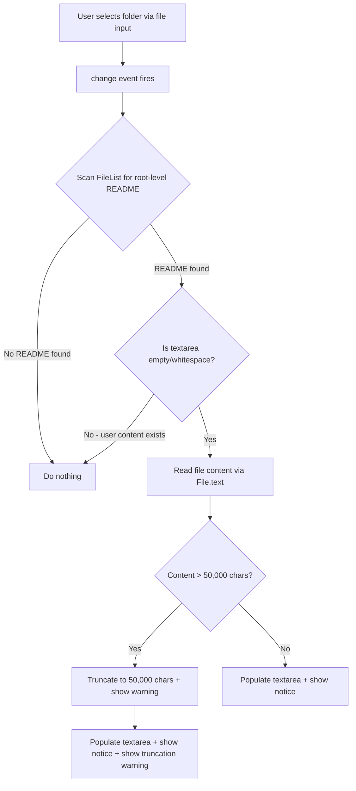

# Design Document: Optional README Autofill

## Overview

This feature transforms the README field from a mandatory input to an optional field with smart autofill capabilities. When a user selects a folder for upload, the system scans the file list for a root-level README file and, if found, automatically populates the textarea with its content. This reduces friction for users who already maintain README files in their project folders.

The change spans three layers:
1. **Shared types** — make `readme` optional in `UploadRequest`
2. **Backend** — remove required validation for readme in `validateRequest()`
3. **Frontend** — remove required validation, add README detection logic, and implement autofill with user feedback (notice/warning elements)

## Architecture

The feature modifies existing components without introducing new services or dependencies. The data flow changes are localized to the upload pipeline:



On the validation side, both frontend `validateForm()` and backend `validateRequest()` simply remove the "readme is required" check while keeping the max-length validation intact.

## Components and Interfaces

### Modified: `shared/src/types.ts`

```typescript
export interface UploadRequest {
  name: string;
  tags: string;
  readme?: string;  // Changed from required to optional
  files: FileEntry[];
}
```

### Modified: `frontend/src/upload-form.ts`

#### `validateForm()` changes

Remove the empty-readme check. Keep the max-length check:

```typescript
// Readme validation — only check length if provided
if (readme.length > MAX_README_LENGTH) {
  errors.readme = `Readme must be at most ${MAX_README_LENGTH.toLocaleString()} characters`;
}
```

#### New function: `detectReadmeFile(files: FileList): File | null`

Scans a FileList for a root-level README file using `webkitRelativePath`. Returns the highest-priority match or `null`.

```typescript
export function detectReadmeFile(files: FileList): File | null {
  const README_PATTERN = /^readme(\.(md|txt))?$/i;
  const PRIORITY: Record<string, number> = { '.md': 0, '.txt': 1, '': 2 };

  const candidates: Array<{ file: File; priority: number; index: number }> = [];

  for (let i = 0; i < files.length; i++) {
    const file = files[i];
    const relativePath = file.webkitRelativePath;
    // Root level: exactly one path separator (e.g., "folderName/README.md")
    const parts = relativePath.split('/');
    if (parts.length !== 2) continue;

    const filename = parts[1];
    if (!README_PATTERN.test(filename)) continue;

    const ext = filename.includes('.') ? filename.slice(filename.lastIndexOf('.')).toLowerCase() : '';
    const priority = PRIORITY[ext] ?? 2;
    candidates.push({ file, priority, index: i });
  }

  if (candidates.length === 0) return null;

  // Sort by priority (lower = higher priority), then by original index (stable)
  candidates.sort((a, b) => a.priority - b.priority || a.index - b.index);
  return candidates[0].file;
}
```

#### New function: `handleReadmeAutofill(files: FileList, textarea: HTMLTextAreaElement, noticeContainer: HTMLDivElement): Promise<void>`

Orchestrates detection, reading, truncation, and UI feedback.

```typescript
export async function handleReadmeAutofill(
  files: FileList,
  textarea: HTMLTextAreaElement,
  noticeContainer: HTMLDivElement,
): Promise<void> {
  // Clear any previous notices
  noticeContainer.innerHTML = '';

  // Only autofill if textarea is empty/whitespace
  if (textarea.value.trim().length > 0) return;

  const readmeFile = detectReadmeFile(files);
  if (!readmeFile) return;

  let content: string;
  try {
    content = await readmeFile.text();
  } catch {
    // Cannot read file — leave textarea unchanged
    return;
  }

  let truncated = false;
  if (content.length > MAX_README_LENGTH) {
    content = content.slice(0, MAX_README_LENGTH);
    truncated = true;
  }

  textarea.value = content;

  // Show autofill notice
  const notice = document.createElement('span');
  notice.className = 'readme-autofill-notice';
  notice.textContent = `Auto-filled from ${readmeFile.name}`;
  notice.setAttribute('aria-live', 'polite');
  noticeContainer.appendChild(notice);

  // Show truncation warning if applicable
  if (truncated) {
    const warning = document.createElement('span');
    warning.className = 'readme-truncation-warning';
    warning.textContent = `Content was truncated to ${MAX_README_LENGTH.toLocaleString()} characters (maximum allowed).`;
    warning.setAttribute('role', 'alert');
    noticeContainer.appendChild(warning);
  }
}
```

#### `renderUploadForm()` changes

1. Remove `required: true` from the `createTextareaGroup` call for readme.
2. Add a notice container `<div>` below the textarea for autofill/truncation messages.
3. Attach a `change` event listener to the file input that calls `handleReadmeAutofill()`.
4. Attach an `input` event listener on the textarea to clear the notice when the user edits.

### Modified: `lambda/src/handler.ts`

#### `validateRequest()` changes

Remove `readme` from the required-fields check. Keep the max-length check:

```typescript
export function validateRequest(data: ParsedFormData): string | null {
  const missingFields: string[] = [];
  if (!data.name || data.name.trim().length === 0) {
    missingFields.push('name');
  }
  // readme is now optional — no required check
  if (!data.files || data.files.length === 0) {
    missingFields.push('files');
  }

  if (missingFields.length > 0) {
    return `Missing required fields: ${missingFields.join(', ')}`;
  }

  // ... existing name/tags validation ...

  // Validate readme length only if provided
  if (data.readme && data.readme.length > MAX_README_LENGTH) {
    return `Readme content must be at most ${MAX_README_LENGTH} characters.`;
  }

  // ... rest of validation ...
}
```

## Data Models

No new data models are introduced. The only change is making the `readme` field optional in the existing `UploadRequest` interface:

| Field | Current Type | New Type | Notes |
|-------|-------------|----------|-------|
| `readme` | `string` (required) | `string \| undefined` (optional) | Downstream processing treats `undefined`/empty as no readme |

The `ProjectMetadata` and `ProjectIndexEntry` types remain unchanged — they don't include readme content directly.

## Correctness Properties

*A property is a characteristic or behavior that should hold true across all valid executions of a system — essentially, a formal statement about what the system should do. Properties serve as the bridge between human-readable specifications and machine-verifiable correctness guarantees.*

### Property 1: Frontend accepts empty or whitespace-only readme

*For any* string composed entirely of whitespace (including the empty string), calling `validateForm` with that string as the readme argument (along with a valid name and files) SHALL NOT produce a `readme` error in the returned `ValidationErrors` object.

**Validates: Requirements 1.1**

### Property 2: Frontend rejects readme exceeding max length

*For any* string with length greater than 50,000 characters, calling `validateForm` with that string as readme SHALL produce a `readme` error in the returned `ValidationErrors` object.

**Validates: Requirements 1.2**

### Property 3: Backend accepts empty, whitespace-only, or undefined readme

*For any* `ParsedFormData` with a valid name, at least one file, and a readme that is either undefined, empty, or whitespace-only, calling `validateRequest` SHALL return `null` (no validation error).

**Validates: Requirements 2.1**

### Property 4: Backend rejects readme exceeding max length

*For any* `ParsedFormData` with a valid name, at least one file, and a readme string with length greater than 50,000 characters, calling `validateRequest` SHALL return a non-null error string mentioning the readme length limit.

**Validates: Requirements 2.2**

### Property 5: Backend accepts readme within valid bounds

*For any* `ParsedFormData` with a valid name, at least one file, and a non-empty readme string with length between 1 and 50,000 characters (inclusive), calling `validateRequest` SHALL return `null` (no validation error).

**Validates: Requirements 2.3**

### Property 6: README detection selects highest-priority root-level match

*For any* FileList containing files with `webkitRelativePath` values, `detectReadmeFile` SHALL return the file that is (a) at root level (exactly one path separator), (b) matches the README pattern case-insensitively, and (c) has the highest extension priority (`.md` > `.txt` > no extension). If no file matches all criteria, it SHALL return `null`.

**Validates: Requirements 3.1, 3.2, 3.3**

### Property 7: Autofill populates textarea when content is empty

*For any* FileList containing a valid root-level README file and a textarea with empty or whitespace-only content, `handleReadmeAutofill` SHALL set the textarea value to the content of the detected README file (up to the max length).

**Validates: Requirements 4.1**

### Property 8: Autofill preserves existing non-whitespace content

*For any* FileList containing a valid root-level README file and a textarea with non-whitespace content, `handleReadmeAutofill` SHALL leave the textarea value unchanged.

**Validates: Requirements 4.2**

### Property 9: Autofill truncates content exceeding max length

*For any* README file with content longer than 50,000 characters, when `handleReadmeAutofill` populates the textarea, the resulting textarea value SHALL have exactly 50,000 characters (the first 50,000 characters of the original content).

**Validates: Requirements 4.4**

## Error Handling

| Scenario | Handling |
|----------|----------|
| `File.text()` rejects (unreadable file) | Silently catch, leave textarea unchanged, show no notice |
| Readme exceeds max length on autofill | Truncate to 50,000 chars, show truncation warning |
| Readme exceeds max length on manual entry | Frontend validation error on submit |
| Readme exceeds max length on backend | 400 response with error message |
| Missing readme on submit (frontend) | No error — field is optional |
| Missing readme on backend | No error — treated as empty string |

Error boundaries are kept narrow: the autofill operation is entirely fire-and-forget from the form's perspective. A failure to read the file does not block submission or alter form state.

## Testing Strategy

### Property-Based Tests (fast-check)

The project already has `fast-check ^3.15.0` as a dev dependency. Each property test runs a minimum of 100 iterations.

**Frontend validation properties (P1, P2):**
- Generate random whitespace strings → verify no readme error
- Generate random strings of length 50,001–100,000 → verify readme error present

**Backend validation properties (P3, P4, P5):**
- Generate undefined/whitespace readme with valid name+files → verify null return
- Generate strings > 50,000 → verify non-null error
- Generate strings 1–50,000 → verify null return

**README detection property (P6):**
- Generate random file lists with varying paths, filenames (README case permutations, extensions), nesting depths → verify correct selection or null

**Autofill properties (P7, P8, P9):**
- Generate random text content + empty textarea → verify population
- Generate random text content + non-empty textarea → verify no change
- Generate strings > 50,000 chars → verify truncation to exactly 50,000

Each property-based test will be tagged with:
```
// Feature: optional-readme-autofill, Property N: <property text>
```

### Unit Tests (example-based)

- Textarea renders without `required` attribute (Req 1.3)
- Autofill notice element appears after detection (Req 4.3)
- Autofill notice disappears on user edit (Req 4.3)
- Truncation warning appears when content exceeds limit (Req 4.4)
- File read failure leaves textarea unchanged (Req 4.5)
- No README in folder leaves textarea unchanged (Req 3.4)
- Textarea remains editable after autofill (Req 3.5)

### Test Configuration

- Framework: vitest with jsdom environment for frontend tests
- PBT library: fast-check (already in devDependencies)
- Minimum iterations: 100 per property
- Test files: `upload-form.test.ts` (frontend), `handler.test.ts` (backend)
