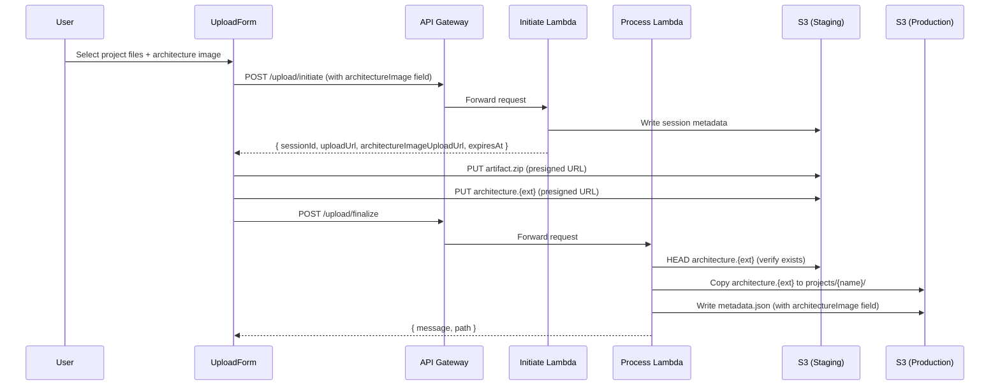
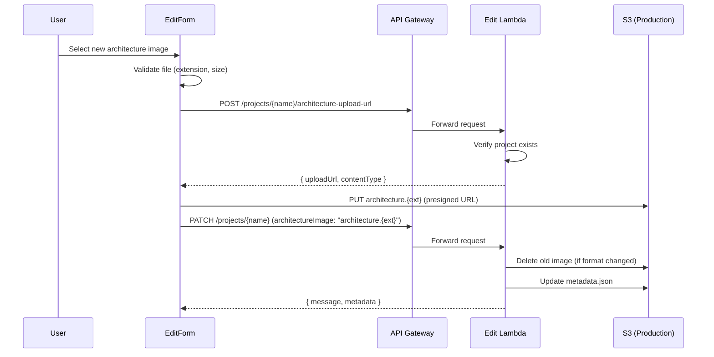
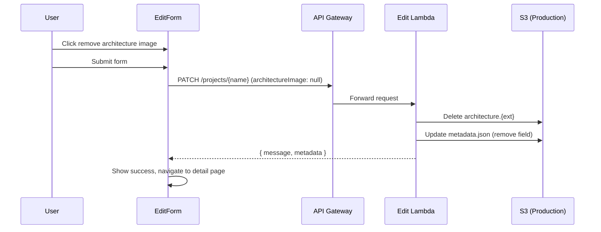

# Design Document: Project Architecture Image

## Overview

This feature extends the project management system to support optional architecture images (PNG or SVG) for projects, mirroring the existing template architecture image functionality. Users can upload, display, replace, and remove architecture diagrams from their projects.

The design leverages the existing `renderArchitectureSection`, `showImageLightbox`, and `resolveArchitectureImageUrl` functions from `template-detail.ts` to ensure visual consistency and maintainability. The backend extends the existing `EditRequest`/`InitiateRequest` interfaces and adds a new presigned URL endpoint for architecture image uploads during edit.

### Key Design Decisions

1. **Reuse template rendering logic** — The architecture image display on projects reuses the same functions from `template-detail.ts` to guarantee identical visual presentation and behavior.
2. **Presigned URL upload** — Architecture images are uploaded directly to S3 via presigned PUT URLs (same pattern as artifact upload), avoiding Lambda payload limits.
3. **Separate presigned URL endpoint for edit** — During edit, a dedicated endpoint (`POST /projects/{name}/architecture-upload-url`) provides the presigned URL, since the edit flow doesn't use the initiate/finalize cycle.
4. **Graceful degradation** — Missing or broken images result in silent section removal rather than error display.

## Architecture

```mermaid
flowchart TD
    subgraph Frontend
        PD[Project Detail Page]
        EF[Edit Form]
        UF[Upload Form]
        TD[template-detail.ts<br/>shared functions]
    end

    subgraph API Gateway
        INIT[POST /upload/initiate]
        FIN[POST /upload/finalize]
        EDIT[PATCH /projects/{name}]
        ARCH_URL[POST /projects/{name}/architecture-upload-url]
    end

    subgraph Lambda
        INIT_H[Initiate Handler]
        PROC_H[Process Handler]
        EDIT_H[Edit Handler]
    end

    subgraph S3
        STAGING[Staging Bucket<br/>staging/{sessionId}/architecture.{ext}]
        PROD[Frontend Bucket<br/>projects/{name}/architecture.{ext}]
        META[Frontend Bucket<br/>projects/{name}/metadata.json]
    end

    subgraph CDN
        CF[CloudFront]
    end

    PD -->|import| TD
    PD -->|HEAD request| CF
    CF -->|serve| PROD

    UF -->|initiate| INIT
    INIT --> INIT_H
    INIT_H -->|presigned URL| UF
    UF -->|PUT image| STAGING
    UF -->|finalize| FIN
    FIN --> PROC_H
    PROC_H -->|copy image| PROD
    PROC_H -->|write| META

    EF -->|request presigned URL| ARCH_URL
    ARCH_URL --> EDIT_H
    EDIT_H -->|presigned URL| EF
    EF -->|PUT image| PROD
    EF -->|PATCH metadata| EDIT
    EDIT --> EDIT_H
    EDIT_H -->|update| META
    EDIT_H -->|delete old image| PROD
```

### Data Flow: Upload During Project Creation



### Data Flow: Upload During Edit



### Data Flow: Removal



## Components and Interfaces

### Type Changes (`shared/src/types.ts`)

```typescript
// Add to ProjectMetadata
export interface ProjectMetadata {
  name: string;
  description: string;
  tags: string[];
  date: string;
  repositoryUrl?: string;
  /** Optional architecture image filename */
  architectureImage?: 'architecture.png' | 'architecture.svg';
}

// Add to InitiateRequest
export interface InitiateRequest {
  // ... existing fields
  /** Optional architecture image filename for upload */
  architectureImage?: 'architecture.png' | 'architecture.svg';
}

// Add to InitiateResponse
export interface InitiateResponse {
  // ... existing fields
  /** Presigned PUT URL for architecture image upload */
  architectureImageUploadUrl?: string;
}

// Add to EditRequest
export interface EditRequest {
  // ... existing fields
  /** Architecture image filename to set, or null to remove */
  architectureImage?: 'architecture.png' | 'architecture.svg' | null;
}
```

### New API Endpoint

```typescript
/**
 * POST /projects/{name}/architecture-upload-url
 * 
 * Request body:
 */
interface ArchitectureUploadUrlRequest {
  /** Target file extension: 'png' or 'svg' */
  extension: 'png' | 'svg';
}

/**
 * Response:
 */
interface ArchitectureUploadUrlResponse {
  /** Presigned PUT URL for uploading the architecture image */
  uploadUrl: string;
  /** Content-Type the upload must use */
  contentType: 'image/png' | 'image/svg+xml';
  /** ISO 8601 expiration timestamp */
  expiresAt: string;
}
```

### Frontend Components

| Component | Change |
|-----------|--------|
| `project-detail.ts` | Import and call `resolveArchitectureImageUrl` (adapted for projects path), `renderArchitectureSection`, `showImageLightbox` from `template-detail.ts`. Insert architecture section in supplementary content before readme. |
| `edit-form.ts` | Add file input for architecture image (PNG/SVG, 5MB max). Add removal control when image exists. Handle presigned URL flow before PATCH. |
| `upload-form.ts` | Add optional file input for architecture image. Include filename in `InitiateRequest`. Upload to `architectureImageUploadUrl` in parallel with artifact. |
| `utils/api.ts` | Add `requestArchitectureUploadUrl(name, extension)` function. Extend `updateProject` to accept `architectureImage` field. |

### Backend Components

| Component | Change |
|-----------|--------|
| `handlers/initiate.ts` | Accept `architectureImage` in request body. Generate additional presigned URL for `staging/{sessionId}/architecture.{ext}`. Include in response. |
| `handlers/process.ts` | During finalize, HEAD-check architecture image in staging. If exists, copy to production path and set field in metadata. |
| `handlers/edit.ts` | Handle `architectureImage` field in EditRequest. When non-null, update metadata. When `null`, delete S3 image and remove field. Handle format change (delete old, keep new). Expose presigned URL sub-route. |
| `utils/validate.ts` | Add validation for `architectureImage` field (must be exact string or null). Add validation for architecture-upload-url request. |

### File Validation Function (Frontend)

```typescript
const ALLOWED_EXTENSIONS = ['.png', '.svg'];
const MAX_ARCHITECTURE_IMAGE_SIZE = 5 * 1024 * 1024; // 5 MB

interface ArchitectureImageValidation {
  valid: boolean;
  error?: string;
  extension?: 'png' | 'svg';
}

function validateArchitectureImage(file: File): ArchitectureImageValidation {
  const name = file.name.toLowerCase();
  const ext = name.slice(name.lastIndexOf('.'));
  
  if (!ALLOWED_EXTENSIONS.includes(ext)) {
    return { valid: false, error: 'Accepted formats: PNG and SVG' };
  }
  
  if (file.size > MAX_ARCHITECTURE_IMAGE_SIZE) {
    return { valid: false, error: 'Maximum file size: 5 MB' };
  }
  
  return { valid: true, extension: ext === '.png' ? 'png' : 'svg' };
}
```

## Data Models

### S3 Object Layout

```
projects/{name}/
├── metadata.json          (includes architectureImage field)
├── readme.md
├── artifact.zip
├── file-tree.json
├── architecture.png       (optional, mutually exclusive with .svg)
└── architecture.svg       (optional, mutually exclusive with .png)

staging/{sessionId}/
├── metadata.json
├── upload.zip             (or files/ for folder mode)
└── architecture.{ext}    (optional, during creation flow)
```

### ProjectMetadata with architectureImage

```json
{
  "name": "my-project",
  "description": "A sample project",
  "tags": ["lambda", "typescript"],
  "date": "2025-01-15",
  "repositoryUrl": "https://github.com/org/my-project",
  "architectureImage": "architecture.png"
}
```

### Presigned URL Configuration

| Parameter | Value |
|-----------|-------|
| Expiry | 900 seconds (15 minutes) |
| Content-Type condition | `image/png` or `image/svg+xml` |
| Content-Length condition | Max 10 MB |
| Target key (creation) | `staging/{sessionId}/architecture.{ext}` |
| Target key (edit) | `projects/{name}/architecture.{ext}` |

## Correctness Properties

*A property is a characteristic or behavior that should hold true across all valid executions of a system — essentially, a formal statement about what the system should do. Properties serve as the bridge between human-readable specifications and machine-verifiable correctness guarantees.*

### Property 1: Conditional rendering based on metadata

*For any* ProjectMetadata object where `architectureImage` is undefined or absent, the project detail page rendering logic SHALL produce no architecture section element in the DOM.

**Validates: Requirements 1.2, 6.6**

### Property 2: Architecture image URL construction

*For any* valid project name and any valid `architectureImage` value (`'architecture.png'` or `'architecture.svg'`), the resolved image URL SHALL equal `{cdnBaseUrl}/projects/{name}/{architectureImage}`.

**Validates: Requirements 1.3**

### Property 3: Accessibility attribute construction

*For any* valid project name string, the rendered architecture section SHALL set the image alt text to exactly `"Architecture diagram for {name}"` and the button aria-label to exactly `"View full-size architecture diagram for {name}"`.

**Validates: Requirements 2.3, 2.4**

### Property 4: Architecture image file validation

*For any* file object, the validation function SHALL accept the file if and only if the file extension (case-insensitive) is `.png` or `.svg` AND the file size does not exceed 5 MB. All other files SHALL be rejected with an appropriate error message.

**Validates: Requirements 3.2, 4.2**

### Property 5: Metadata merge with architectureImage

*For any* existing ProjectMetadata and any EditRequest containing an `architectureImage` field: if the value is a valid filename string, the merged metadata SHALL contain that value in its `architectureImage` field; if the value is `null`, the merged metadata SHALL NOT contain an `architectureImage` field.

**Validates: Requirements 4.8, 6.3**

### Property 6: Presigned URL S3 key construction

*For any* valid project name and any valid extension (`'png'` or `'svg'`), the presigned URL generation logic SHALL target the S3 key `projects/{name}/architecture.{ext}`.

**Validates: Requirements 5.2**

### Property 7: Extension validation on presigned URL endpoint

*For any* string that is not exactly `'png'` or `'svg'`, the architecture upload URL endpoint SHALL reject the request with a validation error.

**Validates: Requirements 5.6**

## Error Handling

| Scenario | Component | Behavior |
|----------|-----------|----------|
| Architecture image fails to load (HTTP error or network failure) | `project-detail.ts` | `img.onerror` removes the entire architecture section from DOM silently |
| Architecture image not in staging during finalize | `process.ts` | Skips image copy, does not set `architectureImage` in metadata. Finalize succeeds normally. |
| Presigned URL upload fails during edit | `edit-form.ts` | Displays error message, does not proceed with PATCH request |
| S3 delete fails during removal | `edit.ts` | Logs error, still removes `architectureImage` from metadata, returns 200 |
| Project not found when requesting upload URL | `edit.ts` | Returns 404 with error message |
| Invalid extension in upload URL request | `edit.ts` | Returns 400 with validation error |
| File exceeds 5 MB (client-side) | `upload-form.ts` / `edit-form.ts` | Displays validation error, prevents submission |
| Format change (png → svg) during edit | `edit.ts` | Deletes old file (`architecture.png`), keeps new file (`architecture.svg`), updates metadata |

## Testing Strategy

### Unit Tests

- **File validation function**: Test boundary conditions (exactly 5 MB, 5 MB + 1 byte, extensions `.PNG`, `.Svg`, `.jpg`, `.gif`, empty filename)
- **Metadata merge**: Test all combinations — set architectureImage, replace architectureImage, null architectureImage, undefined (no change)
- **URL construction**: Test with special characters in project names, both extension values
- **Accessibility strings**: Test with various project names including Unicode
- **Edit Lambda handler**: Mock S3 calls, test format change deletion logic, test null removal logic
- **Initiate handler**: Mock S3, test presigned URL generation when architectureImage is provided vs absent

### Property-Based Tests

Property-based testing is appropriate for this feature because several core functions are pure (validation, merge, string construction) with well-defined input spaces.

**Library**: [fast-check](https://github.com/dubzzz/fast-check) (TypeScript)

**Configuration**: Minimum 100 iterations per property test.

Each property test SHALL be tagged with a comment referencing the design property:
- **Feature: project-architecture-image, Property 1**: Conditional rendering
- **Feature: project-architecture-image, Property 2**: URL construction
- **Feature: project-architecture-image, Property 3**: Accessibility attributes
- **Feature: project-architecture-image, Property 4**: File validation
- **Feature: project-architecture-image, Property 5**: Metadata merge
- **Feature: project-architecture-image, Property 6**: Presigned URL key
- **Feature: project-architecture-image, Property 7**: Extension validation

### Integration Tests

- Full upload flow with architecture image (initiate → upload artifact + image → finalize → verify metadata and S3 objects)
- Edit flow: upload new image via presigned URL, then PATCH with architectureImage field
- Removal flow: PATCH with `architectureImage: null`, verify S3 object deleted
- Format change flow: existing PNG, upload SVG via edit, verify old PNG deleted
- Project detail page rendering with mocked fetch (HEAD requests for image resolution)

### End-to-End Tests

- Upload a project with architecture image → verify it displays on detail page
- Edit project to add architecture image → verify rendering
- Remove architecture image → verify section disappears
- Verify lightbox opens on click and closes with Escape/click-outside/button
