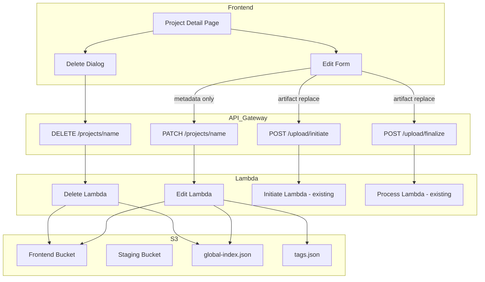
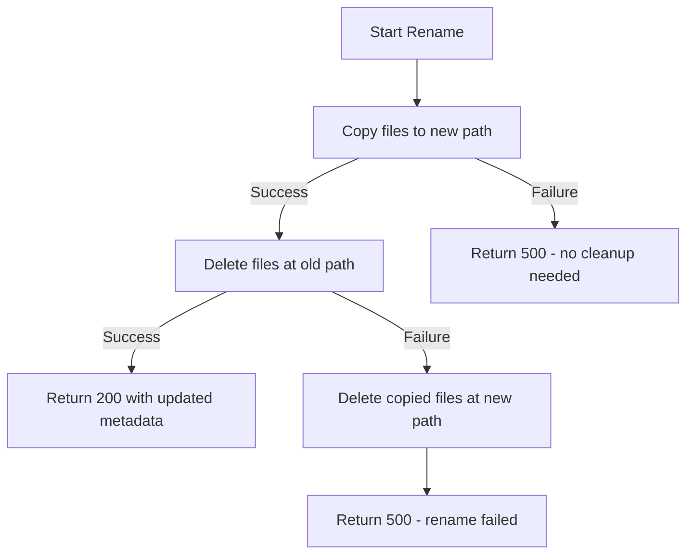

# Design Document: Project Edit & Delete

## Overview

This feature adds edit and delete capabilities to the Internal Repos tool, enabling employees to modify project metadata (name, tags, readme), replace artifact files, and permanently remove projects. The design builds on the existing presigned upload architecture and reuses shared validation, tag registry, and search index regeneration logic.

Two new Lambda handlers are introduced:
- **Edit Lambda** — handles `PATCH /projects/{name}` for metadata updates and coordinates artifact replacement via the existing presigned upload flow
- **Delete Lambda** — handles `DELETE /projects/{name}` for project removal

The frontend adds an edit form (pre-filled from current metadata) and a delete confirmation dialog (type-to-confirm pattern) to the project detail page.

## Architecture



### Key Design Decisions

1. **Separate Lambda handlers for Edit vs Delete** — keeps responsibilities clear, allows independent IAM policies and timeout tuning (edit with rename is more complex than delete)
2. **Reuse existing presigned upload flow for artifact replacement** — the `initiate → upload → finalize` pattern already handles filtering, archiving, and size limits; we add a `mode: "replace"` flag to skip the duplicate-name check
3. **Atomic rename via copy-then-delete** — S3 has no rename primitive; the Edit Lambda copies all objects to the new prefix, verifies success, then deletes the old prefix. Rollback deletes the new prefix on failure.
4. **Partial updates** — the PATCH endpoint accepts only the fields being changed; omitted fields retain their current values
5. **Shared validation** — both backend and frontend reuse constants from `shared/src/constants.ts` to enforce the same rules

## Components and Interfaces

### New Lambda: `edit.ts`

Handles `PATCH /projects/{name}`:

```typescript
interface EditRequest {
  /** New project name (optional, triggers rename) */
  name?: string;
  /** Updated tags array (optional) */
  tags?: string[];
  /** Updated readme content (optional) */
  readme?: string;
}

interface EditResponse {
  message: string;
  metadata: ProjectMetadata;
  renamed?: boolean;
}
```

**Responsibilities:**
- Validate path parameter `{name}` format
- Parse and validate request body fields against shared constants
- Check project existence (404 if not found)
- If `name` field differs from path param → execute rename flow
- If `name` provided and taken → return 409
- Merge updated fields with existing metadata
- Write updated `metadata.json` and `readme.md` to S3
- Add any new tags to the tag registry
- Regenerate `global-index.json`
- Return updated metadata

### New Lambda: `delete.ts`

Handles `DELETE /projects/{name}`:

```typescript
interface DeleteResponse {
  message: string;
  name: string;
}
```

**Responsibilities:**
- Validate path parameter `{name}` format
- Check project existence via HeadObject on `metadata.json` (404 if not found)
- Delete all objects under `projects/{name}/` prefix
- Regenerate `global-index.json`
- Return confirmation with deleted project name

### Modified: `initiate.ts`

Add support for artifact replacement mode:

```typescript
interface InitiateRequest {
  // existing fields...
  /** When true, skips duplicate-name check (for artifact replacement) */
  mode?: 'create' | 'replace';
}
```

When `mode === 'replace'`, the initiate handler:
- Verifies the project **does** exist (404 if not)
- Skips the "name already taken" check
- Stores `mode: 'replace'` in session metadata

### Modified: `process.ts`

When session metadata has `mode === 'replace'`:
- Overwrites only `artifact.zip` in the project entry
- Preserves existing `metadata.json` and `readme.md`
- Does NOT regenerate the search index
- Cleans up staged files as normal

### Frontend: Edit Form Component (`edit-form.ts`)

- Renders on `#/project/:name/edit` route
- Fetches current metadata and readme to pre-fill form
- Reuses the `TagSelector` component from upload form
- Includes optional folder picker for artifact replacement
- Submits metadata changes via `PATCH /projects/{name}`
- If new artifact selected, runs presigned upload flow first, then metadata PATCH
- Navigates back to project detail on success

### Frontend: Delete Dialog Component (`delete-dialog.ts`)

- Rendered as a modal overlay from project detail page
- Shows project name and text input for confirmation
- Confirm button disabled until input matches project name exactly
- Sends `DELETE /projects/{name}` on confirm
- Shows loading indicator during request
- Navigates to home (`#/`) on success

### Frontend: API additions (`api.ts`)

```typescript
/** PATCH /projects/{name} — update project metadata */
export async function updateProject(
  name: string,
  updates: { name?: string; tags?: string[]; readme?: string }
): Promise<ApiResult<EditResponse>>;

/** DELETE /projects/{name} — delete a project */
export async function deleteProject(name: string): Promise<ApiResult<DeleteResponse>>;
```

### Infrastructure: `api.tf` additions

- New API Gateway resource: `/projects/{name}` with path parameter
- PATCH method → Edit Lambda integration (API key required)
- DELETE method → Delete Lambda integration (API key required)
- OPTIONS method → CORS mock integration for PATCH/DELETE
- New Lambda functions with IAM policy including `s3:DeleteObject` permission
- Redeployment triggers updated to include new resources

## Data Models

### Existing Models (unchanged)

| Model | Location | Description |
|-------|----------|-------------|
| `ProjectMetadata` | `shared/src/types.ts` | `{ name, description, tags, date }` stored in `metadata.json` |
| `ProjectIndexEntry` | `shared/src/types.ts` | `{ name, description, tags, date, path }` in `global-index.json` |
| `SessionMetadata` | `shared/src/types.ts` | Upload session state in staging bucket |

### New/Modified Types

```typescript
/** Request body for PATCH /projects/{name} */
export interface EditRequest {
  name?: string;    // 1-64 chars, /^[a-zA-Z0-9_-]+$/
  tags?: string[];  // 1-10 items, each 1-32 chars, /^[a-z0-9_-]+$/
  readme?: string;  // max 50,000 chars
}

/** Response from PATCH /projects/{name} */
export interface EditResponse {
  message: string;
  metadata: ProjectMetadata;
  renamed?: boolean;
}

/** Response from DELETE /projects/{name} */
export interface DeleteResponse {
  message: string;
  name: string;
}

/** Extended SessionMetadata for replace mode */
export interface SessionMetadata {
  // existing fields...
  mode?: 'create' | 'replace';
}
```

### S3 State Transitions

**Edit (metadata only):**
```
projects/{name}/metadata.json  →  overwritten with merged fields
projects/{name}/readme.md      →  overwritten if readme field provided
global-index.json              →  regenerated
tags.json                      →  updated if new tags present
```

**Edit (rename):**
```
projects/{old-name}/*          →  copied to projects/{new-name}/*
projects/{old-name}/*          →  deleted after copy succeeds
global-index.json              →  regenerated
```

**Artifact replacement:**
```
staging/{sessionId}/upload.zip →  processed through filter/archive pipeline
projects/{name}/artifact.zip   →  overwritten with new artifact
staging/{sessionId}/*          →  cleaned up
```

**Delete:**
```
projects/{name}/metadata.json  →  deleted
projects/{name}/readme.md      →  deleted
projects/{name}/artifact.zip   →  deleted
global-index.json              →  regenerated
```


## Correctness Properties

*A property is a characteristic or behavior that should hold true across all valid executions of a system — essentially, a formal statement about what the system should do. Properties serve as the bridge between human-readable specifications and machine-verifiable correctness guarantees.*

### Property 1: Partial update preserves omitted fields

*For any* valid existing `ProjectMetadata` and *for any* subset of update fields (name, tags, readme) where at least one field is provided, applying the edit merge function SHALL produce metadata where: (a) every field included in the update has the new value, and (b) every field NOT included in the update retains its original value.

**Validates: Requirements 1.1, 6.6**

### Property 2: Edit validation correctly classifies inputs

*For any* string `name`, *for any* array of strings `tags`, and *for any* string `readme`: the edit validator SHALL accept the input if and only if all of the following hold: name matches `/^[a-zA-Z0-9_-]+$/` and has length 1–64, each tag matches `/^[a-z0-9_-]+$/` and has length 1–32, there are at most 10 tags, and readme has length ≤ 50,000 characters.

**Validates: Requirements 1.6, 1.7, 1.8, 3.7, 4.4**

### Property 3: Invalid edit requests produce no state mutations

*For any* edit request that fails validation, the edit handler SHALL return a 400 status code and SHALL NOT invoke any S3 write, delete, or copy operations.

**Validates: Requirements 1.9**

### Property 4: Frontend diff sends only modified fields

*For any* pair of (original metadata, edited form values), the constructed PATCH request body SHALL contain exactly the fields whose values differ between the original and edited states, and SHALL omit all fields whose values are identical.

**Validates: Requirements 4.5**

### Property 5: Delete confirmation enabled iff exact name match

*For any* project name and *for any* typed string, the delete confirmation button SHALL be enabled if and only if the typed string is exactly equal to the project name (case-sensitive character-by-character comparison).

**Validates: Requirements 5.2**

## Error Handling

### Edit Lambda Error Cases

| Condition | HTTP Status | Response |
|-----------|------------|----------|
| No updatable fields in body | 400 | `{ error: "At least one field (name, tags, readme) must be provided" }` |
| Name validation fails | 400 | `{ error: "<specific validation message>" }` |
| Tag validation fails | 400 | `{ error: "<specific validation message>" }` |
| Readme too long | 400 | `{ error: "Readme content must be at most 50000 characters" }` |
| Project not found | 404 | `{ error: "Project not found: {name}" }` |
| New name already taken | 409 | `{ error: "Project name already taken: {new-name}" }` |
| Rename rollback (copy succeeded, delete failed) | 500 | `{ error: "Rename could not be completed" }` — new-path files are deleted |
| Unexpected S3 error | 500 | `{ error: "Internal server error" }` |

### Delete Lambda Error Cases

| Condition | HTTP Status | Response |
|-----------|------------|----------|
| Name format invalid | 400 | `{ error: "Invalid project name format" }` |
| Project not found | 404 | `{ error: "Project not found: {name}" }` |
| Partial deletion failure | 500 | `{ error: "Partial deletion failure — some files could not be removed" }` — index NOT regenerated |
| Unexpected error | 500 | `{ error: "Internal server error" }` |

### Frontend Error Handling

- **Edit form load failure**: Shows error message, does not render form (prevents editing stale data)
- **Edit submission failure**: Shows API error message, preserves all form values, keeps form editable
- **Delete failure**: Shows API error message, re-enables confirm button, keeps dialog open
- **Network errors**: Caught and displayed as user-friendly messages with retry option

### Rollback Strategy for Rename



## Testing Strategy

### Unit Tests (Example-based)

- **Edit Lambda**:
  - Returns 404 when project doesn't exist
  - Returns 409 when rename target name is taken
  - Returns 400 when body has no updatable fields
  - Successfully merges partial updates (specific examples)
  - Triggers index regeneration after successful edit
  - Adds new tags to tag registry
  - Rename rollback on partial failure

- **Delete Lambda**:
  - Returns 404 when project doesn't exist
  - Returns 200 with project name on success
  - Triggers index regeneration after successful delete
  - Returns 500 on partial deletion failure without regenerating index

- **Frontend Edit Form**:
  - Pre-fills form with fetched metadata
  - Shows error when fetch fails
  - Navigates back to detail page on success
  - Preserves form values on failure

- **Frontend Delete Dialog**:
  - Renders confirmation input and disabled button
  - Enables button only on exact name match
  - Disables button during request
  - Shows loading indicator during request
  - Navigates to home on success

### Property-Based Tests

Property-based testing library: **fast-check** (already compatible with the project's Vitest/TypeScript stack)

Each property test runs a minimum of **100 iterations** with randomly generated inputs.

| Property | Test Target | Generator Strategy |
|----------|-------------|-------------------|
| Property 1: Partial update merge | `mergeMetadata()` function | Generate random `ProjectMetadata` + random subset of `EditRequest` fields |
| Property 2: Validation correctness | `validateEditRequest()` function | Generate random strings for name (0–100 chars, mixed charset), random tag arrays (0–15 items, varying lengths/chars), random readme strings (0–60,000 chars) |
| Property 3: No mutations on invalid input | Edit handler with mocked S3 | Generate invalid edit requests (bad names, too many tags, oversized readme), verify zero S3 calls |
| Property 4: Frontend diff | `computePatchBody()` function | Generate random pairs of (original metadata, form values), verify PATCH body correctness |
| Property 5: Confirmation match | `isConfirmationValid()` function | Generate random project names + random typed strings (including near-misses with case differences) |

**Tag format**: Each test is annotated with:
```typescript
// Feature: project-edit-delete, Property 1: Partial update preserves omitted fields
```

### Integration Tests

- End-to-end PATCH flow with real (mocked) S3 client
- End-to-end DELETE flow with real (mocked) S3 client
- Artifact replacement via presigned upload flow
- CORS headers on OPTIONS pre-flight requests
- API key requirement enforcement
