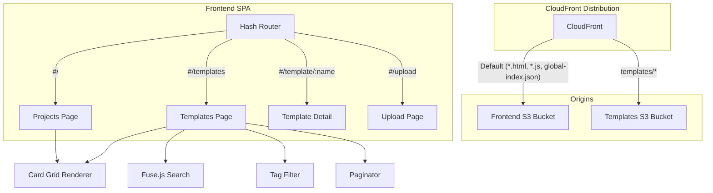

# Design Document: Project Templates

## Overview

This feature extends the internal repository application with a dedicated templates section. Templates are reusable code and Terraform configurations stored in a separate S3 bucket, served through the existing CloudFront distribution via path-based routing. The frontend gains a new `#/templates` route with search, tag filtering, and pagination — all using the same client-side patterns (Fuse.js, tag-filter dropdown, paginator) already in place for projects. Both the projects page and the new templates page switch from a vertical list layout to a responsive card grid.

The design prioritizes reuse of existing infrastructure patterns (OAC-secured S3 + CloudFront, Fuse.js search, paginator) and introduces minimal new abstractions: a shared `TemplateIndexEntry` type, a `fetchTemplateIndex` API function, and a card-grid rendering utility shared between pages.

## Architecture



### Key Architectural Decisions

1. **Separate S3 bucket for templates** — Keeps template artifacts isolated from project data, allowing independent access policies and lifecycle management. The existing CloudFront distribution is extended with a second origin rather than creating a separate distribution.

2. **Path-based routing at CloudFront** — Requests matching `templates/*` are routed to the templates bucket. This avoids CORS complexity and keeps all content on the same domain.

3. **Shared card-grid renderer** — A single `renderCardGrid` function handles both project and template cards. The caller passes item data and a navigation callback; the renderer handles responsive columns, accessibility attributes, and keyboard interaction.

4. **Client-side search for templates** — Mirrors the existing project search: fetch `templates-index.json` once, build a Fuse.js instance, filter/paginate in-browser. No server-side search endpoint needed.

5. **No custom error response for template paths** — Unlike the frontend bucket (which serves `index.html` for 404/403 to support SPA routing), the templates bucket returns raw error codes. This prevents the SPA fallback from masking genuinely missing template files.

## Components and Interfaces

### Infrastructure Components

#### Template S3 Bucket (`aws_s3_bucket.templates`)
- Private bucket with all public access blocks enabled
- Naming: `{bucket_name_prefix}-templates`
- Bucket policy grants `s3:GetObject` to `cloudfront.amazonaws.com` conditioned on the distribution ARN
- Tagged `Project = "internal-repos"`, `Name = "internal-repos-templates"`

#### Template Origin Access Control (`aws_cloudfront_origin_access_control.templates`)
- Type: S3
- Signing behavior: always
- Signing protocol: sigv4

#### CloudFront Cache Behaviors (ordered)
- `templates-index.json` → templates origin, TTL 0/0/0
- `templates/*/metadata.json` → templates origin, TTL 0/0/0
- `templates/*` → templates origin, default caching

### Frontend Components

#### `fetchTemplateIndex(): Promise<ApiResult<TemplateIndex>>` (api.ts)
Fetches `templates-index.json` from CDN. Handles:
- Success (2xx + JSON) → parse and return data
- Missing file (non-JSON response or text not starting with `[`) → return empty array
- HTTP error → return error with status
- Network error → return error with message

#### `renderCardGrid(items, options)` (card-grid.ts)
Shared renderer for both project and template card grids.

```typescript
interface CardGridOptions {
  container: HTMLElement;
  onCardActivate: (item: CardItem) => void;
  breakpoints?: { sm: number; md: number }; // defaults: sm=640, md=1024
  ariaLabelPrefix?: string; // e.g. "View project" or "View template"
}

interface CardItem {
  name: string;
  description: string;
  tags: string[];
  date: string;
}
```

#### Templates Page (`templates-page.ts`)
- Route: `#/templates`
- Fetches template index, initializes Fuse.js, renders card grid with tag filter and paginator
- Empty state: "No templates available yet" (hides search/filter/paginator)
- Error state: error message + retry button

#### Template Detail Page (`template-detail.ts`)
- Route: `#/template/{name}`
- Fetches `templates/{name}/metadata.json`
- Displays name, description, tags, date, and optional language
- Back link to `#/templates`

#### Navigation Update (`index.html` + `main.ts`)
- Replace "Search" link with "Projects" (href `#/`)
- Add "Templates" link (href `#/templates`)
- Active state indicator based on current route hash

### Shared Types (shared/src/types.ts)

New type exports added alongside existing project types.

## Data Models

### TemplateIndexEntry

```typescript
export interface TemplateIndexEntry {
  /** Template name: 1-64 chars, /^[a-zA-Z0-9_-]+$/ */
  name: string;
  /** Description: 0-200 chars */
  description: string;
  /** Tags: 0-50 items, each 1-32 chars, /^[a-z0-9_-]+$/ */
  tags: string[];
  /** ISO 8601 date: "YYYY-MM-DD" */
  date: string;
  /** S3 path prefix: "templates/{name}/" */
  path: string;
}
```

### TemplateIndex

```typescript
export type TemplateIndex = TemplateIndexEntry[];
```

### TemplateMetadata

```typescript
export interface TemplateMetadata {
  /** Template name: 1-64 chars, /^[a-zA-Z0-9_-]+$/ */
  name: string;
  /** Description: 0-200 chars */
  description: string;
  /** Tags: 0-50 items, each 1-32 chars, /^[a-z0-9_-]+$/ */
  tags: string[];
  /** ISO 8601 date: "YYYY-MM-DD" */
  date: string;
  /** Optional primary language/framework: 0-64 chars */
  language?: string;
}
```

### templates-index.json (S3 file)

```json
[
  {
    "name": "basic-lambda",
    "description": "Starter template for AWS Lambda with API Gateway",
    "tags": ["aws", "lambda", "serverless"],
    "date": "2024-11-15",
    "path": "templates/basic-lambda/"
  }
]
```

### templates/{name}/metadata.json (S3 file)

```json
{
  "name": "basic-lambda",
  "description": "Starter template for AWS Lambda with API Gateway",
  "tags": ["aws", "lambda", "serverless"],
  "date": "2024-11-15",
  "language": "TypeScript"
}
```


## Correctness Properties

*A property is a characteristic or behavior that should hold true across all valid executions of a system — essentially, a formal statement about what the system should do. Properties serve as the bridge between human-readable specifications and machine-verifiable correctness guarantees.*

### Property 1: Template data validation accepts valid entries and rejects invalid ones

*For any* object whose `name` is 1–64 characters matching `^[a-zA-Z0-9_-]+$`, whose `description` is 0–200 characters, whose `tags` array has 0–50 items each 1–32 characters matching `^[a-z0-9_-]+$`, whose `date` matches `YYYY-MM-DD` format, and whose `path` starts with `templates/{name}/`, the validation function SHALL return valid. For any object violating one or more of these constraints, the validation function SHALL return invalid.

**Validates: Requirements 3.1, 3.3**

### Property 2: Tag filter AND-logic correctness

*For any* array of template entries and any non-empty set of active filter tags, the filtered result SHALL contain only entries whose `tags` array includes every tag in the active filter set, and SHALL exclude every entry missing at least one active filter tag.

**Validates: Requirements 5.3**

### Property 3: Empty query returns all templates sorted by date descending

*For any* non-empty template index, when the search query is empty, the returned results SHALL contain all entries from the index and SHALL be ordered such that for every adjacent pair (a, b), `a.date >= b.date`.

**Validates: Requirements 5.4**

### Property 4: fetchTemplateIndex parse round-trip

*For any* valid `TemplateIndex` array, when the fetch mock returns that array as JSON with status 200 and content-type `application/json`, `fetchTemplateIndex` SHALL return `{ ok: true, data }` where `data` is deeply equal to the original array.

**Validates: Requirements 6.2**

### Property 5: Error responses preserve error information

*For any* non-2xx HTTP status code (4xx or 5xx), `fetchTemplateIndex` SHALL return `{ ok: false, error }` where the error string contains the numeric status code. *For any* network error with message string M, `fetchTemplateIndex` SHALL return `{ ok: false, error }` where the error string contains M.

**Validates: Requirements 6.4, 6.5**

### Property 6: Card grid renders all required fields for every item

*For any* array of `CardItem` objects (each with non-empty name, description, tags, and date), rendering the card grid SHALL produce one card element per item, and each card element SHALL contain the item's name text, at least one tag element per tag in the item's tags array, and a date element.

**Validates: Requirements 7.2, 8.2**

### Property 7: Card grid accessibility attributes

*For any* `CardItem` with name N, the rendered card SHALL have `tabindex="0"`, `role="link"`, and an `aria-label` attribute whose value contains N.

**Validates: Requirements 7.3, 8.3**

### Property 8: Card activation navigates to correct route

*For any* `CardItem` with name N and a given navigation prefix (either `#/project/` or `#/template/`), activating the card (click or Enter/Space keypress) SHALL set `window.location.hash` to the prefix concatenated with `encodeURIComponent(N)`.

**Validates: Requirements 7.4, 8.4**

### Property 9: Template detail displays all metadata fields

*For any* valid `TemplateMetadata` object, the rendered detail view SHALL contain the name, description, each tag, and date. If the `language` field is present and non-empty, the view SHALL also contain the language value.

**Validates: Requirements 9.3**

### Property 10: Navigation active state matches route prefix

*For any* route hash, the navigation SHALL apply the active style to "Projects" when the hash starts with `/` (exactly) or `/project/`, and SHALL apply the active style to "Templates" when the hash starts with `/templates`. Exactly one of the two navigation links SHALL have the active style at any time.

**Validates: Requirements 10.2**

## Error Handling

### Infrastructure Errors

| Scenario | Behavior |
|----------|----------|
| CloudFront 403/404 on `templates/*` path | Return original error code to client (no SPA fallback) |
| Template bucket unreachable | CloudFront returns 502/504 — frontend displays fetch error |

### Frontend Errors

| Scenario | Behavior |
|----------|----------|
| `templates-index.json` fetch fails (network) | Display error message + retry button; hide search/filter/paginator |
| `templates-index.json` fetch returns non-2xx | Display error message with HTTP status + retry button |
| `templates-index.json` missing (HTML returned) | Treat as empty index — show "No templates available yet" |
| `metadata.json` fetch fails on detail page | Display "Template details are unavailable" + back link |
| Empty template name in route | Display "No template was specified" error |
| Search/filter yields zero results | Display "No results found" message in place of card grid |

### Retry Strategy

- Retry button re-invokes the fetch from scratch (no exponential backoff — user-initiated)
- Retry resets any UI state (clears error message, shows loading indicator during fetch)

## Testing Strategy

### Property-Based Tests (fast-check)

The project already has `fast-check` as a dev dependency. Each property above maps to a single property-based test running a minimum of 100 iterations.

- **Library**: fast-check ^3.15.0 (already installed)
- **Runner**: vitest (already configured)
- **Minimum iterations**: 100 per property
- **Tag format**: `Feature: project-templates, Property {N}: {title}`

Property tests focus on:
- Template data validation logic (generators for valid/invalid entries)
- Search and filter pure functions (Fuse.js integration with generated indices)
- `fetchTemplateIndex` response handling (mock-based with generated payloads)
- Card grid rendering (DOM assertions with generated card items, using jsdom)
- Navigation active state logic (generated route hashes)

### Unit Tests (example-based)

Unit tests cover specific examples, edge cases, and integration points:

- Router route registration and matching for `#/templates` and `#/template/{name}`
- Templates page empty state rendering
- Templates page error state with retry button
- Template detail page with missing name parameter
- Template detail page with fetch failure
- Navigation link structure (Projects, Templates, Upload present)
- Paginator visibility threshold (≤10 hidden, >10 shown)
- Debounce timing behavior (200ms)
- Card grid responsive CSS class application

### Integration Tests

- CloudFront path routing: verify `templates/*` requests reach the templates bucket
- End-to-end template browsing: load page → search → filter → navigate to detail
- Navigation active state transitions across route changes

### Test File Organization

```
frontend/src/
├── card-grid.test.ts          # Properties 6, 7, 8
├── templates-page.test.ts     # Properties 2, 3 + unit tests for empty/error states
├── template-detail.test.ts    # Property 9 + unit tests for error states
├── api.test.ts                # Properties 4, 5 (extend existing file)
├── nav-active.test.ts         # Property 10
shared/src/
├── template-validation.test.ts # Property 1
```
