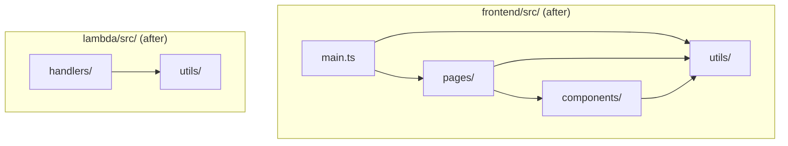

# Design Document: Source Folder Restructure

## Overview

This design describes the reorganization of the flat `frontend/src/` and `lambda/src/` directories into logical subfolders grouped by concern. The restructure is purely organizational — no runtime behavior, public APIs, or build output filenames change. The goal is improved developer navigation and discoverability as the codebase grows.

**Scope:**
- Frontend: group 38 flat files into `components/`, `pages/`, `utils/` subfolders, keeping `main.ts` and `styles.css` at the `src/` root.
- Backend: group 24 flat files into `handlers/` and `utils/` subfolders.
- Update all relative import paths in source and test files.
- Update esbuild entry points in `lambda/package.json`.
- Verify Terraform handler attributes remain valid (they already reference only the output filename, not source path).

## Architecture

The architecture does not change. This is a file-system-level reorganization within existing packages. The dependency graph between modules remains identical — only the relative path strings in `import` statements change.



### Frontend Target Structure

```
frontend/src/
├── main.ts                    (entry point - stays at root)
├── styles.css                 (global styles - stays at root)
├── components/
│   ├── breadcrumb-nav.ts
│   ├── card-grid.ts
│   ├── code-viewer.ts
│   ├── delete-dialog.ts
│   ├── directory-listing.ts
│   ├── drop-zone.ts
│   ├── paginator.ts
│   ├── readme-preview.ts
│   ├── tag-filter.ts
│   └── tag-selector.ts
├── pages/
│   ├── landing-page.ts
│   ├── project-detail.ts
│   ├── project-detail.test.ts
│   ├── templates-page.ts
│   ├── template-detail.ts
│   ├── template-detail.test.ts
│   ├── file-browser.ts
│   ├── file-browser.test.ts
│   ├── edit-form.ts
│   ├── upload-form.ts
│   ├── upload-form.test.ts
│   ├── search.ts
│   └── search.test.ts
└── utils/
    ├── api.ts
    ├── api.test.ts
    ├── i18n.ts
    ├── language-mapper.ts
    ├── language-mapper.test.ts
    ├── relative-date.ts
    ├── router.ts
    ├── search-state.ts
    ├── shared-markdown.ts
    ├── theme-manager.ts
    └── ui.ts
```

**Notes on test file placement:**
- `main.test.ts` stays at root alongside `main.ts`.
- `preservation.test.ts` and `ux-bugs-exploration.test.ts` are cross-cutting test files that don't map 1:1 to a single module. They stay at root or follow whichever module they primarily test. Since `preservation.test.ts` likely tests data preservation logic (api/upload) and `ux-bugs-exploration.test.ts` is an exploratory test suite, both remain at `src/` root.

### Backend Target Structure

```
lambda/src/
├── handlers/
│   ├── initiate.ts
│   ├── initiate.test.ts
│   ├── process.ts
│   ├── process.test.ts
│   ├── delete.ts
│   ├── edit.ts
│   ├── edit.test.ts
│   ├── suggest-tags.ts
│   ├── suggest-tags-preservation.test.ts
│   └── generate-readme.ts
└── utils/
    ├── ai-client.ts
    ├── archiver-wrapper.ts
    ├── archiver-wrapper.test.ts
    ├── file-expander.ts
    ├── file-expander.test.ts
    ├── filter.ts
    ├── filter.test.ts
    ├── index-generator.ts
    ├── index-generator.test.ts
    ├── s3-writer.ts
    ├── s3-writer.test.ts
    ├── tag-registry.ts
    ├── validate.ts
    └── validate.test.ts
```

## Components and Interfaces

No new components or interfaces are introduced. The module public APIs (exports) remain unchanged. Only the file paths change.

### Import Path Transformation Rules

When a file moves from `src/X.ts` to `src/<subfolder>/X.ts`:

1. **Internal imports within the same subfolder**: Change from `./X` to `./X` (unchanged — same directory).
2. **Cross-subfolder imports** (e.g., a page importing a component): Change from `./component-name` to `../components/component-name`.
3. **Imports from root into subfolder**: Change from `./X` to `./<subfolder>/X`.
4. **Imports from subfolder to root**: Change from `./X` to `../X`.

### Build Configuration Changes

#### Lambda `package.json` — esbuild entry points

Current:
```json
"build": "esbuild src/initiate.ts src/process.ts src/suggest-tags.ts src/delete.ts src/edit.ts --bundle --platform=node --target=node22 --format=cjs --outdir=dist --external:@aws-sdk"
```

After:
```json
"build": "esbuild src/handlers/initiate.ts src/handlers/process.ts src/handlers/suggest-tags.ts src/handlers/delete.ts src/handlers/edit.ts --bundle --platform=node --target=node22 --format=cjs --outdir=dist --external:@aws-sdk"
```

The `--outdir=dist` flag with esbuild produces output files named after the input filename (not the full path), so `dist/initiate.js`, `dist/process.js`, etc. remain unchanged. This means:
- Terraform `handler` attributes (`initiate.handler`, `process.handler`, etc.) require **no changes**.
- The `data.archive_file.lambda_zip` source remains `../lambda/dist` — no changes needed.

#### Frontend — Vite / index.html

- `index.html` references `/src/main.ts` which stays at root — **no change needed**.
- `vite.config.ts` has no explicit entry points beyond the default — **no change needed**.
- `tsconfig.json` uses `"rootDir": "./src"` and `"include": ["src/**/*"]` — both still match after subfolder creation — **no change needed**.

#### CI/CD (GitHub Actions)

The workflow calls `npm run build --workspace=lambda` and `npm run build --workspace=frontend`. Since the `package.json` scripts are updated, CI/CD requires **no workflow file changes**.

## Data Models

No data models are affected. This restructure touches only file organization and import paths.

## Error Handling

No new error handling is needed. The restructure is a build-time concern. Errors would manifest as:
- TypeScript compilation errors (unresolved imports) — caught by `tsc`.
- esbuild bundling failures (missing entry points) — caught by `npm run build`.
- Test failures (broken imports in test files) — caught by the test runner.

All of these are caught during the build/test verification step.

## Testing Strategy

### PBT Assessment

Property-based testing is **not applicable** to this feature. The restructure is a mechanical file-move operation with import path updates. There are no pure functions being introduced, no data transformations, and no logic that varies with input. The "correctness" of this change is binary: either all imports resolve and tests pass, or they don't.

### Verification Approach

1. **TypeScript compilation**: Run `tsc --noEmit` in both `frontend/` and `lambda/` to verify all imports resolve.
2. **Build verification**: Run `npm run build` in both workspaces to confirm bundling succeeds.
3. **Test suite execution**: Run the full test suite to confirm zero regressions.
4. **Output file inspection**: Verify `lambda/dist/` still contains `initiate.js`, `process.js`, `suggest-tags.js`, `delete.js`, `edit.js` with the correct handler exports.

### Test Types

- **Existing unit tests**: Continue running as-is (only import paths within test files change).
- **Build smoke test**: `npm run build` succeeds in both packages.
- **No new tests needed**: The restructure introduces no new logic. Existing tests validate that behavior is preserved.

### Execution Sequence

The restructure should be performed in this order to minimize intermediate breakage:

1. Create target subdirectories (`components/`, `pages/`, `utils/`, `handlers/`).
2. Move files to their target locations.
3. Update all import paths in moved files and their dependents.
4. Update `lambda/package.json` esbuild entry points.
5. Run `tsc --noEmit` in both packages.
6. Run `npm run build` in both packages.
7. Run full test suite.

### Risk Mitigation

- **Incremental approach**: Move one subfolder group at a time (e.g., frontend components first, then pages, then utils, then backend) and verify the build between each step.
- **IDE tooling**: Use TypeScript-aware refactoring tools (like `smart_relocate`) that automatically update import references.
- **Git atomicity**: Each logical group move can be a separate commit for easy bisection if issues arise.
