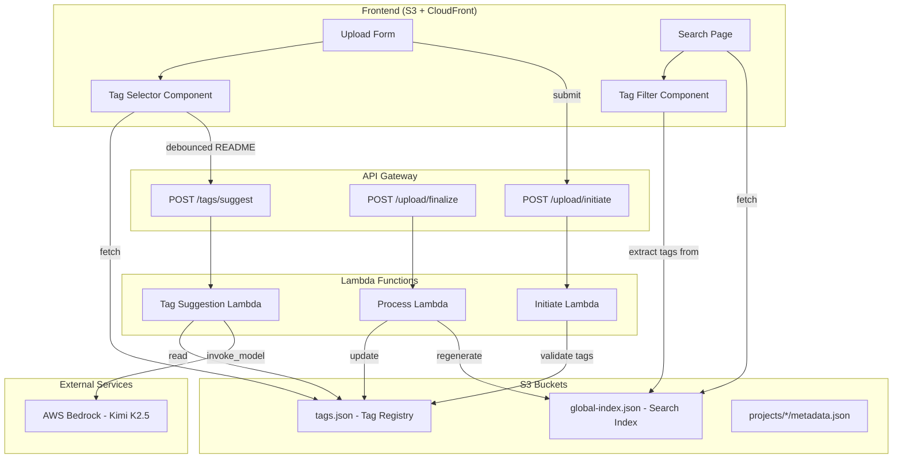

# Design Document: Tag Management

## Overview

Tag Management replaces the existing free-text tag input with a structured tag selection system. The feature introduces:

1. A **Tag Registry** (`tags.json` in S3) as the single source of truth for available tags
2. A **Tag Selector** UI component in the upload form for selecting existing tags and creating new ones
3. A **Tag Filter** component on the search page for filtering results by tag (AND logic)
4. An **AI Tag Suggestion Lambda** that uses AWS Bedrock (Kimi K2.5) to suggest tags from a project's README

The system integrates with the existing upload pipeline (initiate → S3 presigned upload → finalize) and the Fuse.js-powered search page, extending both with tag-aware behavior.

## Architecture



### Key Design Decisions

1. **Tag Registry as flat JSON file**: A `tags.json` file at the S3 bucket root keeps the design simple—no database needed. The registry is small (max 500 entries), rarely mutated, and read-heavy. S3 read-after-write consistency guarantees visibility of updates.

2. **Backend-owned registry mutations**: Only the Upload Lambda (process step) writes to `tags.json`. The frontend never writes directly. This prevents race conditions and ensures validation.

3. **AND-logic tag filtering**: When multiple tags are selected as filters, only projects matching ALL selected tags are shown. This is the most intuitive narrowing behavior for discovery.

4. **AI suggestions are best-effort**: The suggestion Lambda returns only tags that already exist in the registry. If Bedrock fails or times out, the frontend gracefully proceeds without suggestions. User manual interaction always takes priority over AI suggestions.

5. **Separate Lambda for suggestions**: The tag suggestion function is deployed independently from the upload pipeline to isolate Bedrock latency/failures from the critical upload path.

## Components and Interfaces

### Frontend Components

#### TagSelector (frontend/src/tag-selector.ts)

Replaces the free-text tags input in the upload form.

```typescript
export interface TagSelectorOptions {
  /** Container element to render into */
  container: HTMLElement;
  /** Callback fired whenever the selected tags change */
  onChange: (selectedTags: string[]) => void;
  /** Maximum number of tags that can be selected */
  maxTags: number;
}

export interface TagSelectorAPI {
  /** Set the available tags from the registry */
  setAvailableTags(tags: string[]): void;
  /** Apply AI-suggested tags (only if user hasn't interacted) */
  applySuggestions(tags: string[]): void;
  /** Get currently selected tags */
  getSelectedTags(): string[];
  /** Get newly created tags (not from registry) */
  getNewTags(): string[];
  /** Check if user has manually interacted with the selector */
  hasUserInteracted(): boolean;
  /** Destroy/cleanup the component */
  destroy(): void;
}

export function createTagSelector(options: TagSelectorOptions): TagSelectorAPI;
```

#### TagFilter (frontend/src/tag-filter.ts)

Renders on the search page for filtering by tags.

```typescript
export interface TagFilterOptions {
  /** Container element to render into */
  container: HTMLElement;
  /** Callback fired when active filter tags change */
  onFilterChange: (activeTags: string[]) => void;
}

export interface TagFilterAPI {
  /** Set the full list of filterable tags (extracted from search index) */
  setTags(tags: string[]): void;
  /** Get the currently active filter tags */
  getActiveTags(): string[];
  /** Clear all active filters */
  clearFilters(): void;
  /** Destroy/cleanup the component */
  destroy(): void;
}

export function createTagFilter(options: TagFilterOptions): TagFilterAPI;
```

### Backend Components

#### Tag Suggestion Lambda (lambda/src/suggest-tags.ts)

```typescript
export interface SuggestTagsRequest {
  readme: string;
}

export interface SuggestTagsResponse {
  tags: string[];
}

export async function handler(event: APIGatewayProxyEvent): Promise<APIGatewayProxyResult>;
```

#### Tag Registry Module (lambda/src/tag-registry.ts)

Shared module for reading/writing the tag registry from S3.

```typescript
export interface TagRegistry {
  /** Sorted, lowercase, unique tag strings */
  tags: string[];
}

/** Fetch the current tag registry from S3. Returns empty array if not found. */
export async function getTagRegistry(): Promise<string[]>;

/** Add new tags to the registry and persist. Returns the updated list. */
export async function addTagsToRegistry(newTags: string[]): Promise<string[]>;
```

#### Updated Validate Module (lambda/src/validate.ts)

Extended to support structured tag validation with registry awareness.

```typescript
export interface TagInput {
  tag: string;
  isNew: boolean;
}

export function validateTagInputs(
  tags: TagInput[],
  registry: string[]
): string | null;
```

### API Endpoints

| Endpoint | Method | Auth | Description |
|----------|--------|------|-------------|
| `/upload/initiate` | POST | API Key | Existing — updated body schema with structured tags |
| `/upload/finalize` | POST | API Key | Existing — now also updates tag registry |
| `/tags/suggest` | POST | API Key | New — returns AI-suggested tags from README |

### Frontend API Functions (frontend/src/api.ts)

```typescript
/** Fetch the tag registry (tags.json) from CDN */
export async function fetchTagRegistry(): Promise<ApiResult<string[]>>;

/** Request AI tag suggestions based on README content */
export async function suggestTags(readme: string): Promise<ApiResult<string[]>>;
```

## Data Models

### Tag Registry (tags.json)

Stored at the S3 bucket root alongside `global-index.json`.

```json
["api", "aws", "cli", "docker", "frontend", "go", "infrastructure", "java", "kubernetes", "python", "react", "terraform", "typescript"]
```

Constraints:
- Maximum 500 entries
- Each tag: 1–32 characters, pattern `^[a-z0-9_-]+$`
- Sorted alphabetically
- No duplicates (case-insensitive)

### Updated InitiateRequest

```typescript
export interface InitiateRequest {
  name: string;
  tags?: TagInput[];  // Changed from comma-separated string
  readme?: string;
}

export interface TagInput {
  tag: string;
  isNew: boolean;
}
```

### Updated SessionMetadata

```typescript
export interface SessionMetadata {
  sessionId: string;
  name: string;
  tags: string;          // Still comma-separated for backward compatibility
  readme: string;
  createdAt: string;
  newTags?: string[];    // Tags that need to be added to registry during finalize
}
```

### Suggest Tags Request/Response

```typescript
// POST /tags/suggest request body
{ "readme": "# My Project\n\nThis is a TypeScript CLI tool for..." }

// Response
{ "tags": ["typescript", "cli", "tooling"] }
```

### Search Index Entry (unchanged)

The existing `ProjectIndexEntry` already stores `tags: string[]`, so no changes are needed to the search index format.

### Bedrock Prompt Template

```
You are a tag classification system. Given a project README and a list of available tags, suggest the most relevant tags for this project.

Available tags: ${registryTags.join(', ')}

README:
${readmeContent}

Respond with a JSON object containing a "tags" field with an array of up to 10 suggested tags. Only suggest tags from the available tags list.
```


## Correctness Properties

*A property is a characteristic or behavior that should hold true across all valid executions of a system—essentially, a formal statement about what the system should do. Properties serve as the bridge between human-readable specifications and machine-verifiable correctness guarantees.*

### Property 1: Tag Registry Invariant

*For any* sequence of tag addition operations applied to a tag registry, the resulting registry SHALL always be a JSON array of unique, lowercase strings sorted alphabetically with at most 500 entries, and no two entries shall differ only by case.

**Validates: Requirements 1.2, 1.3, 1.4, 6.6**

### Property 2: Tag Selection Maximum Limit

*For any* tag selector state with exactly MAX_TAGS_COUNT (10) tags selected, attempting to select an additional tag SHALL be rejected and the selected set SHALL remain unchanged.

**Validates: Requirements 2.3, 2.4**

### Property 3: New Tag Validation

*For any* string input submitted as a new tag, the validation SHALL accept it if and only if it is between 1 and 32 characters in length, matches the pattern `^[a-z0-9_-]+$`, and does not already exist in the registry (case-insensitive comparison). Invalid inputs SHALL produce an appropriate error message.

**Validates: Requirements 2.7, 6.2**

### Property 4: Tag Filter AND Logic

*For any* list of projects and any set of selected filter tags, the filtered result SHALL contain exactly those projects whose tag arrays include ALL of the selected filter tags, and no others.

**Validates: Requirements 3.1, 3.2, 3.4**

### Property 5: Suggestion Response Filtering

*For any* model response and a given tag registry, the suggestion filter SHALL return only tags that are valid JSON strings present in the registry, capped at 10 results, discarding any tags not found in the registry or any malformed response data.

**Validates: Requirements 4.3, 4.4**

### Property 6: Suggestion Application Respects User Interaction

*For any* tag selector state, AI-suggested tags SHALL be applied as the default selection if and only if the user has NOT manually interacted with the tag selector. If the user has interacted (added, removed, or toggled any tag), suggestions SHALL be discarded.

**Validates: Requirements 4.6, 4.7**

### Property 7: README Truncation for Model

*For any* README string of arbitrary length, the content sent to the Bedrock model SHALL be at most 10,000 characters, equal to the first 10,000 characters of the original input.

**Validates: Requirements 5.5**

### Property 8: Existing Tag Reference Validation

*For any* tag marked as an existing reference (isNew: false) in an upload request, validation SHALL fail if and only if the tag is not present in the current tag registry (case-insensitive comparison).

**Validates: Requirements 6.1**

### Property 9: Validation Failure Atomicity

*For any* upload request containing a mix of valid and invalid tags, if any single tag fails validation, the system SHALL reject the entire request with a 400 error and SHALL NOT persist any new tags from that request to the registry.

**Validates: Requirements 6.5**

### Property 10: Tag Serialization Round-Trip

*For any* set of valid tags, serializing them as a comma-separated string and then parsing back into an array (splitting on comma, trimming whitespace, filtering empty strings) SHALL produce the original set of tags.

**Validates: Requirements 2.5, 6.4**

### Property 11: Suggestion Trigger Threshold

*For any* README content in the textarea, the system SHALL send a suggestion request if and only if the content length is 50 or more characters and the content has been stable (unchanged) for at least 500ms.

**Validates: Requirements 4.1, 4.9**

## Error Handling

### Frontend Error Handling

| Scenario | Behavior |
|----------|----------|
| Tag registry fetch returns 404 | Treat as empty registry; allow new tag creation |
| Tag registry fetch returns non-404 error | Show warning "Existing tag suggestions unavailable"; allow new tag creation |
| Suggestion Lambda returns error/timeout | Silently proceed without suggestions |
| Suggestion Lambda returns invalid JSON | Silently proceed without suggestions (empty array) |
| Network error during suggestion request | Silently proceed without suggestions |

### Backend Error Handling

| Scenario | Behavior |
|----------|----------|
| Tag registry read fails (S3 error) | For initiate: return 500. For suggestion Lambda: return 502 |
| Tag registry write fails after upload | Proceed with upload success; include `warning` field in response |
| Tag validation fails (any tag invalid) | Return 400 with specific error message identifying the invalid tag and reason |
| Bedrock InvokeModel fails/times out | Return empty suggestions array (200 response with `{"tags": []}`) |
| Bedrock returns invalid response format | Parse what's possible, return empty array if unparseable |
| Tag registry at 500 entries and new tags submitted | Reject new tags with 400 error indicating registry is full |

### Graceful Degradation Principles

1. **AI suggestions are advisory**: Any failure in the suggestion pipeline never blocks the upload flow
2. **Registry failures are non-fatal for uploads**: If registry update fails post-upload, the project is still saved
3. **Frontend always allows new tag creation**: Even if registry fetch fails, users can manually enter tags
4. **Validation failures are atomic**: One bad tag rejects the whole request, preventing partial state

## Testing Strategy

### Property-Based Testing

**Library**: fast-check (already available via Vitest ecosystem)

**Configuration**: Minimum 100 iterations per property test.

Each property test references its design document property:

| Property | Test File | Description |
|----------|-----------|-------------|
| Property 1 | `lambda/src/tag-registry.test.ts` | Registry invariant under random operations |
| Property 2 | `frontend/src/tag-selector.test.ts` | Max tag selection enforcement |
| Property 3 | `lambda/src/validate.test.ts` | New tag validation correctness |
| Property 4 | `frontend/src/tag-filter.test.ts` | AND-logic filter correctness |
| Property 5 | `lambda/src/suggest-tags.test.ts` | Response filtering correctness |
| Property 6 | `frontend/src/tag-selector.test.ts` | Suggestion application logic |
| Property 7 | `lambda/src/suggest-tags.test.ts` | README truncation |
| Property 8 | `lambda/src/validate.test.ts` | Existing tag reference validation |
| Property 9 | `lambda/src/validate.test.ts` | Atomicity on validation failure |
| Property 10 | `shared/src/tag-utils.test.ts` | Serialization round-trip |
| Property 11 | `frontend/src/tag-selector.test.ts` | Debounce threshold logic |

**Tag format**: `Feature: tag-management, Property {N}: {title}`

### Unit Tests (Example-Based)

- Tag selector renders all provided tags (Req 2.1)
- Tag selector toggles selected state on click (Req 2.2)
- "Add new tag" button shows text input (Req 2.6)
- Valid new tag appears in list and is selected (Req 2.8)
- Invalid new tag shows specific error messages (Req 2.9)
- Tag filter CSS class distinction for active/inactive (Req 3.5)
- Deselecting a filter tag updates results (Req 3.6)
- Empty search index results in no filter options (Req 3.8)
- AI-suggested tags render with distinct icon/label (Req 4.5)
- Bedrock failure returns empty suggestions (Req 4.8)
- Missing registry (404) creates new registry on tag add (Req 1.6)

### Integration Tests

- Full upload flow with new tags updates `tags.json` in S3 (Req 6.3)
- Tag suggestion Lambda invokes Bedrock with correct payload structure (Req 4.2)
- Registry fetch from S3 returns valid data within timeout (Req 1.1)
- API Gateway POST /tags/suggest requires API key (Req 5.3)

### Infrastructure Tests (Smoke / Plan Validation)

- Terraform plan produces correct Lambda configuration (Req 5.1)
- IAM role has required Bedrock and S3 permissions (Req 5.2)
- CORS headers configured for /tags/suggest (Req 5.7)
- Lambda timeout set to 30s (Req 5.4)
