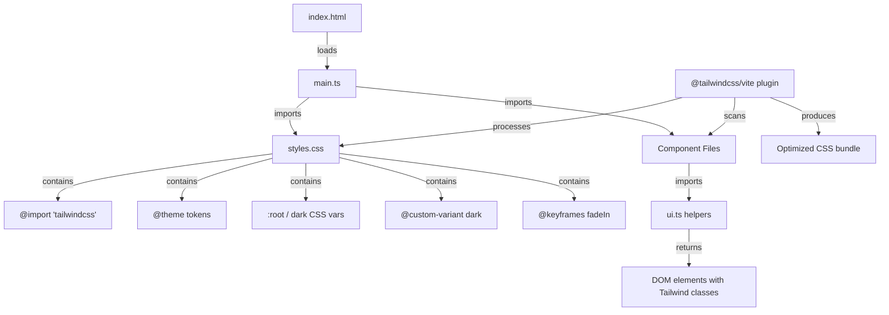
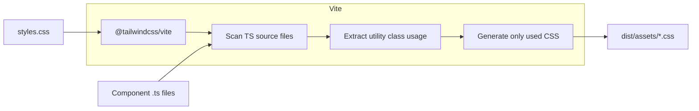

# Design Document: Tailwind UI Migration

## Overview

This design describes the migration of the Internal Repos frontend from ~700 lines of hand-written CSS (in `index.html` `<style>` block and `card-grid.ts` injected styles) to Tailwind CSS 4 utility classes. A thin `ui.ts` helpers module provides factory functions for repeated component patterns, eliminating class string duplication across components.

The migration preserves the existing visual identity (colors, fonts, spacing proportions) while improving responsive behavior, spacing consistency, and maintainability. No functional changes to routing, API calls, or state management are introduced.

### Goals

- Replace all hand-written CSS with Tailwind CSS 4 utilities
- Create a reusable `ui.ts` module for common UI patterns
- Improve responsive behavior with additional breakpoints (768px tablet, 1024px desktop)
- Maintain existing dark mode support via `data-theme` attribute
- Remove all legacy style sources (index.html style block, card-grid.ts injected styles)

### Non-Goals

- Adopting a frontend framework (React, Vue, Lit, etc.)
- Changing router logic, API layer, or state management
- Redesigning the visual identity

## Architecture

The migration follows a layered approach where Tailwind CSS 4 replaces all styling concerns:



### Build Pipeline



## Components and Interfaces

### 1. `@tailwindcss/vite` Plugin (vite.config.ts)

Registered as a Vite plugin, replaces the need for PostCSS configuration or a `tailwind.config.js` file. Tailwind CSS 4 uses automatic content detection — no explicit content paths needed.

```typescript
// frontend/vite.config.ts
import { defineConfig } from 'vite';
import { resolve } from 'path';
import tailwindcss from '@tailwindcss/vite';

export default defineConfig({
  plugins: [tailwindcss()],
  resolve: {
    alias: {
      shared: resolve(__dirname, '../shared/src'),
    },
  },
  build: {
    outDir: 'dist',
    sourcemap: true,
  },
});
```

### 2. `styles.css` (CSS Entry File)

Single source of truth for all global CSS. Contains:
- Tailwind import directive
- `@theme` block mapping design tokens
- `@custom-variant` for dark mode
- CSS custom properties (light and dark)
- `@keyframes` animations
- Minimal base resets via `@layer base`

```css
@import "tailwindcss";

/* Custom dark variant using data-theme attribute */
@custom-variant dark (&:where([data-theme="dark"], [data-theme="dark"] *));

@theme {
  /* Colors referencing CSS custom properties */
  --color-bg: var(--color-bg);
  --color-surface: var(--color-surface);
  --color-surface-raised: var(--color-surface-raised);
  --color-border: var(--color-border);
  --color-border-strong: var(--color-border-strong);
  --color-text: var(--color-text);
  --color-text-muted: var(--color-text-muted);
  --color-accent: var(--color-accent);
  --color-accent-hover: var(--color-accent-hover);
  --color-accent-subtle: var(--color-accent-subtle);
  --color-tag-bg: var(--color-tag-bg);
  --color-tag-text: var(--color-tag-text);
  --color-success: var(--color-success);
  --color-error: var(--color-error);
  --color-error-hover: var(--color-error-hover);
  --color-code-bg: var(--color-code-bg);
  --color-on-accent: var(--color-on-accent);
  --color-overlay: var(--color-overlay);
  --color-header-bg: var(--color-header-bg);

  /* Font families */
  --font-mono: var(--font-mono);
  --font-body: var(--font-body);

  /* Border radius */
  --radius-sm: 4px;
  --radius-md: 8px;
  --radius-lg: 12px;

  /* Shadows */
  --shadow-sm: 0 1px 3px rgba(44, 42, 38, 0.06);
  --shadow-md: 0 4px 12px rgba(44, 42, 38, 0.08);
  --shadow-lg: 0 8px 24px rgba(44, 42, 38, 0.1);

  /* Transition duration */
  --transition-duration-180: 180ms;
}

:root {
  --color-bg: #f4f2ef;
  --color-surface: #ffffff;
  --color-surface-raised: #fafaf8;
  --color-border: #e2dfd9;
  --color-border-strong: #c9c4bc;
  --color-text: #2c2a26;
  --color-text-muted: #6b6660;
  --color-accent: #d35c2e;
  --color-accent-hover: #b84d24;
  --color-accent-subtle: #fdf0eb;
  --color-tag-bg: #eae7e2;
  --color-tag-text: #4a4640;
  --color-success: #3d8c5c;
  --color-error: #c43d3d;
  --color-error-hover: #a83333;
  --color-code-bg: #2c2a26;
  --color-on-accent: #ffffff;
  --color-overlay: rgba(44, 42, 38, 0.5);
  --color-header-bg: rgba(255, 255, 255, 0.92);
  --font-mono: 'JetBrains Mono', 'Fira Code', monospace;
  --font-body: 'Source Sans 3', -apple-system, BlinkMacSystemFont, sans-serif;
}

html[data-theme="dark"] {
  --color-bg: #1a1a1e;
  --color-surface: #242428;
  --color-surface-raised: #2c2c31;
  --color-border: #3a3a40;
  --color-border-strong: #4e4e56;
  --color-text: #e8e6e1;
  --color-text-muted: #9e9a94;
  --color-accent: #e8743f;
  --color-accent-hover: #f08a56;
  --color-accent-subtle: #2e2018;
  --color-tag-bg: #2e2e33;
  --color-tag-text: #c4c0ba;
  --color-success: #4ea870;
  --color-error: #e05555;
  --color-error-hover: #c44444;
  --color-code-bg: #1e1e22;
  --color-on-accent: #ffffff;
  --color-overlay: rgba(0, 0, 0, 0.6);
  --color-header-bg: rgba(36, 36, 40, 0.92);
  --shadow-sm: 0 1px 3px rgba(0, 0, 0, 0.2);
  --shadow-md: 0 4px 12px rgba(0, 0, 0, 0.3);
  --shadow-lg: 0 8px 24px rgba(0, 0, 0, 0.4);
}

@layer base {
  * {
    box-sizing: border-box;
    margin: 0;
    padding: 0;
  }

  body {
    font-family: var(--font-body);
    font-weight: 400;
    line-height: 1.6;
    color: var(--color-text);
    background: var(--color-bg);
    -webkit-font-smoothing: antialiased;
    -moz-osx-font-smoothing: grayscale;
  }
}

@keyframes fadeIn {
  from { opacity: 0; transform: translateY(4px); }
  to { opacity: 1; transform: translateY(0); }
}

@keyframes slideUp {
  from { opacity: 0; transform: translateY(8px); }
  to { opacity: 1; transform: translateY(0); }
}
```

### 3. `ui.ts` Helpers Module

Factory functions returning DOM elements pre-configured with Tailwind utility classes. Each function encapsulates the class string so components remain clean.

```typescript
// frontend/src/ui.ts

/**
 * Create a card container with hover, focus, and active states.
 */
export function card(opts?: { hoverable?: boolean; className?: string }): HTMLDivElement;

/**
 * Create a tag/badge element with mono font, small size, themed background.
 */
export function badge(text: string): HTMLSpanElement;

/**
 * Create a button with variant-specific styling.
 */
export function button(text: string, variant?: 'primary' | 'secondary' | 'danger'): HTMLButtonElement;

/**
 * Create a heading element with appropriate typography classes.
 */
export function heading(text: string, level?: 1 | 2 | 3 | 4 | 5 | 6): HTMLHeadingElement;

/**
 * Create a text input with border, focus ring, and font styling.
 */
export function input(opts?: {
  type?: string;
  placeholder?: string;
  id?: string;
  maxLength?: number;
}): HTMLInputElement;

/**
 * Create a textarea with consistent styling.
 */
export function textarea(opts?: {
  placeholder?: string;
  id?: string;
  rows?: number;
  maxLength?: number;
}): HTMLTextAreaElement;

/**
 * Create a page-level wrapper with max-width, centering, and responsive padding.
 */
export function container(className?: string): HTMLDivElement;

/**
 * Create a fixed-position overlay suitable for modals.
 */
export function overlay(): HTMLDivElement;

/**
 * Create a minimal icon-only button.
 */
export function iconButton(opts?: { ariaLabel?: string; className?: string }): HTMLButtonElement;
```

#### Class Mappings

| Helper | Base Tailwind Classes |
|--------|---------------------|
| `card` | `bg-surface border border-border rounded-md p-4 transition-all duration-180 flex flex-col gap-1.5` |
| `card` (hoverable) | + `cursor-pointer hover:border-border-strong hover:shadow-md hover:-translate-y-px active:translate-y-0 active:shadow-sm focus:outline-2 focus:outline-accent focus:outline-offset-2` |
| `badge` | `font-mono text-xs font-medium bg-tag-bg text-tag-text px-2 py-0.5 rounded-sm tracking-wide` |
| `button` (primary) | `px-5 py-2.5 font-mono text-sm font-semibold text-on-accent bg-accent border-none rounded-sm cursor-pointer transition-all duration-180 hover:bg-accent-hover hover:shadow-md active:scale-[0.98] disabled:opacity-60 disabled:cursor-not-allowed` |
| `button` (secondary) | `px-4 py-2 font-mono text-sm font-semibold text-accent bg-surface border border-accent rounded-sm cursor-pointer transition-all duration-180 hover:bg-accent hover:text-on-accent` |
| `button` (danger) | `px-4 py-2 font-mono text-sm font-semibold text-error bg-surface border border-error rounded-sm cursor-pointer transition-all duration-180 hover:bg-error hover:text-on-accent` |
| `heading` | `font-body font-semibold text-text tracking-tight` (with size per level) |
| `input` | `w-full px-3 py-2.5 font-mono text-sm border border-border rounded-sm bg-surface text-text transition-all duration-180 outline-none focus:border-accent focus:ring-3 focus:ring-accent-subtle shadow-sm` |
| `textarea` | Same as input + `resize-y min-h-[180px] leading-relaxed` |
| `container` | `max-w-4xl mx-auto px-4 sm:px-6 lg:px-8 animate-[fadeIn_300ms_ease]` |
| `overlay` | `fixed inset-0 bg-overlay flex items-center justify-center z-[1000] animate-[fadeIn_150ms_ease]` |
| `iconButton` | `inline-flex items-center justify-center w-9 h-9 p-0 bg-transparent border-none rounded-sm text-text-muted cursor-pointer transition-all duration-180 hover:text-text focus-visible:outline-2 focus-visible:outline-accent focus-visible:outline-offset-2 active:scale-[0.92]` |

### 4. Component Migration Pattern

Each component file follows this pattern:

```typescript
// Before (card-grid.ts)
const card = document.createElement('div');
card.className = 'card-grid-item'; // requires CSS stylesheet

// After (card-grid.ts)
import { card as createCard, badge } from './ui';
const cardEl = createCard({ hoverable: true });

// Or for one-off styling:
const el = document.createElement('div');
el.className = 'flex flex-col gap-2 p-4';
```

### 5. Migration Order

```mermaid
gantt
    title Component Migration Phases
    dateFormat X
    axisFormat %s
    
    section Phase 1 - Infrastructure
    Install Tailwind + plugin     : 0, 1
    Create styles.css             : 1, 2
    Configure vite.config.ts      : 2, 3
    
    section Phase 2 - Helpers
    Create ui.ts module           : 3, 4
    Write ui.ts tests             : 4, 5
    
    section Phase 3 - Components
    card-grid.ts                  : 5, 6
    search.ts / main.ts           : 6, 7
    upload-form.ts                : 7, 8
    project-detail.ts             : 8, 9
    template-detail.ts            : 9, 10
    edit-form.ts                  : 10, 11
    delete-dialog.ts              : 11, 12
    paginator / tag-filter        : 12, 13
    tag-selector / drop-zone      : 13, 14
    readme-preview / landing-page : 14, 15
    theme-manager.ts              : 15, 16
    
    section Phase 4 - Cleanup
    Remove index.html styles      : 16, 17
    Remove card-grid injectStyles : 17, 18
```



## Data Models

No new data models are introduced. The migration only changes how existing DOM elements are styled. The existing TypeScript interfaces (`CardItem`, `CardGridOptions`, `ProjectMetadata`, `TemplateMetadata`, etc.) remain unchanged.

### Theme Token Mapping

| CSS Custom Property | Tailwind Token | Utility Example |
|---|---|---|
| `--color-bg` | `--color-bg` | `bg-bg` |
| `--color-surface` | `--color-surface` | `bg-surface` |
| `--color-accent` | `--color-accent` | `bg-accent`, `text-accent` |
| `--color-text` | `--color-text` | `text-text` |
| `--color-text-muted` | `--color-text-muted` | `text-text-muted` |
| `--color-border` | `--color-border` | `border-border` |
| `--color-tag-bg` | `--color-tag-bg` | `bg-tag-bg` |
| `--color-tag-text` | `--color-tag-text` | `text-tag-text` |
| `--color-error` | `--color-error` | `text-error`, `border-error` |
| `--color-success` | `--color-success` | `text-success` |
| `--color-on-accent` | `--color-on-accent` | `text-on-accent` |
| `--color-overlay` | `--color-overlay` | `bg-overlay` |
| `--font-mono` | `--font-mono` | `font-mono` |
| `--font-body` | `--font-body` | `font-body` |
| `--radius-sm` (4px) | `--radius-sm` | `rounded-sm` |
| `--radius-md` (8px) | `--radius-md` | `rounded-md` |
| `--radius-lg` (12px) | `--radius-lg` | `rounded-lg` |
| `--shadow-sm` | `--shadow-sm` | `shadow-sm` |
| `--shadow-md` | `--shadow-md` | `shadow-md` |
| `--shadow-lg` | `--shadow-lg` | `shadow-lg` |

### Responsive Breakpoints

| Breakpoint | Width | Grid Columns | Container Padding |
|---|---|---|---|
| default (mobile) | < 640px | 1 | `px-4` |
| `sm` | ≥ 640px | 2 | `px-6` |
| `md` | ≥ 768px | 2 | `px-6` |
| `lg` | ≥ 1024px | 3-4 | `px-8` |

## Correctness Properties

*A property is a characteristic or behavior that should hold true across all valid executions of a system — essentially, a formal statement about what the system should do. Properties serve as the bridge between human-readable specifications and machine-verifiable correctness guarantees.*

### Property 1: UI helper element construction

*For any* UI helper function (`card`, `badge`, `button`, `heading`, `input`, `textarea`, `container`, `overlay`, `iconButton`) called with any valid combination of options, the returned HTML element SHALL have the correct tag name and contain all required base Tailwind classes for its role.

**Validates: Requirements 4.1, 4.2, 4.3, 4.5, 4.6, 4.7, 4.8, 4.9**

### Property 2: Button variant class mapping

*For any* variant parameter (`'primary'`, `'secondary'`, `'danger'`) passed to the `button` helper, the returned button element SHALL contain exactly the Tailwind classes corresponding to that variant and SHALL NOT contain classes belonging to other variants.

**Validates: Requirements 4.3**

### Property 3: Heading level-to-tag mapping

*For any* heading level (1-6) and any non-empty text string, the `heading` helper SHALL return an element with tag name `H{level}` (uppercase), the provided text as textContent, and appropriate font-size Tailwind classes for that level.

**Validates: Requirements 4.4**

### Property 4: No custom stylesheet class names in helpers

*For any* UI helper function call with valid options, the `className` of the returned element SHALL contain only Tailwind utility class patterns (space-separated tokens matching Tailwind's naming convention) and SHALL NOT contain BEM-style class names (names with `__` or `--` separators) that would require a separate stylesheet definition.

**Validates: Requirements 4.10, 5.2**

## Error Handling

This migration does not introduce new error paths. Existing error handling in components (API failures, validation errors, missing data) remains unchanged. The only consideration:

- **Build failure on invalid Tailwind classes**: If a typo in a utility class is used, Tailwind CSS 4 will silently ignore it (the class simply won't generate CSS). This is caught during development via visual inspection and existing test coverage.
- **Missing CSS custom property**: If a `var(--color-*)` reference in `@theme` points to an undefined property, the browser falls back to `initial`. Mitigated by defining all properties in both `:root` and `html[data-theme="dark"]` blocks.
- **Dark mode flash**: The existing inline `<script>` in `index.html` that sets `data-theme` before rendering prevents flash-of-incorrect-theme (FOIT). This script is preserved.

## Testing Strategy

### Unit Tests

- **ui.ts helpers**: Test each factory function returns the correct element type, has expected classes, and respects all option combinations.
- **Existing component tests**: Run existing tests (`upload-form.test.ts`, `search.test.ts`, `main.test.ts`, `project-detail.test.ts`, `template-detail.test.ts`) to verify no functional regressions.

### Property-Based Tests

Property-based testing applies to the `ui.ts` helpers module since these are pure factory functions with clear input/output behavior and the input space (option combinations, variant enums, heading levels 1-6, arbitrary strings) is well-suited for random generation.

- **Library**: `fast-check` (well-maintained, TypeScript-native PBT library)
- **Minimum iterations**: 100 per property test
- **Tag format**: `Feature: tailwind-ui-migration, Property {number}: {property_text}`

Each correctness property maps to a single property-based test:
1. Generate random helper function + valid options → verify element tag + base classes
2. Generate random variant → verify button contains exactly that variant's classes
3. Generate random level (1-6) + random string → verify heading tag and text
4. Generate random helper call → verify no BEM-style patterns in className

### Integration / Visual Tests

- **Build verification**: Run `vite build` and verify the output CSS bundle contains expected utility classes.
- **Visual regression**: Manual comparison of screenshots before/after migration at mobile, tablet, and desktop viewports.
- **Dark mode**: Verify both themes render correctly after migration.

### Smoke Tests

- `vite dev` starts without errors
- `vite build` completes successfully
- No `<style>` block in production `index.html`
- No `injectStyles` calls in production bundle
