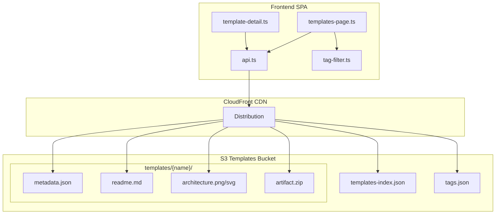
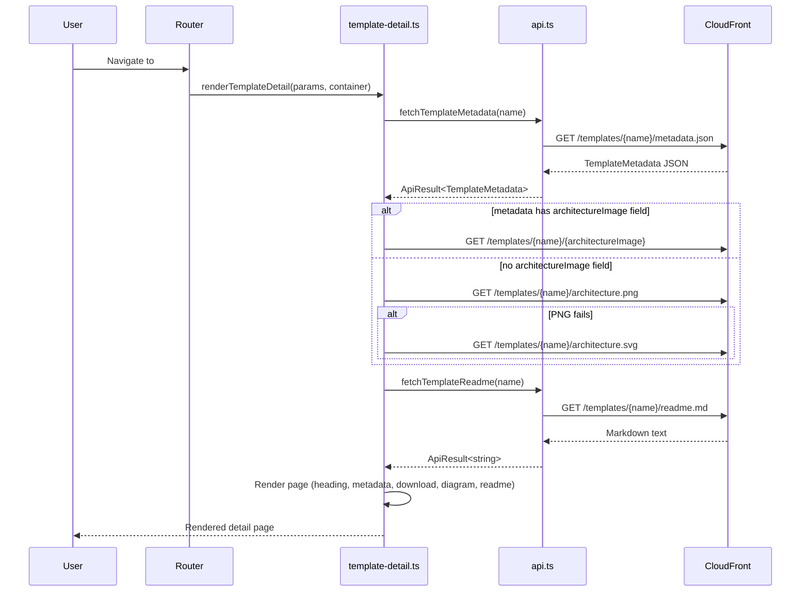

# Design Document: Template Content

## Overview

This design extends the existing template detail page (`template-detail.ts`) to display the full content of a template: architecture diagram, rendered markdown readme, and a download button for the template artifact. It also formalizes the S3 folder structure contract, adds an optional `architectureImage` metadata field for format hinting, and integrates templates with the shared tag registry.

The frontend remains read-only — no template CRUD. Content is managed externally (CI/CD or manual upload) and the frontend simply fetches and renders what's in S3.

### Key Design Decisions

1. **Reuse existing patterns**: Markdown rendering reuses the same `Marked` + `marked-highlight` + `highlight.js` configuration from `project-detail.ts`. Download uses a simple anchor with `download` attribute, identical to the project download pattern.
2. **Architecture image fallback strategy**: When the `architectureImage` metadata field is present, use it directly. When absent, try PNG then SVG sequentially. This avoids unnecessary network requests for templates that declare their format.
3. **No new API endpoints**: All template content is fetched via CDN (CloudFront). The frontend constructs URLs from the template name and known path conventions.
4. **Shared tag namespace**: Templates and projects both reference `tags.json`. The tag filter on the templates page already extracts unique tags from the template index — no changes needed there.

## Architecture



### Data Flow — Template Detail Page



## Components and Interfaces

### Modified Files

#### `shared/src/types.ts`

Add the optional `architectureImage` field to both interfaces:

```typescript
export interface TemplateMetadata {
  name: string;
  description: string;
  tags: string[];
  date: string;
  language?: string;
  /** Optional architecture image filename: "architecture.png" or "architecture.svg" */
  architectureImage?: 'architecture.png' | 'architecture.svg';
}

export interface TemplateIndexEntry {
  name: string;
  description: string;
  tags: string[];
  date: string;
  path: string;
  /** Optional architecture image filename: "architecture.png" or "architecture.svg" */
  architectureImage?: 'architecture.png' | 'architecture.svg';
}
```

#### `frontend/src/api.ts`

Add a new function to fetch the template readme:

```typescript
/**
 * Fetch a template's readme.md content by template name.
 * @param name - The template name, e.g. "basic-lambda"
 */
export async function fetchTemplateReadme(name: string): Promise<ApiResult<string>> {
  try {
    const url = `${getBaseUrl()}/templates/${name}/readme.md`;
    const response = await fetch(url);
    if (!response.ok) {
      return { ok: false, error: `Failed to load template documentation (HTTP ${response.status})` };
    }
    const text = await response.text();
    return { ok: true, data: text };
  } catch (err) {
    return {
      ok: false,
      error: err instanceof Error
        ? `Failed to load template documentation: ${err.message}`
        : 'Failed to load template documentation: unknown error',
    };
  }
}
```

#### `frontend/src/template-detail.ts`

Rewrite to include all content sections. Key responsibilities:

1. Render back link, h1 heading, metadata (tags, date, language)
2. Render download button (anchor with `download` attribute)
3. Fetch and render architecture image (with format detection/fallback)
4. Fetch and render readme as HTML using configured `Marked` instance

```typescript
// New imports needed:
import { Marked } from 'marked';
import { markedHighlight } from 'marked-highlight';
import hljs from 'highlight.js';
import { fetchTemplateMetadata, fetchTemplateReadme } from './api';
import { formatRelativeDate } from './relative-date';

// Reuse the same marked configuration as project-detail.ts
const marked = new Marked(
  markedHighlight({
    langPrefix: 'hljs language-',
    highlight(code: string, lang: string) {
      if (lang && hljs.getLanguage(lang)) {
        return hljs.highlight(code, { language: lang }).value;
      }
      return hljs.highlightAuto(code).value;
    },
  }),
);
```

**Architecture image resolution logic:**

```typescript
async function resolveArchitectureImageUrl(
  name: string,
  metadata: TemplateMetadata
): Promise<string | null> {
  const baseUrl = getBaseUrl();

  // If metadata specifies the image format, use it directly
  if (
    metadata.architectureImage === 'architecture.png' ||
    metadata.architectureImage === 'architecture.svg'
  ) {
    const url = `${baseUrl}/templates/${name}/${metadata.architectureImage}`;
    try {
      const res = await fetch(url, { method: 'HEAD' });
      return res.ok ? url : null;
    } catch {
      return null;
    }
  }

  // Fallback: try PNG first, then SVG
  const pngUrl = `${baseUrl}/templates/${name}/architecture.png`;
  try {
    const pngRes = await fetch(pngUrl, { method: 'HEAD' });
    if (pngRes.ok) return pngUrl;
  } catch {
    // continue to SVG
  }

  const svgUrl = `${baseUrl}/templates/${name}/architecture.svg`;
  try {
    const svgRes = await fetch(svgUrl, { method: 'HEAD' });
    if (svgRes.ok) return svgUrl;
  } catch {
    // no image available
  }

  return null;
}
```

**Page render order** (per Requirement 8):
1. Back-navigation link → `#/templates`
2. Template name as `<h1>`
3. Metadata section (tags as `<span class="tag">`, date as `<time>`, language if present)
4. Download button
5. Architecture diagram (if available)
6. Rendered readme

### New Functions

| Function | File | Purpose |
|----------|------|---------|
| `fetchTemplateReadme(name)` | `api.ts` | Fetch readme.md text from CDN |
| `resolveArchitectureImageUrl(name, metadata)` | `template-detail.ts` | Determine architecture image URL with fallback |
| `renderArchitectureImage(url, name)` | `template-detail.ts` | Render `` wrapped in `<a>` with accessibility attributes |
| `renderDownloadButton(name)` | `template-detail.ts` | Render anchor with `download` attribute |
| `renderReadmeSection(readmeText)` | `template-detail.ts` | Parse markdown and render into `.readme-content` div |

### Component Interaction

The templates-page and tag-filter already work correctly for template tag filtering (AND-logic). No changes are needed there — the tag filter extracts unique tags from the template index entries, which already contain the tags array.

## Data Models

### Template Folder Structure (S3)

```
templates/{name}/
├── metadata.json          # TemplateMetadata (required)
├── readme.md              # Markdown description (required, max 50KB)
├── architecture.png|svg   # Draw.io export (required, max 5MB)
└── artifact.zip           # Downloadable archive (required, max 100MB)
```

### Template Artifact Structure (inside artifact.zip)

```
{template-name}/
├── README.md                    # Deployment instructions
├── {app-directory}/             # Application source code
│   └── ...
└── infra/
    ├── main.tf                  # Core infrastructure
    ├── variables.tf             # Variable declarations
    ├── terraform.tfvars.example # Documented variable placeholders
    └── *.tf                     # Additional Terraform configs
```

### metadata.json Schema

```json
{
  "name": "string (1-64 chars, /^[a-zA-Z0-9_-]+$/)",
  "description": "string (0-200 chars)",
  "tags": ["string (1-32 chars, /^[a-z0-9_-]+$/, max 50 items)"],
  "date": "string (ISO 8601 YYYY-MM-DD)",
  "language": "string? (0-64 chars, optional)",
  "architectureImage": "\"architecture.png\" | \"architecture.svg\"? (optional)"
}
```

### templates-index.json Schema

```json
[
  {
    "name": "string",
    "description": "string",
    "tags": ["string"],
    "date": "string (YYYY-MM-DD)",
    "path": "templates/{name}/",
    "architectureImage": "\"architecture.png\" | \"architecture.svg\"? (optional)"
  }
]
```

### tags.json Schema (Shared Tag Registry)

```json
["tag-one", "tag-two", "another-tag"]
```

A flat sorted array of all registered tags. Both projects and templates reference this same file for consistent categorization.


## Correctness Properties

*A property is a characteristic or behavior that should hold true across all valid executions of a system — essentially, a formal statement about what the system should do. Properties serve as the bridge between human-readable specifications and machine-verifiable correctness guarantees.*

### Property 1: URL construction correctness

*For any* valid template name (1–64 characters matching `/^[a-zA-Z0-9_-]+$/`), all CDN URLs constructed by the system SHALL follow the pattern `{baseUrl}/templates/{name}/{file}` where file is one of `metadata.json`, `readme.md`, `architecture.png`, `architecture.svg`, or `artifact.zip`.

**Validates: Requirements 1.1, 3.1, 5.2, 5.3**

### Property 2: Template metadata validation

*For any* JSON object, the metadata validation logic SHALL accept it if and only if it has: a `name` field of 1–64 chars matching `/^[a-zA-Z0-9_-]+$/`, a `description` field of 0–200 chars, a `tags` array of 0–50 items each 1–32 chars matching `/^[a-z0-9_-]+$/`, a `date` field in ISO 8601 "YYYY-MM-DD" format, and optionally a `language` string of 0–64 chars and an `architectureImage` of value `architecture.png` or `architecture.svg`.

**Validates: Requirements 1.2, 6.5, 7.1**

### Property 3: Architecture image resolution logic

*For any* valid template name and TemplateMetadata object: if `architectureImage` is `"architecture.png"` or `"architecture.svg"`, the resolver SHALL construct exactly one URL using that filename; if `architectureImage` is absent or contains any other value, the resolver SHALL attempt `architecture.png` first and `architecture.svg` second; in all cases a failed fetch SHALL result in null (no image).

**Validates: Requirements 4.1, 7.2, 7.3, 7.6**

### Property 4: Accessibility attributes derived from template name

*For any* valid template name, the rendered template detail page SHALL contain: an `` alt attribute equal to `"Architecture diagram for {name}"` (when image is present), an anchor aria-label equal to `"View full-size architecture diagram for {name}"` (when image is present), and a download anchor aria-label equal to `"Download {name} template zip archive"` with a `download` attribute equal to `"{name}.zip"`.

**Validates: Requirements 4.2, 4.4, 5.3, 5.4**

### Property 5: Markdown rendering produces HTML in correct container

*For any* non-empty markdown string, the rendering function SHALL produce a non-empty HTML string and place it inside a `<div>` element with CSS class `readme-content`.

**Validates: Requirements 3.2, 3.4**

### Property 6: AND-logic tag filtering

*For any* set of template index entries and any subset of tags selected as a filter, the filtered results SHALL contain only those entries whose `tags` array includes every selected filter tag, and the tag list presented in the filter SHALL be the unique alphabetically-sorted set of all tags across all index entries.

**Validates: Requirements 6.2, 6.3**

### Property 7: Template detail page render structure

*For any* valid TemplateMetadata, the rendered detail page SHALL present elements in this order: back-link, h1 (template name), metadata section (tags as `<span class="tag">` elements, `<time>` with `datetime` attribute set to the ISO date and text content equal to `formatRelativeDate(date)`, and language paragraph only if language is non-empty), download button, architecture image section (if available), and readme section.

**Validates: Requirements 8.1, 8.2, 8.3, 8.4, 8.5**

### Property 8: Template index exclusion for invalid folders

*For any* set of template folders in S3, the index generation SHALL include only those folders that contain all four required files (`metadata.json`, `readme.md`, one of `architecture.png`/`architecture.svg`, and `artifact.zip`), and SHALL exclude any folder missing one or more of these files.

**Validates: Requirements 1.6**

## Error Handling

| Scenario | Behavior | User Feedback |
|----------|----------|---------------|
| `metadata.json` fetch fails (network error or non-2xx) | Stop rendering detail content | Display "Template details are unavailable" + back link |
| `readme.md` fetch fails | Continue rendering other sections | Display "Template documentation is unavailable" in readme area |
| Architecture image fetch fails (both PNG and SVG) | Skip architecture section entirely | No error message, no placeholder |
| Architecture image loads but fires `onerror` | Remove image section from DOM | No error message |
| `templates-index.json` missing or invalid JSON | Treat catalog as empty | Display "No templates available yet" |
| `architectureImage` metadata field has invalid value | Treat as absent, use fallback strategy | No user-visible indication |
| Template name param empty/missing in URL | Don't fetch anything | Display "No template was specified" |

### Error Recovery Patterns

- **Graceful degradation**: The page renders progressively. If metadata loads but readme fails, the user still sees metadata + download. If the image is unavailable, everything else still renders.
- **No retry on detail page**: Unlike the templates list page (which has a retry button), the detail page does not auto-retry. The user can refresh or navigate back.
- **Silent image failures**: Architecture images fail silently per requirements — no broken image icons, no error text.

## Testing Strategy

### Unit Tests (Example-Based)

| Test | Validates |
|------|-----------|
| Metadata fetch failure renders error message | Req 3.3, 5.5 |
| Readme fetch failure renders fallback text | Req 3.3 |
| Both image fetches fail → no architecture section | Req 4.3 |
| Image onerror removes section from DOM | Req 4.5 |
| No download button when metadata fails | Req 5.5 |
| Empty/missing template name shows error | Req 8 (edge) |
| No edit/delete/create controls on template detail | Req 9.1, 9.2 |
| Invalid index.json renders empty state | Req 9.5 |
| architectureImage "architecture.png" uses direct URL | Req 7.2 |
| architectureImage invalid value triggers fallback | Req 7.6 |

### Property-Based Tests

Property-based tests use **fast-check** (TypeScript PBT library) with a minimum of 100 iterations per property.

| Property | Tag |
|----------|-----|
| URL construction correctness | Feature: template-content, Property 1: URL construction correctness |
| Template metadata validation | Feature: template-content, Property 2: Template metadata validation |
| Architecture image resolution logic | Feature: template-content, Property 3: Architecture image resolution logic |
| Accessibility attributes from name | Feature: template-content, Property 4: Accessibility attributes derived from template name |
| Markdown rendering to HTML container | Feature: template-content, Property 5: Markdown rendering produces HTML in correct container |
| AND-logic tag filtering | Feature: template-content, Property 6: AND-logic tag filtering |
| Detail page render structure | Feature: template-content, Property 7: Template detail page render structure |
| Index exclusion for invalid folders | Feature: template-content, Property 8: Template index exclusion for invalid folders |

### Integration Tests

| Test | Validates |
|------|-----------|
| Template folder with all required files appears in index | Req 1.6 |
| Template folder missing readme.md excluded from index | Req 1.6 |
| New template tags propagate to tags.json | Req 6.6 |
| templates-index.json regenerated on S3 changes | Req 9.4 |

### Test Configuration

- **Framework**: Vitest (already used in the project via `vite.config.ts`)
- **PBT Library**: fast-check
- **DOM Mocking**: jsdom (via Vitest environment)
- **Fetch Mocking**: vi.fn() / vi.spyOn on global fetch
- **Minimum iterations**: 100 per property test
- **Test location**: `frontend/src/template-detail.test.ts` for detail page tests, `frontend/src/template-content.property.test.ts` for property tests
