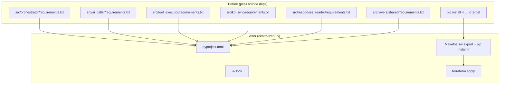

# Design Document: Template Conventions Migration

## Overview

This design migrates both chatbot RAG templates (`chatbot-rag-mantle` and `chatbot-rag-agentcore`) from their current per-Lambda `requirements.txt` + pip workflow to the upd8 Python and Terraform conventions. The migration is a structural/configuration refactor — no application logic changes. Both templates receive identical changes (except AI-specific dependency declarations).

### Key Design Decisions

1. **Single `pyproject.toml` at template root**: Centralizes all Python metadata, dependencies, and tool configs (ruff, pytest). Per-Lambda `requirements.txt` files are deleted.
2. **`uv export` for Lambda packaging via Makefile**: A `Makefile` automates `uv export --format requirements-txt` + `pip install -t` into each Lambda's source directory, bridging uv's lock-based resolution with Terraform's `archive_file` zip packaging.
3. **Dependency groups, not extras**: Runtime deps go in `[project.dependencies]`, dev deps in `[dependency-groups]` dev group. This leverages uv's native group support for selective export.
4. **`providers.tf` extraction**: The `terraform {}` block with `required_providers` and the `provider "aws"` block move from `main.tf` to a dedicated `providers.tf`. The `backend "s3"` block stays in `backend.tf`. `main.tf` keeps only module calls.
5. **`default_tags` in provider block**: Standard tags (`Project`, `Environment`, `ManagedBy`, `Client`) are applied via `default_tags` in the `provider "aws"` block — no per-resource tag blocks needed.
6. **Naming convention: `${var.project_name}-${var.environment}-<function>`**: Replaces the current `project_prefix` variable with two separate variables (`project_name`, `environment`), enabling structured tagging and consistent naming across environments.
7. **Minimal test scaffold**: Each template gets a `tests/` directory with one example test per Lambda that demonstrates mocking patterns — not exhaustive coverage (that's future work).

## Architecture

The migration touches file structure and configuration only. The runtime architecture (API Gateway → SQS → Lambdas → DynamoDB/S3) is unchanged.



### File Structure Delta

```
templates/chatbot-rag-{mantle,agentcore}/
├── pyproject.toml                         # NEW — all deps, ruff, pytest config
├── uv.lock                                # NEW — committed lock file
├── Makefile                               # NEW — build automation
├── tests/                                 # NEW — pytest test directory
│   ├── conftest.py
│   ├── test_orchestrator.py
│   ├── test_ai_caller.py
│   ├── test_tool_executor.py
│   ├── test_responses_reader.py
│   └── test_kb_sync.py
├── .gitignore                             # MODIFIED — add .ruff_cache/, consolidate venv
├── README.md                              # MODIFIED — uv-based instructions
├── src/
│   ├── orchestrator/
│   │   ├── handler.py                     # MODIFIED — type hints
│   │   └── requirements.txt               # DELETED
│   ├── ai_caller/
│   │   ├── handler.py                     # MODIFIED — type hints
│   │   └── requirements.txt               # DELETED
│   ├── tool_executor/
│   │   ├── handler.py                     # MODIFIED — type hints
│   │   └── requirements.txt               # DELETED
│   ├── responses_reader/
│   │   ├── handler.py                     # MODIFIED — type hints
│   │   └── requirements.txt               # DELETED
│   ├── kb_sync/
│   │   ├── handler.py                     # MODIFIED — type hints
│   │   └── requirements.txt               # DELETED
│   └── layers/shared/
│       ├── python/shared/...              # MODIFIED — type hints
│       └── requirements.txt               # DELETED
└── infra/environment/{dev,staging,prod}/
    ├── backend.tf                         # MODIFIED — upd8 S3 backend pattern
    ├── providers.tf                       # NEW — extracted from main.tf
    ├── main.tf                            # MODIFIED — no terraform/provider blocks
    ├── variables.tf                       # MODIFIED — project_name + environment
    ├── outputs.tf                         # UNCHANGED
    └── terraform.tfvars.example           # MODIFIED — new variable examples
```

## Components and Interfaces

### 1. pyproject.toml

The central configuration file at each template root.

```toml
[project]
name = "chatbot-rag-mantle"  # or "chatbot-rag-agentcore"
version = "0.1.0"
description = "Chatbot RAG template using Bedrock Mantle API"
requires-python = ">=3.12"
dependencies = [
    "aws-lambda-powertools[all]~=3.4",
    "boto3>=1.34.0,<2.0.0",
    "openai>=1.50.0,<2.0.0",  # Mantle only; AgentCore omits this
]

[dependency-groups]
dev = [
    "pytest~=8.0",
    "hypothesis~=6.100",
    "ruff~=0.11",
    "pytest-mock~=3.14",
]

[tool.ruff]
target-version = "py312"
line-length = 120

[tool.ruff.lint]
select = ["E", "F", "I", "UP", "B", "ANN"]
ignore = [
    "ANN101",  # missing type annotation for self
    "ANN102",  # missing type annotation for cls
    "ANN401",  # Dynamically typed expressions (typing.Any) — allowed with comment
]

[tool.ruff.format]
quote-style = "double"

[tool.pytest.ini_options]
testpaths = ["tests"]
pythonpath = ["src/orchestrator", "src/ai_caller", "src/tool_executor", "src/responses_reader", "src/kb_sync", "src/layers/shared/python"]
```

**AgentCore variant difference**: The `[project.dependencies]` section replaces `openai` with no additional runtime dependency (AgentCore uses only `boto3` for the Bedrock Agent Runtime API).

```toml
# chatbot-rag-agentcore pyproject.toml [project] section
dependencies = [
    "aws-lambda-powertools[all]~=3.4",
    "boto3>=1.34.0,<2.0.0",
]
```

### 2. Makefile (Build Script)

A `Makefile` at template root automates Lambda packaging. Each target:
1. Exports runtime deps from `pyproject.toml` via `uv export`
2. Installs them into the Lambda source directory
3. Leaves the directory ready for Terraform's `archive_file`

```makefile
.PHONY: all clean package-orchestrator package-ai-caller package-tool-executor package-responses-reader package-kb-sync package-shared-layer

PYTHON_PLATFORM := manylinux2014_x86_64
PYTHON_VERSION := 3.12

# Lambda source directories
ORCHESTRATOR_DIR := src/orchestrator
AI_CALLER_DIR := src/ai_caller
TOOL_EXECUTOR_DIR := src/tool_executor
RESPONSES_READER_DIR := src/responses_reader
KB_SYNC_DIR := src/kb_sync
SHARED_LAYER_DIR := src/layers/shared/python

all: package-orchestrator package-ai-caller package-tool-executor package-responses-reader package-kb-sync package-shared-layer

# Export runtime dependencies only (no dev group)
requirements.txt: pyproject.toml uv.lock
	uv export --format requirements-txt --no-dev --no-hashes -o requirements.txt

package-orchestrator: requirements.txt
	pip install -r requirements.txt -t $(ORCHESTRATOR_DIR) --platform $(PYTHON_PLATFORM) --python-version $(PYTHON_VERSION) --only-binary=:all: --quiet --upgrade
	@echo "✓ Packaged orchestrator"

package-ai-caller: requirements.txt
	pip install -r requirements.txt -t $(AI_CALLER_DIR) --platform $(PYTHON_PLATFORM) --python-version $(PYTHON_VERSION) --only-binary=:all: --quiet --upgrade
	@echo "✓ Packaged ai_caller"

package-tool-executor: requirements.txt
	pip install -r requirements.txt -t $(TOOL_EXECUTOR_DIR) --platform $(PYTHON_PLATFORM) --python-version $(PYTHON_VERSION) --only-binary=:all: --quiet --upgrade
	@echo "✓ Packaged tool_executor"

package-responses-reader: requirements.txt
	pip install -r requirements.txt -t $(RESPONSES_READER_DIR) --platform $(PYTHON_PLATFORM) --python-version $(PYTHON_VERSION) --only-binary=:all: --quiet --upgrade
	@echo "✓ Packaged responses_reader"

package-kb-sync: requirements.txt
	pip install -r requirements.txt -t $(KB_SYNC_DIR) --platform $(PYTHON_PLATFORM) --python-version $(PYTHON_VERSION) --only-binary=:all: --quiet --upgrade
	@echo "✓ Packaged kb_sync"

package-shared-layer: requirements.txt
	pip install -r requirements.txt -t $(SHARED_LAYER_DIR) --platform $(PYTHON_PLATFORM) --python-version $(PYTHON_VERSION) --only-binary=:all: --quiet --upgrade
	@echo "✓ Packaged shared layer"

clean:
	rm -f requirements.txt
	rm -rf $(ORCHESTRATOR_DIR)/*.dist-info $(ORCHESTRATOR_DIR)/bin
	rm -rf $(AI_CALLER_DIR)/*.dist-info $(AI_CALLER_DIR)/bin
	rm -rf $(TOOL_EXECUTOR_DIR)/*.dist-info $(TOOL_EXECUTOR_DIR)/bin
	rm -rf $(RESPONSES_READER_DIR)/*.dist-info $(RESPONSES_READER_DIR)/bin
	rm -rf $(KB_SYNC_DIR)/*.dist-info $(KB_SYNC_DIR)/bin
	rm -rf $(SHARED_LAYER_DIR)/*.dist-info $(SHARED_LAYER_DIR)/bin
	@echo "✓ Cleaned packaging artifacts"
```

**Rationale for `pip install --platform`**: Lambda runs on Amazon Linux (x86_64). Using `--platform manylinux2014_x86_64 --only-binary=:all:` ensures native wheels (e.g., `pydantic-core`) are compiled for the correct architecture regardless of the developer's OS.

**Error handling**: Each Make target runs as an independent step. If any `uv export` or `pip install` fails, Make stops with a non-zero exit code and prints the failing step. The developer must fix the issue before running `terraform apply`.

### 3. Terraform — providers.tf (New File)

Extracted from `main.tf`:

```hcl
# infra/environment/{dev,staging,prod}/providers.tf

terraform {
  required_version = ">= 1.5"

  required_providers {
    aws = {
      source  = "hashicorp/aws"
      version = "~> 6.0"
    }
  }
}

provider "aws" {
  region = var.aws_region

  default_tags {
    tags = {
      Project     = var.project_name
      Environment = var.environment
      ManagedBy   = "terraform"
      Client      = var.client
    }
  }
}
```

### 4. Terraform — backend.tf (Modified)

```hcl
# infra/environment/dev/backend.tf

terraform {
  backend "s3" {
    bucket         = "upd8-tfstate-<cliente>"
    key            = "<project>/terraform.tfstate"
    region         = "us-east-1"
    encrypt        = true
    dynamodb_table = "upd8-tfstate-lock"
  }
}
```

Placeholders `<cliente>` and `<project>` are documented in the README for developer replacement before `terraform init`.

### 5. Terraform — variables.tf (Modified)

```hcl
# infra/environment/{dev,staging,prod}/variables.tf

variable "project_name" {
  description = "Project name — used in resource naming. Lowercase alphanumeric and hyphens only, max 20 chars."
  type        = string

  validation {
    condition     = can(regex("^[a-z0-9][a-z0-9-]{0,19}$", var.project_name)) && var.project_name != ""
    error_message = "project_name must be 1–20 characters, lowercase alphanumeric and hyphens only."
  }
}

variable "environment" {
  description = "Deployment environment — determines resource naming suffix and tag value."
  type        = string

  validation {
    condition     = contains(["dev", "staging", "prod"], var.environment)
    error_message = "environment must be one of: dev, staging, prod."
  }
}

variable "client" {
  description = "Client name for cost allocation tags."
  type        = string

  validation {
    condition     = var.client != "" && length(var.client) <= 64
    error_message = "client must not be empty and must not exceed 64 characters."
  }
}

variable "aws_region" {
  description = "AWS region for deployment"
  type        = string
  default     = "us-east-1"
}

variable "aws_account_id" {
  description = "AWS account ID for ARN construction"
  type        = string
}

variable "model_id" {
  description = "AI model identifier for Bedrock"
  type        = string
  default     = "your-model-id"
}

# Mantle-only:
variable "mantle_base_url" {
  description = "Bedrock Mantle API base URL"
  type        = string
  default     = "https://bedrock-mantle.us-east-1.api.aws/v1"
}

variable "max_conversation_history" {
  description = "Maximum number of messages to retain in conversation context"
  type        = number
  default     = 50
}

variable "max_retry_attempts" {
  description = "Maximum retry attempts for message processing"
  type        = number
  default     = 3
}

variable "log_level" {
  description = "Powertools log level (DEBUG, INFO, WARNING, ERROR)"
  type        = string
  default     = "INFO"
}

variable "opensearch_collection_arn" {
  description = "ARN of the OpenSearch Serverless collection for the Bedrock Knowledge Base"
  type        = string
}
```

### 6. Terraform — main.tf (Modified)

The `terraform {}` and `provider "aws" {}` blocks are removed. Module calls update from `project_prefix` to pass `project_name` and `environment` separately:

```hcl
# infra/environment/dev/main.tf — example excerpt

locals {
  name_prefix = "${var.project_name}-${var.environment}"
}

module "sqs" {
  source       = "../../modules/sqs"
  project_name = var.project_name
  environment  = var.environment
}

module "orchestrator" {
  source       = "../../modules/lambda/orchestrator"
  project_name = var.project_name
  environment  = var.environment
  # ... remaining variables unchanged
}
```

Each module internally computes `"${var.project_name}-${var.environment}-<function>"` for resource names.

### 7. Module Variable Interface Change

All child modules switch from receiving `project_prefix` (a combined value) to receiving `project_name` + `environment` separately:

```hcl
# modules/lambda/orchestrator/variables.tf — example

variable "project_name" {
  description = "Project name for resource naming"
  type        = string
}

variable "environment" {
  description = "Deployment environment (dev, staging, prod)"
  type        = string
}

# Inside module resources:
locals {
  function_name = "${var.project_name}-${var.environment}-orchestrator"
}
```

### 8. terraform.tfvars.example (Modified)

```hcl
# Project name — lowercase alphanumeric and hyphens, max 20 chars.
# Combined with environment to form resource name prefix: <project_name>-<environment>-<function>
# Example result: my-chatbot-dev-orchestrator
project_name = "my-chatbot"

# Deployment environment (allowed: dev, staging, prod)
environment = "dev"

# Client name for cost allocation and tagging
client = "acme-corp"

# AWS region for deployment
aws_region = "us-east-1"

# AWS account ID for ARN construction
aws_account_id = "123456789012"

# AI model identifier — Replace with an available Bedrock model
model_id = "us.anthropic.claude-sonnet-4-20250514"

# Bedrock Mantle API base URL (Mantle template only)
mantle_base_url = "https://bedrock-mantle.us-east-1.api.aws/v1"

# Maximum messages to retain in conversation context
max_conversation_history = 50

# Maximum retry attempts for message processing
max_retry_attempts = 3

# Powertools log level (DEBUG, INFO, WARNING, ERROR)
log_level = "INFO"

# OpenSearch Serverless collection ARN for the Bedrock Knowledge Base
opensearch_collection_arn = "arn:aws:aoss:us-east-1:123456789012:collection/your-collection-id"

# NOTE: The combined prefix (project_name + environment) plus function suffix
# must not exceed 63 characters to respect AWS naming limits.
# Example: "my-chatbot" + "dev" + "orchestrator" = "my-chatbot-dev-orchestrator" (28 chars ✓)
```

### 9. .gitignore (Modified)

```gitignore
# Terraform
.terraform/
*.tfstate
*.tfstate.backup
.terraform.lock.hcl
*.tfplan
crash.log
override.tf
override.tf.json
*_override.tf
*_override.tf.json

# Build artifacts
build/*
!build/.gitkeep
*.zip

# Python
__pycache__/
*.pyc
*.pyo
*.pyd
.pytest_cache/
*.egg-info/
*.egg
dist/

# Virtual environment (uv default)
.venv/

# Environment files (secrets)
.env
.env.*

# Ruff cache
.ruff_cache/

# IDE
.idea/
.vscode/
*.swp
*.swo
*~

# OS
.DS_Store
Thumbs.db

# Installed dependencies (packaged into Lambda at deploy time)
src/*/package/
src/layers/shared/python/shared/__pycache__/

# uv export artifact (regenerated by Makefile)
requirements.txt
```

**Changes from current**:
- Added `.ruff_cache/`
- Removed `venv/` and `env/` (consolidated to `.venv/` only — uv's default)
- Added `requirements.txt` (now a generated build artifact, not source)
- `uv.lock` is NOT listed (committed to version control)

### 10. Pytest Infrastructure

#### `tests/conftest.py`

```python
"""Shared test fixtures for all Lambda function tests."""

import os
from unittest.mock import MagicMock, patch

import pytest


@pytest.fixture(autouse=True)
def _aws_env_vars(monkeypatch: pytest.MonkeyPatch) -> None:
    """Set required AWS-related environment variables for all tests."""
    monkeypatch.setenv("AWS_DEFAULT_REGION", "us-east-1")
    monkeypatch.setenv("AWS_ACCESS_KEY_ID", "testing")
    monkeypatch.setenv("AWS_SECRET_ACCESS_KEY", "testing")
    monkeypatch.setenv("POWERTOOLS_SERVICE_NAME", "test")
    monkeypatch.setenv("POWERTOOLS_LOG_LEVEL", "DEBUG")


@pytest.fixture(autouse=True)
def _lambda_env_vars(monkeypatch: pytest.MonkeyPatch) -> None:
    """Set Lambda-specific environment variables for all tests."""
    monkeypatch.setenv("DYNAMODB_TABLE_NAME", "test-context-table")
    monkeypatch.setenv("RESPONSES_TABLE_NAME", "test-responses-table")
    monkeypatch.setenv("AI_CALLER_FUNCTION_NAME", "test-ai-caller")
    monkeypatch.setenv("TOOL_EXECUTOR_FUNCTION_NAME", "test-tool-executor")
    monkeypatch.setenv("RAG_BUCKET_NAME", "test-rag-bucket")
    monkeypatch.setenv("MAX_CONVERSATION_HISTORY", "50")
    monkeypatch.setenv("MAX_RETRY_ATTEMPTS", "3")
    monkeypatch.setenv("MAX_TOOL_ITERATIONS", "10")
```

#### `tests/test_orchestrator.py` (Example)

```python
"""Example tests for the Orchestrator Lambda."""

from unittest.mock import MagicMock, patch

import pytest


@pytest.fixture
def lambda_context() -> MagicMock:
    """Create a mock Lambda context."""
    context = MagicMock()
    context.aws_request_id = "test-request-id"
    context.function_name = "test-orchestrator"
    return context


@pytest.fixture
def sqs_event() -> dict:
    """Create a sample SQS event."""
    import json

    return {
        "Records": [
            {
                "body": json.dumps({
                    "userId": "user-123",
                    "message": "Hello",
                    "messageId": "msg-001",
                    "correlationId": "corr-001",
                    "timestamp": "2024-01-15T10:00:00Z",
                })
            }
        ]
    }


@patch("handler.lambda_client")
@patch("handler.table")
@patch("handler.responses_table")
def test_handler_processes_message_successfully(
    mock_responses_table: MagicMock,
    mock_table: MagicMock,
    mock_lambda_client: MagicMock,
    sqs_event: dict,
    lambda_context: MagicMock,
) -> None:
    """Test that the orchestrator processes a message end-to-end."""
    import json

    # Mock DynamoDB get_item — empty history
    mock_table.get_item.return_value = {"Item": {"userId": "user-123", "messages": []}}

    # Mock AI Caller invocation — text-only response (no tool calls)
    mock_lambda_client.invoke.return_value = {
        "Payload": MagicMock(
            read=MagicMock(return_value=json.dumps({
                "content": "Hello! How can I help?",
                "timestamp": "2024-01-15T10:00:01Z",
            }).encode())
        ),
    }

    from handler import handler

    result = handler(sqs_event, lambda_context)

    assert result["statusCode"] == 200
    mock_responses_table.put_item.assert_called()
```

### 11. README Structure (Post-Migration)

```markdown
# Chatbot RAG Template — Bedrock Mantle API

## Overview
(unchanged — describes the template and architecture)

## Architecture
(unchanged — component diagram and description)

## Prerequisites

- AWS account with Bedrock model access enabled
- Terraform >= 1.5
- Python 3.12
- [uv](https://docs.astral.sh/uv/) (Astral Python package manager)
- AWS CLI configured with appropriate credentials
- GNU Make

## Project Structure
(updated to show pyproject.toml, Makefile, tests/)

## Development Setup

Install all dependencies (runtime + dev):

    uv sync

Format code:

    uv run ruff format .

Lint code:

    uv run ruff check .

Run tests:

    uv run pytest

## Configuration

### Terraform Variables
(updated — now describes project_name, environment, client)

### Backend Setup

Before running `terraform init`, replace the placeholders in `backend.tf`:
- `<cliente>` → your upd8 client slug (e.g., `acme`)
- `<project>` → your project identifier (e.g., `chatbot-rag-mantle/dev`)

The S3 bucket (`upd8-tfstate-<cliente>`) and DynamoDB table
(`upd8-tfstate-lock`) must exist before init.

## Testing

Run the full test suite:

    uv run pytest

Test directory convention: `tests/test_<function_name>.py`

Tests mock all AWS services — no real credentials or live services needed.
Each test file demonstrates the mocking pattern using `unittest.mock.patch`
and `pytest.MonkeyPatch` for environment variables.

## Deployment

### 1. Install Dependencies & Package Lambdas

    make all

This exports runtime dependencies from `pyproject.toml` via `uv export`
and installs them into each Lambda's source directory for Terraform packaging.

### 2. Configure Environment

    cp infra/environment/dev/terraform.tfvars.example infra/environment/dev/terraform.tfvars
    # Edit terraform.tfvars with your values

### 3. Deploy

    cd infra/environment/dev
    terraform init
    terraform plan
    terraform apply

## RAG Knowledge Base
(unchanged)

## Observability
(unchanged)

## Customization
(unchanged)
```

## Data Models

No data model changes. The migration affects only:
- File structure (new/deleted/moved files)
- Configuration file content (pyproject.toml, Terraform .tf files)
- Documentation (README)

The DynamoDB schema, API request/response formats, SQS message format, and all runtime data structures remain unchanged.

## Error Handling

### Build Script (Makefile) Errors

| Scenario | Behavior |
|----------|----------|
| `uv export` fails (invalid pyproject.toml) | Make stops, prints uv error output, exits non-zero |
| `pip install -t` fails (network, incompatible wheel) | Make stops at failing target, exits non-zero |
| Missing `uv` binary | Make reports command not found, exits non-zero |
| Missing `pyproject.toml` or `uv.lock` | `uv export` fails with clear error message |

### Terraform Validation Errors

| Scenario | Behavior |
|----------|----------|
| `project_name` empty or invalid chars | `terraform plan` fails with custom error message |
| `environment` not in allowed list | `terraform plan` fails with custom error message |
| `client` empty | `terraform plan` fails with custom error message |
| Backend bucket doesn't exist | `terraform init` fails with S3 error |
| DynamoDB lock table doesn't exist | `terraform init` fails with lock error |

## Testing Strategy

### Testing Approach Assessment

This feature is a **configuration and tooling migration**. The acceptance criteria overwhelmingly test:
- File existence and content (structural validation)
- Configuration schema correctness
- Terraform file organization
- Naming patterns and tag presence
- Documentation content

**Property-based testing does NOT apply** to this feature because:
- There are no pure functions with variable input being introduced
- Terraform IaC is declarative configuration, not a function with inputs/outputs
- The build script is a sequence of shell commands, not a testable function
- Naming convention is a simple string interpolation (`${var.project_name}-${var.environment}-<function>`)
- File structure validation is best done with example-based structural assertions

### Unit Tests (Example-Based)

| Test | Validates |
|------|-----------|
| `pyproject.toml` declares `requires-python = ">=3.12"` | Req 1.6 |
| `pyproject.toml` has `[project.dependencies]` with runtime deps | Req 1.1 |
| `pyproject.toml` has `[dependency-groups]` dev group with pytest, hypothesis, ruff | Req 1.4, 5.2 |
| `uv.lock` exists at template root | Req 1.2 |
| Per-Lambda `requirements.txt` files do NOT exist | Req 1.5 |
| `Makefile` exists with `all` target | Req 2.3 |
| `Makefile` uses `uv export --format requirements-txt` | Req 2.1 |
| `[tool.ruff]` has `target-version = "py312"` and `line-length = 120` | Req 3.1, 3.3 |
| `[tool.ruff.lint]` selects E, F, I, UP, B, ANN | Req 3.2, 4.2 |
| No `black`, `flake8`, `isort` configs or deps present | Req 3.6 |
| `.gitignore` includes `.ruff_cache/` | Req 3.4, 11.2 |
| `.gitignore` includes `.venv/` but NOT `venv/` or `env/` | Req 11.1, 11.4 |
| `.gitignore` does NOT include `uv.lock` | Req 11.3 |
| `tests/` directory exists with `conftest.py` | Req 5.1 |
| `[tool.pytest.ini_options]` has `testpaths` and `pythonpath` | Req 5.3 |
| `backend.tf` has `bucket = "upd8-tfstate-<cliente>"` pattern | Req 6.1 |
| `backend.tf` includes `encrypt = true` and `dynamodb_table` | Req 6.2, 6.3 |
| `providers.tf` exists with `required_providers` + `provider "aws"` | Req 7.1, 7.2 |
| `main.tf` has NO `terraform {}` or `provider {}` blocks | Req 7.4 |
| Provider block has `default_tags` with Project, Environment, ManagedBy, Client | Req 8.3 |
| `variables.tf` has `project_name` with validation (lowercase, max 20) | Req 9.2 |
| `variables.tf` has `environment` restricted to dev/staging/prod | Req 9.2 |
| `variables.tf` has `client` with non-empty validation | Req 8.5 |
| `project_prefix` variable does NOT exist | Req 9.3 |
| `terraform.tfvars.example` shows combined naming examples | Req 9.5 |
| README lists `uv` as prerequisite with link | Req 10.1 |
| README has "Development Setup" section with uv commands | Req 10.3 |
| README mentions `uv.lock` committed | Req 10.4 |
| README contains no `pip install`, `virtualenv`, `python -m venv` | Req 10.5, 10.6 |
| Both templates have identical pyproject.toml structure (except deps) | Req 12.1 |
| AgentCore pyproject.toml differs only in dependencies | Req 12.2 |

### Integration Tests

| Test | Validates |
|------|-----------|
| `uv sync` succeeds from clean state | Req 1.3 |
| `uv run pytest` passes with zero failures | Req 5.4 |
| `uv run ruff check .` exits zero on template source | Req 4.5 |
| `uv run ruff format --check .` exits zero | Req 3.1 |
| `make all` succeeds (packages all Lambdas) | Req 2.3 |
| `terraform validate` passes per environment | Req 7.5 |
| `terraform plan` with valid tfvars shows zero changes against refactored state | Req 7.5 |

### Smoke Tests

| Test | Validates |
|------|-----------|
| `terraform init` succeeds with configured backend | Req 6.1 |
| `make clean` removes packaging artifacts | Req 2.3 |

