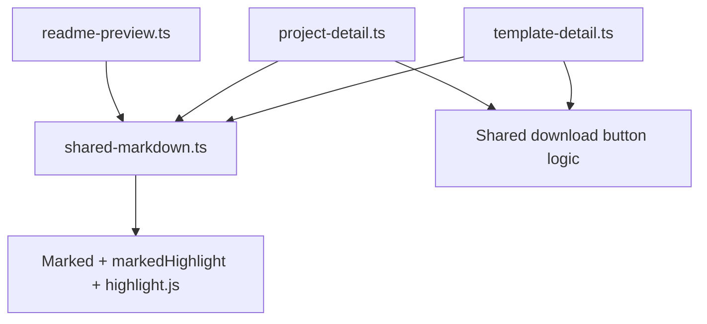

# Design Document: UI Consistency Improvements

## Overview

This feature unifies the visual and structural presentation of the Template Detail and Project Detail pages by:

1. **Standardizing the download button** — Both pages will use the same HTML element structure, CSS class, accessibility attributes, and spacing for their download actions.
2. **Extracting a shared markdown renderer** — The template page's superior README rendering (Marked + highlight.js with full syntax highlighting) will be extracted into a reusable module that both pages consume, eliminating duplicated Marked instances and ensuring identical rendering behavior across the site.

### Current State

| Aspect | Template Detail Page | Project Detail Page |
|--------|---------------------|---------------------|
| Marked instance | Local `new Marked(markedHighlight(...))` | Local `new Marked(markedHighlight(...))` |
| Download element | `<a class="download-link">` with `download` attr + `aria-label` | `<a class="download-link">` (available) or `<span class="download-link disabled">` (unavailable) |
| Readme wrapper | `<section class="template-readme">` → `<div class="readme-content">` | `<section class="project-readme">` → `<div class="readme-content">` |
| Download placement | After metadata, before architecture/readme | After metadata, before readme |

The two pages already share the `.download-link` CSS class and `.readme-content` styling. The main inconsistencies are:
- The project page lacks `aria-label` and a meaningful `download` filename on its download link.
- Both pages independently instantiate `Marked` with identical configuration — this should be a single shared instance.
- The template page has `renderReadmeSection()` and `renderReadmeError()` helpers that the project page duplicates inline.

## Architecture



The design introduces a single new shared module (`shared-markdown.ts`) that both detail pages and the readme-preview component import. Each page removes its local Marked instantiation and instead uses the shared module's exports.

For the download button, the existing `renderDownloadButton` pattern from `template-detail.ts` becomes the canonical implementation that `project-detail.ts` also adopts (with parameter adjustments for project-specific URLs).

## Components and Interfaces

### 1. Shared Markdown Module (`frontend/src/shared-markdown.ts`)

This new module exports three things:

```typescript
// shared-markdown.ts

import { Marked } from 'marked';
import { markedHighlight } from 'marked-highlight';
import hljs from 'highlight.js';

/**
 * Single shared Marked instance configured with highlight.js syntax highlighting.
 * Uses 'hljs language-' prefix and auto-detection fallback.
 */
export const marked: Marked;

/**
 * Render a readme section from pre-parsed HTML content.
 * Returns: <section class="{contextClass}"> → <div class="readme-content">{html}</div>
 *
 * If htmlContent is empty/whitespace, renders a placeholder message instead.
 */
export function renderReadmeSection(htmlContent: string, contextClass: string): HTMLElement;

/**
 * Render a readme error fallback element.
 * Returns: <p class="error-message">{message}</p>
 */
export function renderReadmeError(message: string): HTMLElement;
```

### 2. Updated Template Detail Page (`frontend/src/template-detail.ts`)

- Removes local `Marked` instantiation
- Imports `marked`, `renderReadmeSection`, `renderReadmeError` from `./shared-markdown`
- `renderDownloadButton()` remains here (it is template-specific with template URL patterns)
- Calls `renderReadmeSection(readmeHtml, 'template-readme')` instead of inline DOM construction

### 3. Updated Project Detail Page (`frontend/src/project-detail.ts`)

- Removes local `Marked` instantiation
- Imports `marked`, `renderReadmeSection`, `renderReadmeError` from `./shared-markdown`
- Updates `renderDownloadSection()` to include `aria-label` with project name and `download` attribute with filename
- Calls `renderReadmeSection(readmeHtml, 'project-readme')` instead of inline DOM construction
- Uses `renderReadmeError('Documentation is unavailable')` for the error case

### 4. Updated Readme Preview (`frontend/src/readme-preview.ts`)

- Removes acceptance of a `markedInstance` parameter in `ReadmePreviewOptions`
- Imports `marked` from `./shared-markdown` directly
- The component uses the shared instance internally

## Data Models

No new data models are introduced. The existing `TemplateMetadata` and `ProjectMetadata` types remain unchanged.

The key interface change is in `ReadmePreviewOptions`:

```typescript
// Before
export interface ReadmePreviewOptions {
  container: HTMLElement;
  markedInstance: Marked;  // Caller provides instance
  // ...
}

// After
export interface ReadmePreviewOptions {
  container: HTMLElement;
  // markedInstance removed — uses shared module internally
  // ...
}
```

## Correctness Properties

*A property is a characteristic or behavior that should hold true across all valid executions of a system — essentially, a formal statement about what the system should do. Properties serve as the bridge between human-readable specifications and machine-verifiable correctness guarantees.*

### Property 1: Download button accessibility contract

*For any* valid resource name string (non-empty), the rendered download button SHALL have: (a) a `download` attribute present, (b) an `aria-label` attribute containing both the resource name and the word "download" (case-insensitive), and (c) visible text content that begins with the word "Download".

**Validates: Requirements 1.3**

### Property 2: Download button href construction

*For any* valid resource name string and base URL, when the download button is rendered in the enabled state, it SHALL be an `<a>` element whose `href` attribute equals `{baseUrl}/{path}/{name}/artifact.zip` (for projects) or `{baseUrl}/templates/{name}/artifact.zip` (for templates).

**Validates: Requirements 1.5**

### Property 3: Readme render function structure contract

*For any* non-empty, non-whitespace HTML string and any context class string, calling `renderReadmeSection(html, contextClass)` SHALL return an HTMLElement that is a `<section>` with the given context class, containing a nested `<div>` with class `readme-content`, whose innerHTML equals the input HTML string.

**Validates: Requirements 3.1, 4.4**

### Property 4: Syntax highlighting configuration

*For any* markdown string containing a fenced code block with a recognized language identifier, parsing with the shared Marked instance SHALL produce HTML where the `<code>` element has a class matching the pattern `hljs language-{lang}`.

**Validates: Requirements 3.4**

### Property 5: Empty/whitespace content shows placeholder

*For any* string composed entirely of whitespace characters (including empty string), calling `renderReadmeSection(whitespaceStr, contextClass)` SHALL return an HTMLElement containing a placeholder message rather than rendering the whitespace as content.

**Validates: Requirements 3.6**

## Error Handling

| Scenario | Behavior |
|----------|----------|
| Markdown parsing throws an error | `renderReadmeError(message)` returns a `<p class="error-message">` with the provided message text |
| Empty/whitespace markdown content | `renderReadmeSection` renders a placeholder "No documentation available" message inside the `readme-content` div |
| Artifact unavailable (project page) | Download button renders as `<span class="download-link disabled" aria-disabled="true">` with adjacent unavailable message |
| Metadata fetch failure | Each page retains its existing error handling (error message, no download button rendered) |

## Testing Strategy

### Property-Based Tests

Property-based testing applies to this feature because the shared rendering functions are pure (or near-pure) with clear input/output contracts that should hold across a wide range of inputs.

**Library:** [fast-check](https://github.com/dubzzz/fast-check) (TypeScript PBT library, compatible with Vitest)

**Configuration:**
- Minimum 100 iterations per property test
- Tests run in jsdom environment (Vitest)
- Each test tagged with property reference comment

**Tag format:** `Feature: ui-consistency-improvements, Property {number}: {property_text}`

Properties to implement:
1. Download button accessibility contract (arbitrary non-empty strings)
2. Download button href construction (arbitrary names + base URLs)
3. Readme render function structure (arbitrary HTML strings + class names)
4. Syntax highlighting configuration (markdown with code fences)
5. Empty/whitespace placeholder behavior (whitespace-only strings)

### Unit Tests (Example-Based)

- Verify both pages produce download buttons with the same CSS class (Requirements 1.1, 2.4)
- Verify DOM ordering: metadata → download → readme on both pages (Requirement 2.2)
- Verify disabled state renders as `<span>` with `aria-disabled` (Requirement 1.4)
- Verify both pages import from shared module (no local Marked instances) (Requirement 4.2)
- Verify error fallback structure matches across pages (Requirement 3.5)

### Integration Tests

- Render full template detail page and full project detail page, compare download button structures
- Render README content on both pages, verify identical HTML output for same markdown input
