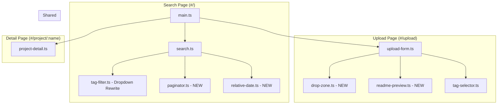
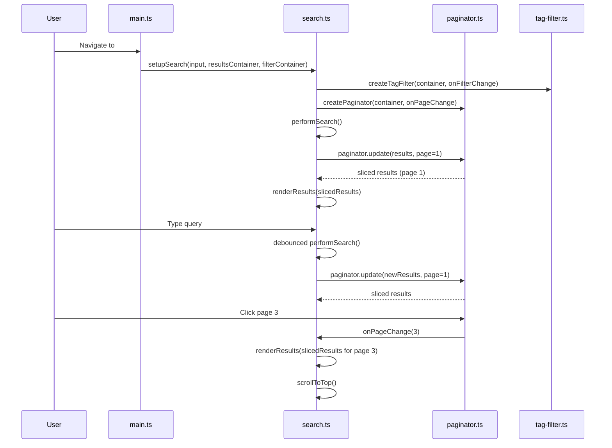
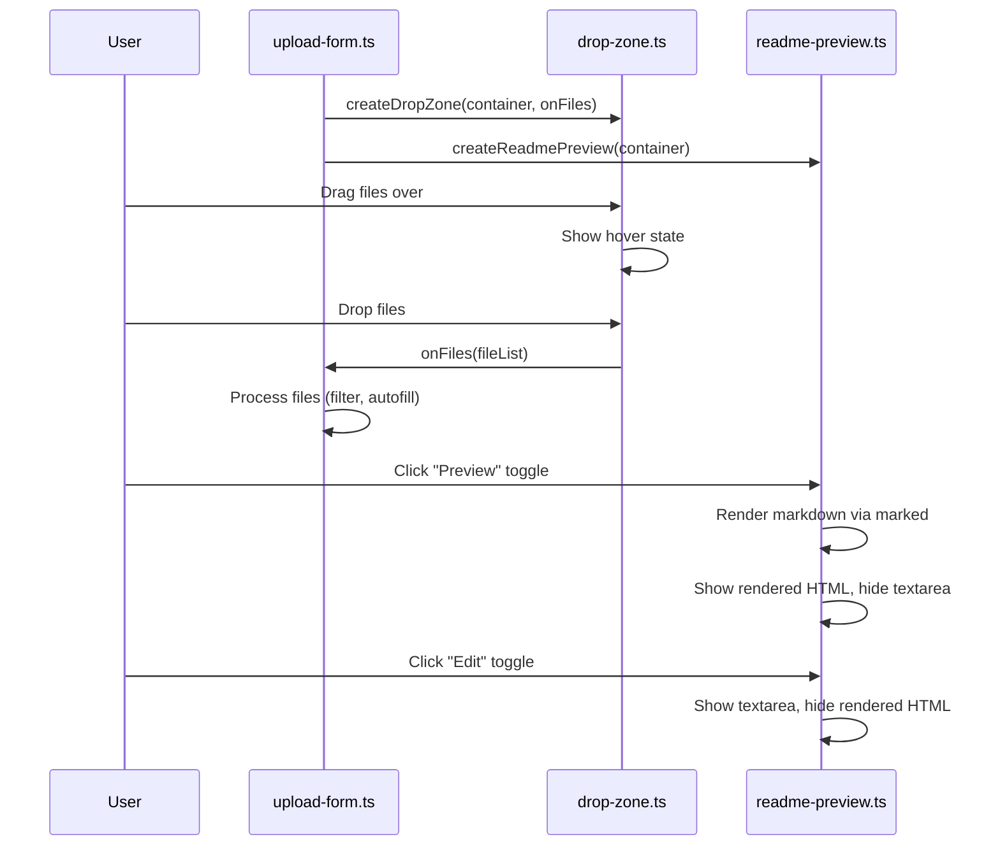
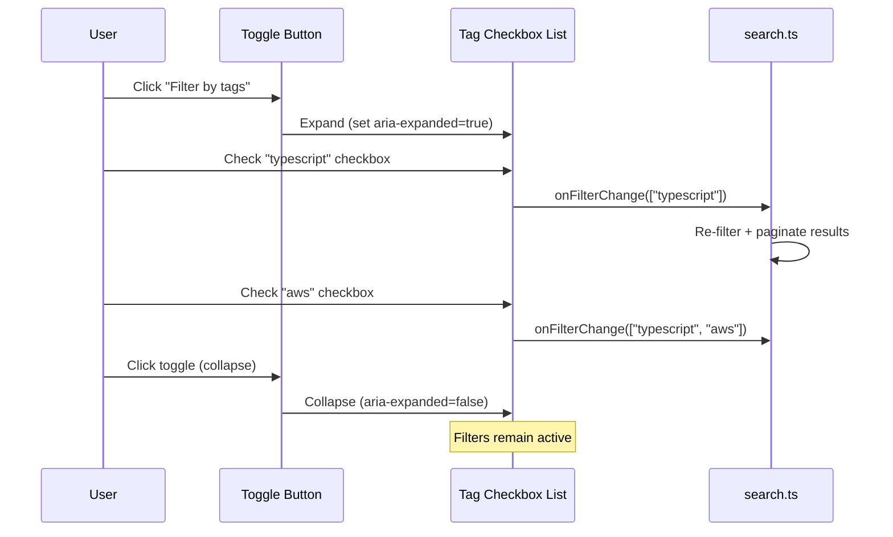

# Design Document: UI/UX Overhaul

## Overview

This design covers a comprehensive frontend-only UX overhaul of the Internal Repos application. The changes span the search/home page (paginated results, collapsible tag filter dropdown, keyboard-navigable result cards with relative dates), the upload page (drag-and-drop zone, markdown preview toggle, reordered form layout), and the project detail page (back navigation link).

All new modules follow the existing imperative DOM manipulation pattern using vanilla TypeScript. No frameworks are introduced. New components are implemented as factory functions that accept a container element and return a control API object, matching the established pattern in `tag-filter.ts` and `tag-selector.ts`. CSS remains inline in `index.html`.

## Architecture



## Sequence Diagrams

### Search Page with Pagination



### Upload Form with Drop Zone and Preview



### Tag Filter Dropdown Interaction



## Components and Interfaces

### Component 1: Paginator (`paginator.ts`)

**Purpose**: Slices a result array into pages and renders page navigation controls.

```typescript
export interface PaginatorOptions {
  container: HTMLElement;
  onPageChange: (page: number) => void;
  pageSize?: number; // default: 10
  maxButtons?: number; // default: 7
}

export interface PaginatorAPI {
  /** Update with new results and optionally reset to a specific page */
  update(totalItems: number, currentPage?: number): void;
  /** Get the current page (1-indexed) */
  getCurrentPage(): number;
  /** Get total number of pages */
  getTotalPages(): number;
  /** Get the start/end indices for slicing the results array */
  getSliceRange(): { start: number; end: number };
  /** Destroy and clean up DOM */
  destroy(): void;
}

export function createPaginator(options: PaginatorOptions): PaginatorAPI;
```

**Responsibilities**:
- Calculate total pages from item count and page size
- Render prev/next buttons and up to 7 numbered page buttons
- Disable prev on first page, next on last page
- Show "Page X of Y" text label
- Hide all controls when totalItems ≤ pageSize
- Emit `onPageChange` callback when user selects a page
- Provide slice indices so the caller can extract the visible subset

**Rendering logic for numbered buttons** (up to 7 visible):
- If totalPages ≤ 7: show all pages
- If currentPage ≤ 4: show 1–5, ellipsis, lastPage
- If currentPage ≥ totalPages − 3: show 1, ellipsis, (totalPages−4)–totalPages
- Otherwise: show 1, ellipsis, (current−1)–(current+1), ellipsis, lastPage

---

### Component 2: Drop Zone (`drop-zone.ts`)

**Purpose**: Provides a styled drag-and-drop area for folder selection, replacing the native file input as the primary file selection UI.

```typescript
export interface DropZoneOptions {
  container: HTMLElement;
  onFiles: (files: FileList) => void;
}

export interface DropZoneAPI {
  /** Get current selected files (null if none) */
  getFiles(): FileList | null;
  /** Reset to empty state */
  reset(): void;
  /** Destroy and clean up DOM + event listeners */
  destroy(): void;
}

export function createDropZone(options: DropZoneOptions): DropZoneAPI;
```

**Responsibilities**:
- Render a styled zone with instructional text when empty
- Show drag-hover visual state on `dragenter`/`dragover`
- Revert hover state on `dragleave`/`drop` within 150ms
- On drop: extract files from `DataTransferItemList`, call `onFiles`
- On click: trigger hidden `<input type="file" webkitdirectory>` and call `onFiles`
- Show file count summary after selection (e.g., "23 files selected")
- Feature-detect drag-and-drop; fall back to styled click-to-browse button

**DOM structure**:
```
div.drop-zone
  ├── div.drop-zone__content
  │     ├── p.drop-zone__text ("Drag & drop a project folder here, or click to browse")
  │     └── p.drop-zone__summary ("23 files selected") [hidden until files chosen]
  └── input[type=file][hidden][webkitdirectory]
```

---

### Component 3: Readme Preview (`readme-preview.ts`)

**Purpose**: Wraps the readme textarea with a toggle between Edit and Preview modes.

```typescript
import { Marked } from 'marked';

export interface ReadmePreviewOptions {
  container: HTMLElement;
  /** Shared Marked instance (already configured with highlight.js) */
  markedInstance: Marked;
  /** Text area config */
  textareaId?: string;
  maxLength?: number;
  placeholder?: string;
  rows?: number;
}

export interface ReadmePreviewAPI {
  /** Get the current textarea value (works in both modes) */
  getValue(): string;
  /** Set the textarea value programmatically (e.g., autofill) */
  setValue(content: string): void;
  /** Get the underlying textarea element (for event listeners) */
  getTextarea(): HTMLTextAreaElement;
  /** Switch to edit mode */
  setEditMode(): void;
  /** Switch to preview mode */
  setPreviewMode(): void;
  /** Get current mode */
  getMode(): 'edit' | 'preview';
  /** Destroy and clean up */
  destroy(): void;
}

export function createReadmePreview(options: ReadmePreviewOptions): ReadmePreviewAPI;
```

**Responsibilities**:
- Render toggle control (Edit | Preview) with `role="tablist"` / `role="tab"` pattern
- Default to Edit mode (textarea visible, preview hidden)
- On switch to Preview: parse textarea value with `marked.parse()`, display sanitized HTML
- Escape embedded HTML tags in markdown source before rendering (`marked` option `sanitize` or manual escape)
- Show "Nothing to preview" placeholder when textarea is empty in Preview mode
- Preserve textarea content across mode toggles
- Expose `getValue()` so the form always reads from the textarea regardless of current mode

---

### Component 4: Tag Filter Dropdown (rewrite of `tag-filter.ts`)

**Purpose**: Replaces flat tag buttons with a collapsible dropdown containing checkboxes.

```typescript
export interface TagFilterOptions {
  container: HTMLElement;
  onFilterChange: (activeTags: string[]) => void;
}

export interface TagFilterAPI {
  setTags(tags: string[]): void;
  getActiveTags(): string[];
  clearFilters(): void;
  destroy(): void;
}

export function createTagFilter(options: TagFilterOptions): TagFilterAPI;
```

**Interface stays the same** — existing consumers (`search.ts`) don't need changes. Internal implementation changes:

**New DOM structure**:
```
div.tag-filter-dropdown
  ├── button.tag-filter-toggle [aria-expanded="false"]
  │     └── "Filter by tags (3)"
  └── div.tag-filter-panel [hidden]
        └── ul.tag-filter-list [role="group"]
              ├── li > label > input[type=checkbox] + span "typescript"
              ├── li > label > input[type=checkbox] + span "aws"
              └── ...
```

**Behavior**:
- Toggle button shows/hides the panel; sets `aria-expanded`
- Panel has `max-height: 300px; overflow-y: auto`
- Each checkbox fires `onFilterChange` with the full list of checked tags
- Badge count shown in toggle text when filters active
- Panel stays open while any child has focus (blur handler with `relatedTarget` check)
- Keyboard: Enter/Space on toggle button expands/collapses
- On collapse, checked state is preserved

---

### Component 5: Relative Date Utility (`relative-date.ts`)

**Purpose**: Formats ISO date strings into human-readable relative time strings.

```typescript
/**
 * Converts an ISO date string to a relative date string.
 * Uses user's local timezone for "today"/"yesterday" calculations.
 *
 * Thresholds:
 *   0 days  → "today"
 *   1 day   → "yesterday"
 *   2–6     → "N days ago"
 *   7–13    → "1 week ago"
 *   14–29   → "N weeks ago"
 *   30–59   → "1 month ago"
 *   60–364  → "N months ago"
 *   365+    → "N years ago" (or "1 year ago")
 *
 * Returns raw date string for invalid or future dates.
 */
export function formatRelativeDate(isoDate: string): string;
```

**Implementation notes**:
- Uses `new Date(isoDate)` for parsing
- Calculates day difference using midnight-to-midnight comparison in local timezone
- Returns the raw input string (fallback) if `isNaN(date.getTime())` or if date is in the future
- Pure function, no side effects — easily unit-testable

---

## Data Models

### ProjectIndexEntry (existing, from `shared/types`)

```typescript
interface ProjectIndexEntry {
  name: string;
  description: string;
  tags: string[];
  date: string; // ISO 8601 format "YYYY-MM-DD"
}
```

No new shared types needed. All new component interfaces are local to the frontend.

---

## Upload Form Layout (reordering in `upload-form.ts`)

The current form order is: Project Name → Tags → Readme → Files → Submit.

**New order**:
1. **Drop Zone** (replaces file input, first element)
2. **Project Name** (auto-filled from folder name)
3. **Tags** (tag selector)
4. **Submit Button** ("Upload Project") — positioned here in the above-fold section
5. **Readme** (below fold) — with Edit/Preview toggle

This groups primary actions (file selection, naming, submitting) together at the top. The readme—a secondary, optional field—moves below the fold.

---

## Result Card Enhancements

### Keyboard Navigation

Changes to `renderResults()` in `search.ts`:

```typescript
// For each result card <li>:
li.setAttribute('tabindex', '0');
li.setAttribute('role', 'link');
li.setAttribute('aria-label', `View project ${item.name}`);

li.addEventListener('keydown', (e: KeyboardEvent) => {
  if (e.key === 'Enter' || e.key === ' ') {
    e.preventDefault();
    window.location.hash = `#/project/${encodeURIComponent(item.name)}`;
  }
});
```

### Relative Date Display

Added to each result card:

```typescript
const dateEl = document.createElement('time');
dateEl.className = 'result-date';
dateEl.textContent = formatRelativeDate(item.date);
dateEl.setAttribute('title', item.date);
dateEl.setAttribute('datetime', item.date);
li.appendChild(dateEl);
```

### Focus Indicator (CSS)

```css
.result-item:focus {
  outline: 2px solid var(--color-accent);
  outline-offset: 2px;
  box-shadow: 0 0 0 4px var(--color-accent-subtle);
}
```

---

## Back Navigation (in `project-detail.ts`)

Added as the first element rendered in both success and error paths of `renderProjectDetail`:

```typescript
const backLink = document.createElement('a');
backLink.href = '#/';
backLink.className = 'back-link';
backLink.textContent = '← Back to search';
container.appendChild(backLink);
```

This runs before any metadata fetch result check, so it renders even when metadata fails.

---

## CSS Additions (in `index.html` `<style>`)

New style blocks needed for all new components:

```css
/* ─── Drop Zone ─── */
.drop-zone {
  border: 2px dashed var(--color-border-strong);
  border-radius: var(--radius-md);
  padding: 2rem;
  text-align: center;
  cursor: pointer;
  transition: all var(--transition);
  background: var(--color-surface-raised);
}

.drop-zone:hover {
  border-color: var(--color-accent);
  background: var(--color-accent-subtle);
}

.drop-zone--drag-over {
  border-color: var(--color-accent);
  background: var(--color-accent-subtle);
  box-shadow: 0 0 0 4px var(--color-accent-subtle);
}

.drop-zone__text {
  font-size: 0.875rem;
  color: var(--color-text-muted);
  margin-bottom: 0.5rem;
}

.drop-zone__summary {
  font-family: var(--font-mono);
  font-size: 0.82rem;
  font-weight: 600;
  color: var(--color-success);
}

/* ─── Readme Preview Toggle ─── */
.readme-toggle {
  display: flex;
  gap: 0;
  border: 1px solid var(--color-border);
  border-radius: var(--radius-sm);
  overflow: hidden;
  align-self: flex-start;
  margin-bottom: 0.5rem;
}

.readme-toggle__btn {
  padding: 0.4rem 0.85rem;
  font-family: var(--font-mono);
  font-size: 0.75rem;
  font-weight: 500;
  background: var(--color-surface);
  border: none;
  cursor: pointer;
  color: var(--color-text-muted);
  transition: all var(--transition);
}

.readme-toggle__btn--active {
  background: var(--color-accent);
  color: #fff;
}

.readme-preview-content {
  background: var(--color-surface);
  border: 1px solid var(--color-border);
  border-radius: var(--radius-sm);
  padding: 1.25rem 1.5rem;
  min-height: 180px;
}

.readme-preview-placeholder {
  color: var(--color-text-muted);
  font-style: italic;
  font-size: 0.875rem;
}

/* ─── Tag Filter Dropdown ─── */
.tag-filter-dropdown {
  margin-top: 0.75rem;
  margin-bottom: 0.75rem;
  position: relative;
}

.tag-filter-toggle {
  font-family: var(--font-mono);
  font-size: 0.78rem;
  font-weight: 500;
  padding: 0.4rem 0.75rem;
  background: var(--color-surface);
  border: 1px solid var(--color-border);
  border-radius: var(--radius-sm);
  cursor: pointer;
  color: var(--color-text-muted);
  transition: all var(--transition);
}

.tag-filter-toggle:hover {
  border-color: var(--color-accent);
  color: var(--color-accent);
}

.tag-filter-toggle[aria-expanded="true"] {
  border-color: var(--color-accent);
  color: var(--color-accent);
}

.tag-filter-panel {
  margin-top: 0.5rem;
  max-height: 300px;
  overflow-y: auto;
  border: 1px solid var(--color-border);
  border-radius: var(--radius-sm);
  background: var(--color-surface);
  padding: 0.5rem;
}

.tag-filter-panel[hidden] {
  display: none;
}

.tag-filter-list {
  list-style: none;
  display: flex;
  flex-direction: column;
  gap: 0.25rem;
}

.tag-filter-list label {
  display: flex;
  align-items: center;
  gap: 0.5rem;
  padding: 0.3rem 0.4rem;
  border-radius: var(--radius-sm);
  font-family: var(--font-mono);
  font-size: 0.75rem;
  cursor: pointer;
  transition: background var(--transition);
}

.tag-filter-list label:hover {
  background: var(--color-accent-subtle);
}

/* ─── Paginator ─── */
.paginator {
  display: flex;
  align-items: center;
  justify-content: center;
  gap: 0.375rem;
  margin-top: 1.5rem;
  flex-wrap: wrap;
}

.paginator[hidden] {
  display: none;
}

.paginator__btn {
  font-family: var(--font-mono);
  font-size: 0.78rem;
  font-weight: 500;
  padding: 0.4rem 0.65rem;
  background: var(--color-surface);
  border: 1px solid var(--color-border);
  border-radius: var(--radius-sm);
  cursor: pointer;
  color: var(--color-text);
  transition: all var(--transition);
  min-width: 2rem;
  text-align: center;
}

.paginator__btn:hover:not(:disabled) {
  border-color: var(--color-accent);
  color: var(--color-accent);
}

.paginator__btn--active {
  background: var(--color-accent);
  color: #fff;
  border-color: var(--color-accent);
}

.paginator__btn:disabled {
  opacity: 0.4;
  cursor: not-allowed;
}

.paginator__info {
  font-family: var(--font-mono);
  font-size: 0.75rem;
  color: var(--color-text-muted);
  margin-left: 0.75rem;
}

.paginator__ellipsis {
  font-family: var(--font-mono);
  font-size: 0.78rem;
  color: var(--color-text-muted);
  padding: 0.4rem 0.25rem;
}

/* ─── Result Card Date ─── */
.result-date {
  font-family: var(--font-mono);
  font-size: 0.7rem;
  color: var(--color-text-muted);
  margin-top: 0.375rem;
}

/* ─── Result Card Focus ─── */
.result-item:focus {
  outline: 2px solid var(--color-accent);
  outline-offset: 2px;
  box-shadow: 0 0 0 4px var(--color-accent-subtle);
}

.result-item:focus:not(:focus-visible) {
  outline: none;
  box-shadow: none;
}

.result-item:focus-visible {
  outline: 2px solid var(--color-accent);
  outline-offset: 2px;
  box-shadow: 0 0 0 4px var(--color-accent-subtle);
}

/* ─── Back Link ─── */
.back-link {
  display: inline-block;
  font-family: var(--font-mono);
  font-size: 0.82rem;
  font-weight: 500;
  color: var(--color-text-muted);
  text-decoration: none;
  margin-bottom: 1.25rem;
  transition: color var(--transition);
}

.back-link:hover {
  color: var(--color-accent);
}
```

---

## Correctness Properties

### Property 1: Pagination slice integrity

For any page `p` where `1 ≤ p ≤ totalPages`, `getSliceRange()` returns `{ start: (p-1)*pageSize, end: min(p*pageSize, totalItems) }`, and `end - start ≤ pageSize`.

**Validates: Requirements 1.1**

### Property 2: Pagination completeness

The union of all page slices equals the full result set — no item is lost or duplicated across pages.

**Validates: Requirements 1.1, 1.4**

### Property 3: Filter reset on input change

After any search query change or tag filter toggle, `paginator.getCurrentPage() === 1`.

**Validates: Requirements 1.9**

### Property 4: Tag filter AND-logic

For any set of active tags `T`, every displayed result `r` satisfies `T ⊆ r.tags`.

**Validates: Requirements 4.6**

### Property 5: Readme content preservation

For all toggle sequences (Edit→Preview→Edit→…), `readmePreview.getValue()` always returns the last value set in the textarea, regardless of current mode.

**Validates: Requirements 3.8, 3.9**

### Property 6: Drop zone file parity

Files delivered via `onFiles` callback after a drop event are identical to files delivered after a click selection of the same folder.

**Validates: Requirements 2.4**

### Property 7: Relative date monotonicity

For two dates `d1 < d2` (both valid, both in the past), `daysAgo(d1) ≥ daysAgo(d2)` — the older date always produces an equal or larger "ago" value.

**Validates: Requirements 6.1**

### Property 8: Relative date fallback

If `isNaN(Date.parse(input))` or the date is in the future, `formatRelativeDate(input) === input` (returns raw string unchanged).

**Validates: Requirements 6.5**

### Property 9: Keyboard activation equivalence

Pressing Enter or Space on a focused result card produces the same navigation as clicking that card.

**Validates: Requirements 7.3**

### Property 10: Back link always renders

The "← Back to search" anchor is present in the DOM regardless of whether `fetchProjectMetadata` succeeds or fails.

**Validates: Requirements 5.4**

---

## Error Handling

### Drop Zone Errors

| Condition | Response | Recovery |
|-----------|----------|----------|
| Browser lacks drag-and-drop API | Render fallback button-only UI | User clicks to browse |
| Drop contains no files | Ignore drop, maintain current state | User retries |
| Drop contains files (not folder) | Still process; file filtering handles it | Files processed normally |

### Paginator Edge Cases

| Condition | Response |
|-----------|----------|
| 0 results | Hide paginator entirely |
| Results change while on page 3 (now only 1 page) | Reset to page 1 |
| Rapid page clicks | Each click re-renders; no debounce needed (synchronous slice) |

### Readme Preview Errors

| Condition | Response |
|-----------|----------|
| `marked.parse()` throws | Show error text in preview area; preserve textarea content |
| Extremely large markdown (>100KB) | Render anyway; marked handles streaming |

---

## Testing Strategy

### Unit Testing

- `relative-date.ts`: Pure function — test all threshold boundaries, invalid dates, future dates, timezone edge cases
- `paginator.ts`: Test `getSliceRange()` for various totalItems/page combinations; test button generation logic for ellipsis scenarios
- `drop-zone.ts`: Test feature detection path; mock DataTransfer for drop handling
- `readme-preview.ts`: Test mode toggle state management; verify getValue() returns textarea content in both modes

### Integration Testing

- Search page: Verify pagination resets on search/filter change
- Upload form: Verify form submission reads textarea value when in Preview mode
- Keyboard navigation: Verify Enter/Space on result cards triggers navigation

---

## Performance Considerations

- **Paginator**: Only renders the visible page slice (10 items max). No virtual scrolling needed for this scale.
- **Tag Filter Dropdown**: Renders all checkboxes on first expand. For the expected tag count (<100), this is instant.
- **Relative Date**: Called once per visible result card per render. Pure function with no allocation concerns.
- **Markdown Preview**: `marked.parse()` is synchronous. For typical README sizes (<50KB), latency is negligible.

---

## Security Considerations

- **Markdown rendering**: Use `marked`'s built-in HTML escaping. Set `sanitize: true` or manually escape `<script>`, `<iframe>`, `on*` attributes in the rendered output. The existing `project-detail.ts` already uses marked without extra sanitization — the readme-preview component should match that behavior but escape raw HTML in user input context.
- **Drop Zone file processing**: No new trust boundary; files are processed client-side identically to the existing `<input>` path, passing through `filterFileList()` and `shouldExcludeFile()`.

---

## Dependencies

No new external dependencies. All new modules use:
- `marked` + `marked-highlight` + `highlight.js` (existing) — for readme preview
- `fuse.js` (existing) — search remains unchanged
- Vanilla DOM APIs — `DataTransfer`, `DragEvent`, `FileList`
