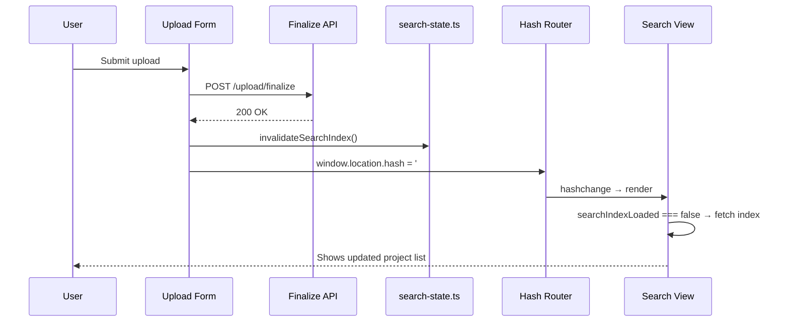

# Design Document: Upload Redirect

## Overview

This feature modifies the upload form's success handling to redirect the user to the project list (`#/`) instead of displaying a success message and resetting the form. The change is minimal — it replaces the success block in the form submit handler with a `window.location.hash = '#/'` assignment while preserving the `invalidateSearchIndex()` call.

The existing hash-based router detects the hash change and renders the search view, which re-fetches the project index (because it was invalidated) and shows the updated list including the newly uploaded project.

## Architecture



### Key Design Decisions

1. **Direct hash assignment over router.navigate()**: The upload form doesn't have access to the router instance. Since the router listens for `hashchange` events, setting `window.location.hash` directly triggers the same navigation flow. This avoids introducing new imports or passing the router instance around.

2. **Invalidate before redirect**: `invalidateSearchIndex()` sets `searchIndexLoaded = false` synchronously before the hash assignment. When the search view renders in response to the hashchange, it sees the flag is false and re-fetches the index from the server.

3. **No success message**: The redirect itself serves as confirmation — the user lands on the project list and sees their new project. Showing a transient message before navigating away would flash briefly and provide no value.

4. **No form reset**: Since the page navigates away from the upload view, resetting form fields is unnecessary. The next time the user navigates to `#/upload`, the form renders fresh from scratch.

## Components and Interfaces

### Modified Component: Upload Form (frontend/src/upload-form.ts)

The only change is in the success block of the `form.addEventListener('submit', ...)` handler (step 7):

```typescript
// Current implementation (to be replaced):
// invalidateSearchIndex();
// statusEl.textContent = finalizeResult.data.warning
//   ? `Project uploaded successfully. Warning: ${finalizeResult.data.warning}`
//   : 'Project uploaded successfully!';
// statusEl.className = 'upload-status upload-status--success';
// submitBtn.disabled = false;
// submitBtn.textContent = 'Upload Project';
// form.reset();

// New implementation:
invalidateSearchIndex();
window.location.hash = '#/';
```

### Unchanged Components

- **router.ts**: Already listens for `hashchange` and routes `#/` to the search view. No changes needed.
- **search-state.ts**: `invalidateSearchIndex()` already sets `searchIndexLoaded = false`. No changes needed.
- **main.ts / renderSearchView()**: Already checks `searchIndexLoaded` and re-fetches when false. No changes needed.
- **Error handling paths**: All error branches in the submit handler remain unchanged — they still show the error message in the status area and re-enable the submit button.

## Data Models

No new data models are introduced. The feature only changes control flow in the success path.

## Error Handling

| Scenario | Behavior |
|----------|----------|
| Finalize returns success | `invalidateSearchIndex()` → redirect to `#/` |
| Finalize returns error | Display error in status area, remain on upload page (unchanged) |
| Initiate fails | Display error in status area, remain on upload page (unchanged) |
| S3 upload fails | Display error in status area, remain on upload page (unchanged) |
| Zip too large | Display error in status area, remain on upload page (unchanged) |
| All files filtered out | Display error in status area, remain on upload page (unchanged) |

## Correctness Properties

*A property is a characteristic or behavior that should hold true across all valid executions of a system—essentially, a formal statement about what the system should do. Properties serve as the bridge between human-readable specifications and machine-verifiable correctness guarantees.*

After analyzing all acceptance criteria, none are suitable for property-based testing. The feature is a minimal control-flow change where:

- The behavior does not vary with input (it's always the same redirect regardless of project name, tags, or files uploaded)
- There is no data transformation or input space to explore
- The correctness guarantee is a fixed sequence of two operations: invalidate then redirect

All acceptance criteria are best validated through example-based unit tests that verify specific DOM state and call ordering after mocked API responses.

## Testing Strategy

### Unit Tests (Example-Based via Vitest + jsdom)

All tests belong in `frontend/src/upload-form.test.ts`:

| Requirement | Test Description |
|-------------|-----------------|
| 1.1 | On successful finalize, `window.location.hash` is set to `'#/'` |
| 1.2 | `invalidateSearchIndex()` is called before the hash change |
| 1.3 | Status element does not receive success message or success CSS class |
| 1.4 | `form.reset()` is not called after successful finalize |
| 3.1 | On finalize error, status shows error message and hash is unchanged |
| 3.2 | On initiate/S3 failure, status shows error message and hash is unchanged |

### Integration Tests

| Requirement | Test Description |
|-------------|-----------------|
| 2.1 | After `invalidateSearchIndex()`, rendering the search view triggers `fetchSearchIndex()` |

This integration test is already covered by the existing search view tests — the `searchIndexLoaded` flag mechanism is tested as part of the search feature. No new integration test is needed.

### Existing Tests to Update

The current test "shows success message on successful upload" asserts `statusEl.textContent` contains "uploaded successfully" and checks the success CSS class. This test must be updated to instead verify:
1. `window.location.hash === '#/'`
2. `invalidateSearchIndex()` was called
3. No success message was displayed
